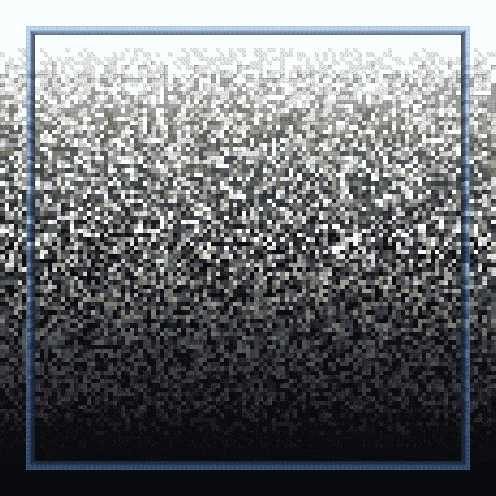
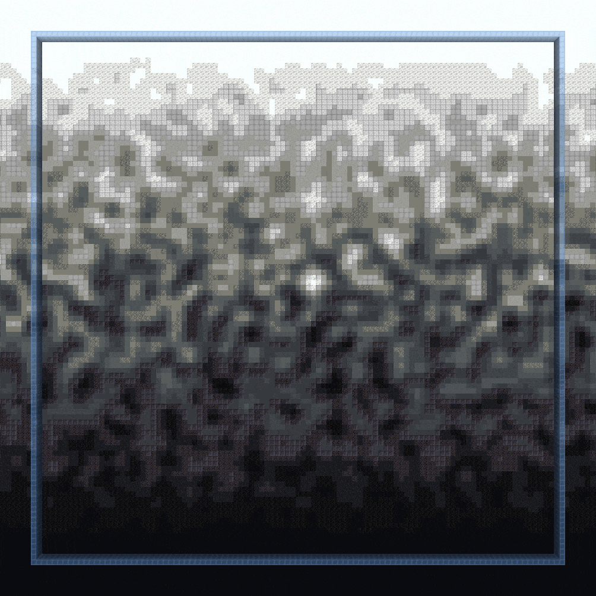
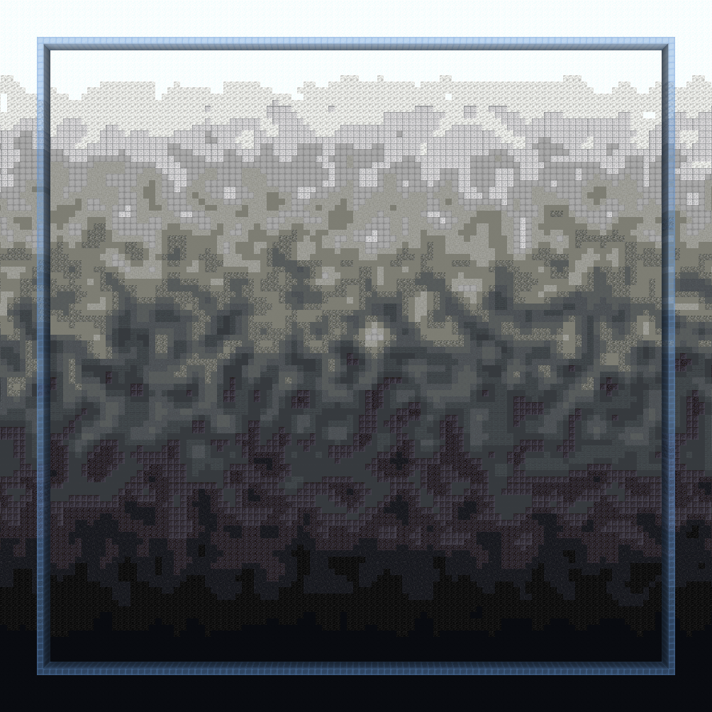
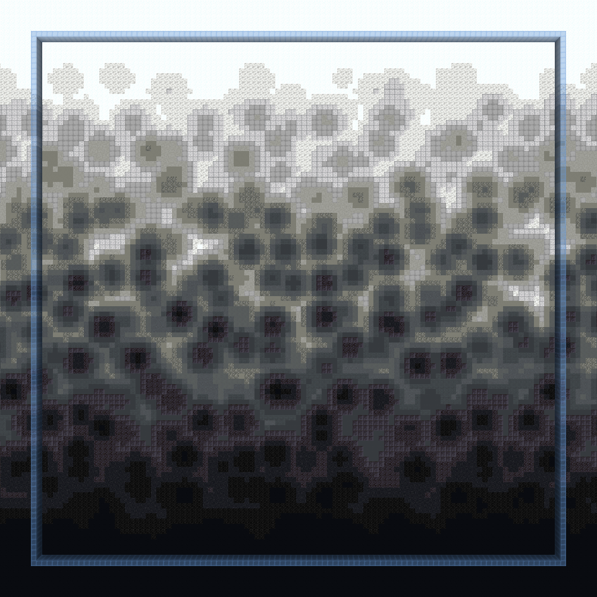
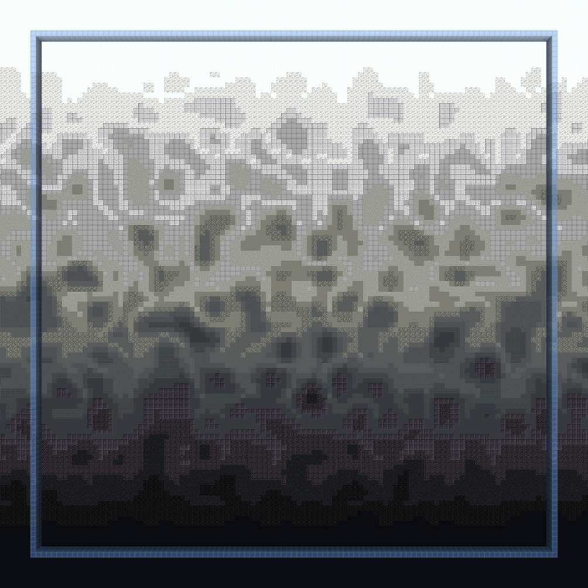
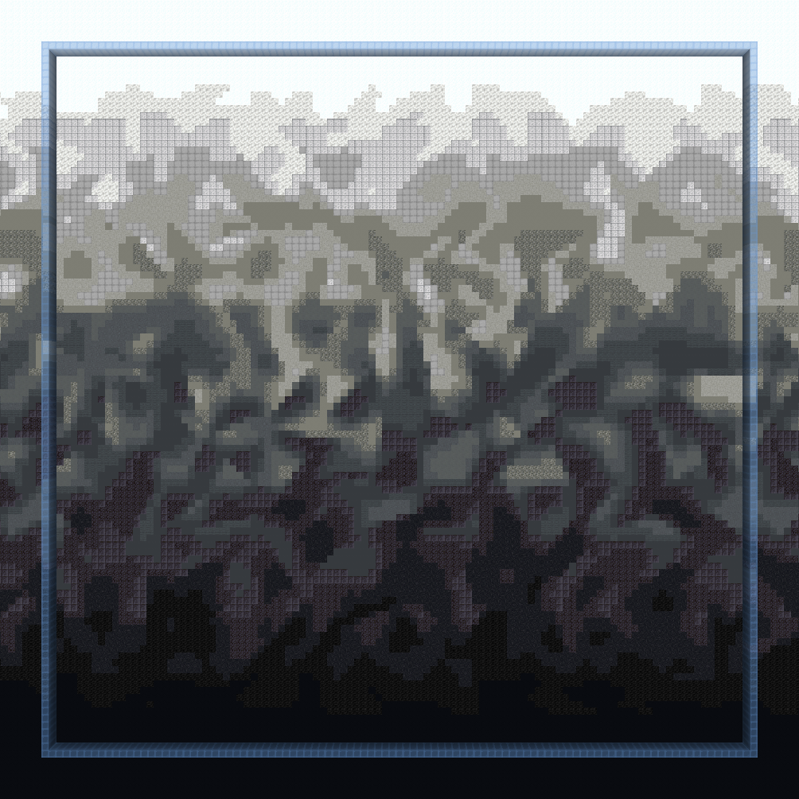
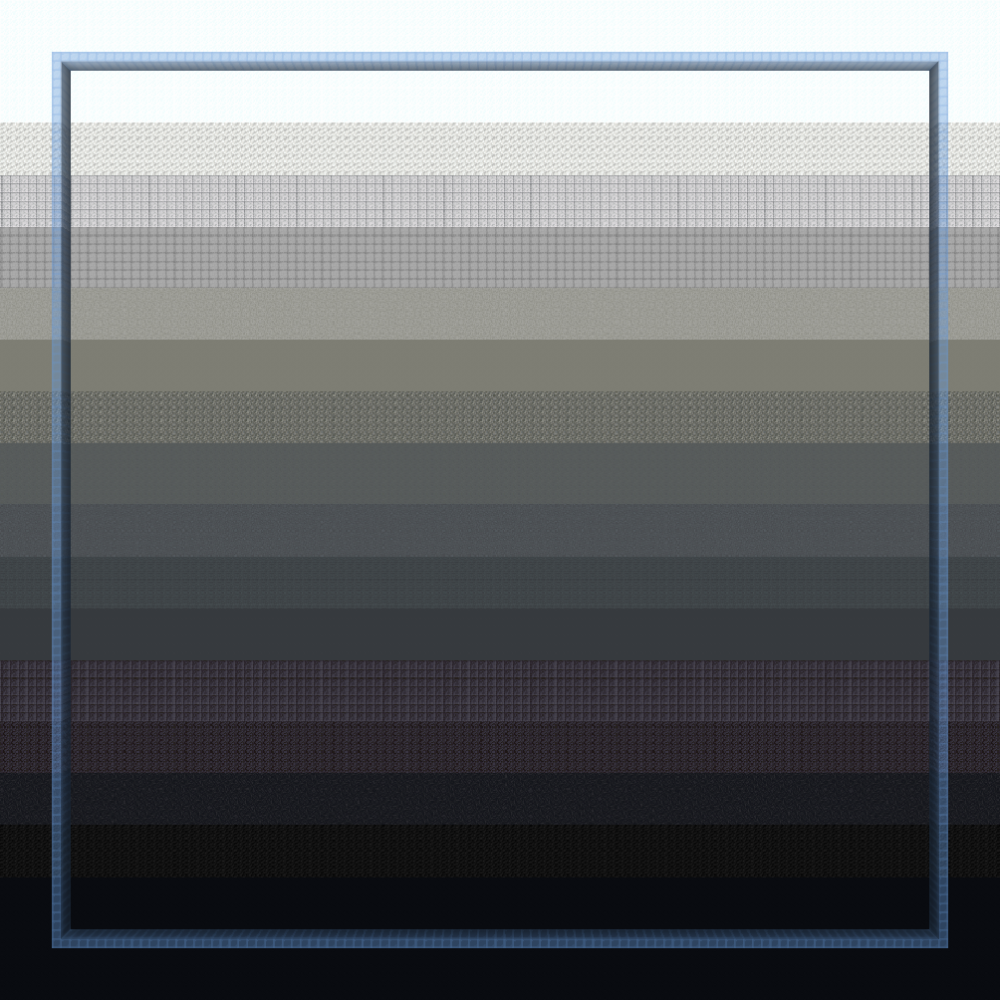
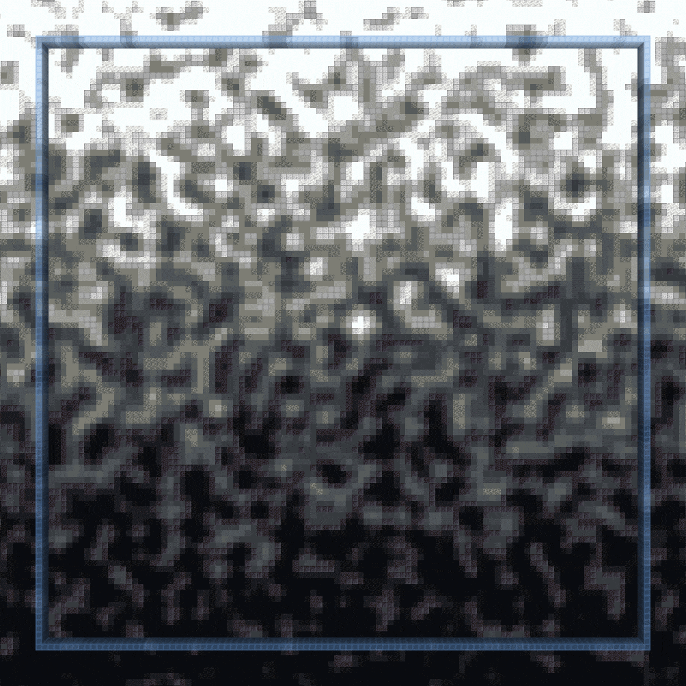
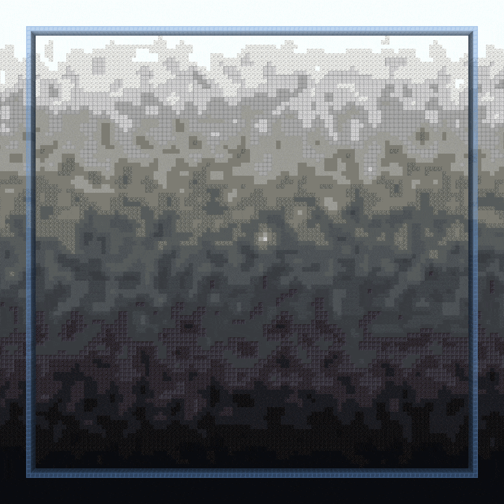
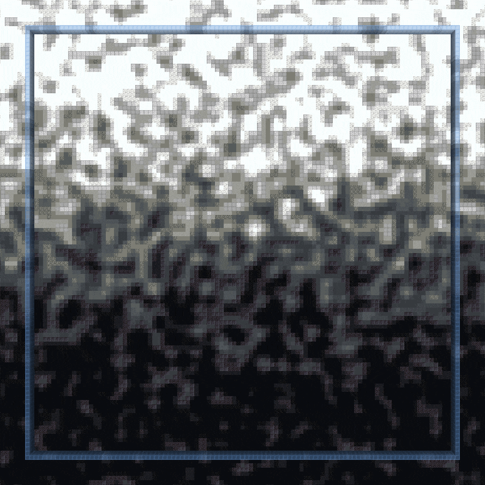

<!-- langmirror:chunk 0 -->
# 调色盘渐变笔刷 (Palette Gradient Brushes)

以下命令包含用于创建渐变的笔刷。

***

### `//ezbr` <mark style="color:orange;">`gradient`</mark>

<mark style="color:blue;">渐变笔刷 (Gradient Brush)</mark>

**`//ezbr gradient`` `**<mark style="color:orange;">**`<palette> [radius] [interpolation] [bleed] [-avw] [-n <noise>] [-z <scale>] [-d <distanceFunction>]`**</mark>

`gradient` 笔刷允许你先通过选择 2 个点来定义一个平面，然后你就可以使用渐变进行涂刷，方块将根据沿该平面的距离进行选择。

<mark style="color:blue;">**左键点击**</mark>**&#x20;在目标方块处开始定义平面**\
<mark style="color:blue;">**潜行 + 左键点击**</mark>**&#x20;在玩家位置处开始定义平面**\
<mark style="color:blue;">**右键点击**</mark>**&#x20;在目标方块处设置平面终点，如果平面已设置，则涂刷调色盘方块**\
<mark style="color:blue;">**潜行 + 右键点击**</mark>**&#x20;在玩家位置处设置平面终点，如果平面已设置，则涂刷调色盘方块**\
<mark style="color:blue;">**切手**</mark>**&#x20;（默认 F 键）在全局 (GLOBAL) 和单物品 (PER\_ITEM) 激活渐变之间切换**

<!-- langmirror:chunk 1 -->
* <mark style="color:orange;">**Palette**</mark>: 指定用于渐变的调色板。
* <mark style="color:orange;">**Radius**</mark> (默认值: 8): 设置刷子的半径。
* <mark style="color:orange;">**Interpolation**</mark> (默认值: NONE): 确定渐变过渡中使用的插值类型。
* <mark style="color:orange;">**Bleed**</mark> (默认值: 0.5): 调整插值强度，正常范围为 0 到 1。
* <mark style="color:orange;">**`-a`**</mark>: 激活后，渐变允许替换空气方块。
* <mark style="color:orange;">**`-v`**</mark>: 停用 WorldEditCUI 集成。
* <mark style="color:orange;">`-w`</mark>: 尝试使用最接近的现有材料为形状方块（台阶、楼梯等）设置纹理。
* <mark style="color:orange;">**`-n <noise>`**</mark> (默认值: `White()`): 为渐变效果添加基础噪声场。
* <mark style="color:orange;">**`-z <scale>`**</mark> (默认值: 1): 修改噪声的缩放比例。
* <mark style="color:orange;">**`-d <distanceFunction>`**</mark> (默认值: NONE): 设置距离模式，使刷子基于与初始方块的距离以及给定的距离函数进行工作。

***

### `//ezbr` <mark style="color:orange;">`gradientstroke`</mark>

<mark style="color:blue;">渐变笔触刷子 (Gradient Stroke Brush)</mark>

**`//ezbr gradientstroke`` `**<mark style="color:orange;">**`<palette> [radius] [interpolation] [bleed] [-advwx] [-n <noise>] [-z <scale>]`**</mark>

`gradientstroke` 刷子允许沿着通过选择点定义的路径（笔触）应用渐变。

<!-- langmirror:chunk 2 -->
<mark style="color:blue;">**左键点击**</mark>**&#x20;以添加点**\
<mark style="color:blue;">**潜行 + 左键点击**</mark>**&#x20;以移除最后一个点**\
<mark style="color:blue;">**右键点击**</mark>**&#x20;以确认并放置渐变描边**\
<mark style="color:blue;">**潜行 + 右键点击**</mark>**&#x20;以清除所有点**\
<mark style="color:blue;">**切换副手**</mark>**&#x20;（默认 F 键）以在 GLOBAL（全局）和 PER\_ITEM（单物品）激活渐变之间切换**

<!-- langmirror:chunk 3 -->
* <mark style="color:orange;">**Palette**</mark>: 指定渐变的方块调色盘。
* <mark style="color:orange;">**Radius**</mark> (默认: 8): 设置笔刷的半径。
* <mark style="color:orange;">**Interpolation**</mark> (默认: LINEAR): 确定渐变过渡中使用的插值类型。
* <mark style="color:orange;">**Bleed**</mark> (默认: 0.5): 调整插值的强度，正常范围为 0 到 1。
* <mark style="color:orange;">**`-a`**</mark>: 激活后，允许渐变替换空气方块。
* <mark style="color:orange;">**`-d`**</mark>: 激活“到中心的距离”模式，该模式根据到笔画中心线的距离（而非沿笔画的距离）应用渐变。
* <mark style="color:orange;">**`-v`**</mark>: 禁用 WorldEditCUI 集成。
* <mark style="color:orange;">`-w`</mark>: 尝试使用最接近的现有材料为形状方块（台阶、楼梯等）设置纹理。
* <mark style="color:orange;">**`-x`**</mark>: 在每次笔画放置后清除笔刷的路径。
* <mark style="color:orange;">**`-n <noise>`**</mark> (默认: `White()`): 为渐变效果添加基础噪声场。
* <mark style="color:orange;">**`-z <scale>`**</mark> (默认: 1): 修改噪声的缩放比例。

***

## 渐变参数

有几个创建渐变的参数值得详细说明。

### 溢色 (Bleed)

首先是 <mark style="color:orange;">**`bleed`**</mark> 参数。

溢色参数决定了颜色之间相互渗透的程度。

### 噪声 (Noise)

<!-- langmirror:chunk 4 -->
这种混合发生的模式可以由 <mark style="color:orange;">**`noise`**</mark> 决定。上方的 GIF 使用的是白噪声 (`-n White`)，而下方的 GIF 使用的是柏林噪声 (`-n Perlin(Freq:0.25)`)。

#### 你也可以输入任何噪声。以下是更多示例：

**`-n Perlin(Freq:0.25)`**

**`-n Cellular(Freq:0.15)`**

**`-n @@ridged(Freq:0.15)`**

**`-n Shard(Freq:0.15)`**

### 插值模式 (Interpolation Mode)

在下文中，我们对比了将噪声应用于渐变的五种不同 <mark style="color:orange;">**`interpolation modes`**</mark>。这些 GIF 展示了在 0 到 1 之间递增和递减的混合值 (bleed values)。

_蓝色方块的顶部和底部显示了渐变开始和结束的位置_

#### NONE（无）

不应用任何插值。

#### LINEAR（线性）

在整个渐变过程中以恒定因子应用噪声。正因如此，渐变会在选定的两个位置之外产生“截断”。

#### TAPERED（渐变收缩）

在渐变中间应用最强的噪声，并向开始和结束位置逐渐变弱，以避免在给定位置之外产生“截断”。

#### BEZIER（贝塞尔）

使用贝塞尔插值以更柔和、更平滑地应用噪声。当混合值 (bleed value) >1 时会失效。

#### SIN（正弦）

