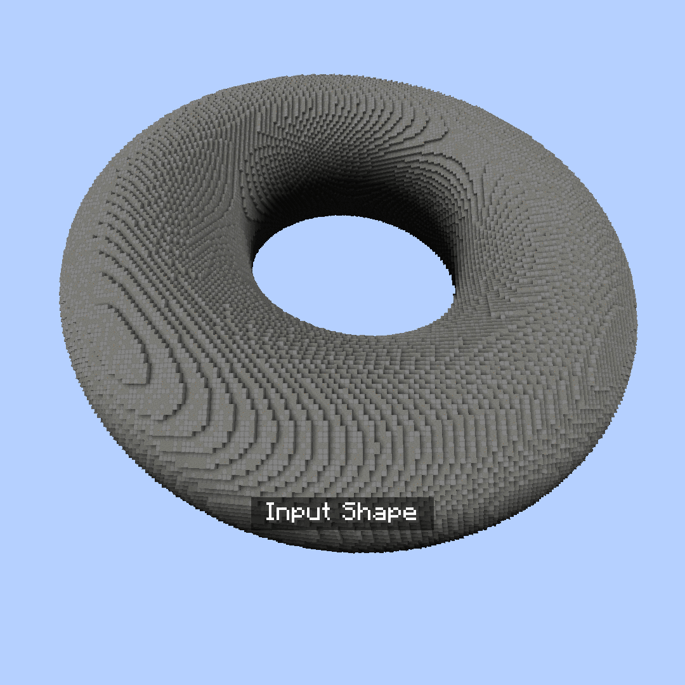
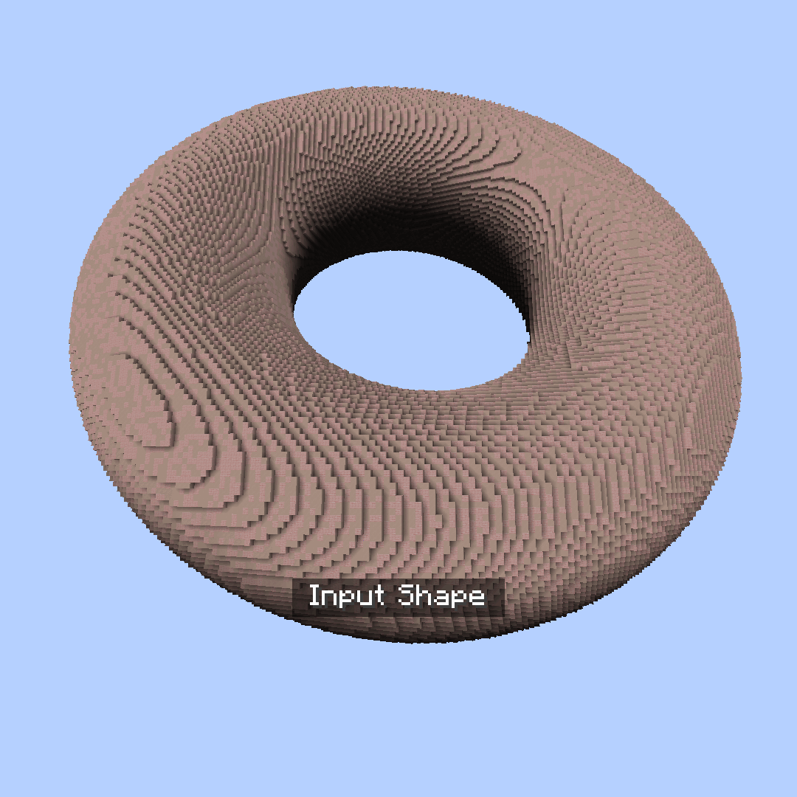
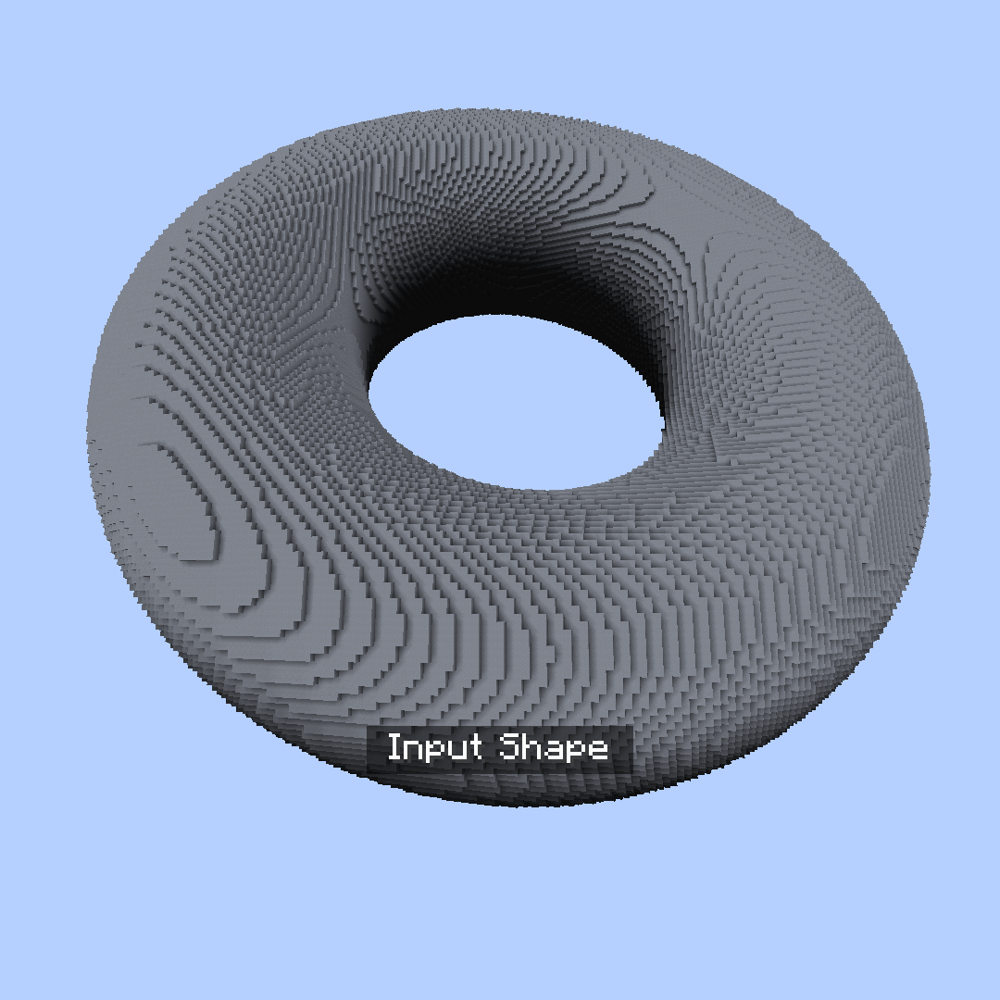
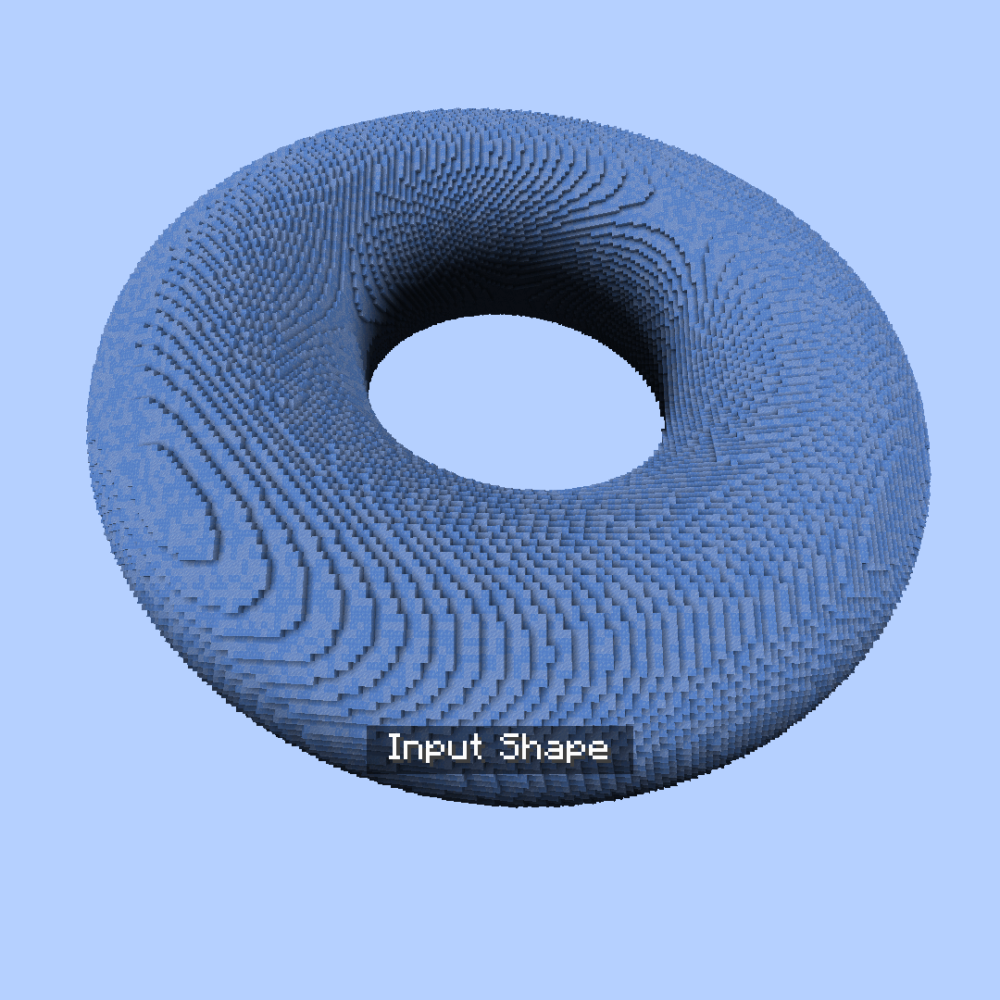
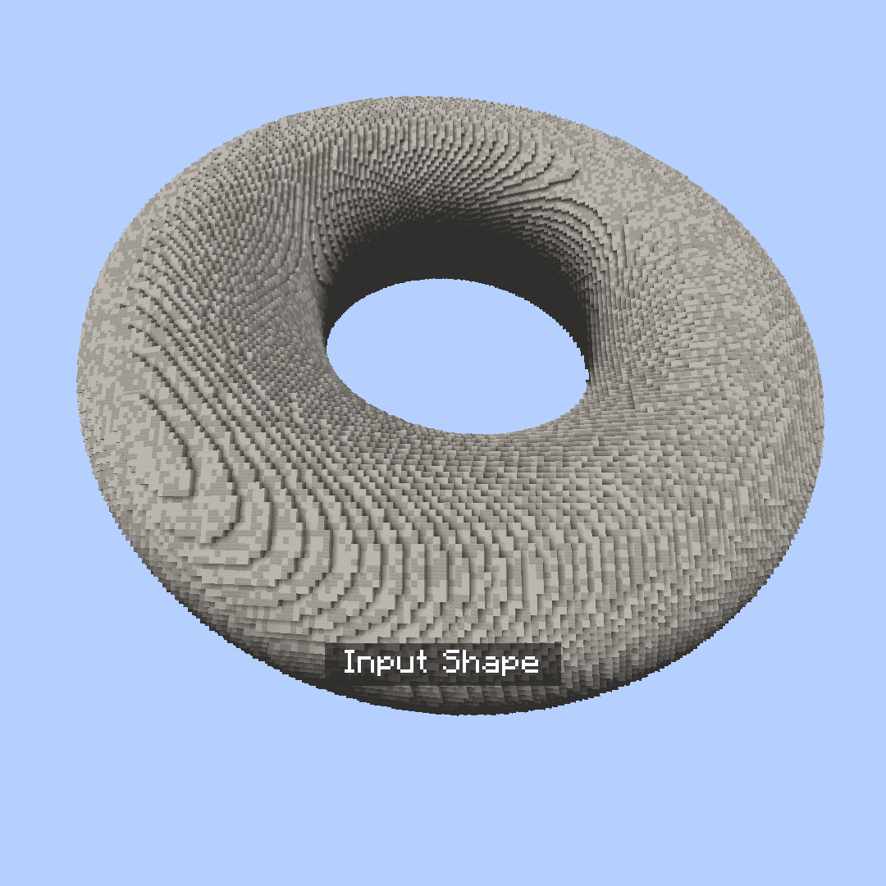
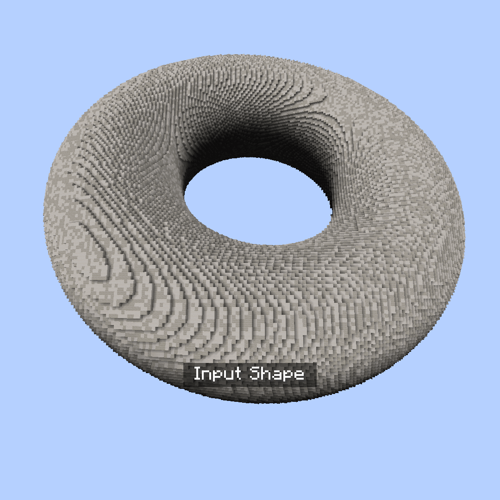

<!-- langmirror:chunk 0 -->
# 变形 (Deformation)

变形命令可将给定区域的内容变形为新的形状和形态。

所有子命令均位于 `//ezdeform` (`//ezd`) 之下\
例如 `//ezdeform hexagonalize`

***

## 子命令列表

***

#### 

### `//ezdeform`` `<mark style="color:orange;">`hexagonalize`</mark>

<mark style="color:blue;">六角形化 (Hexagonalize)</mark>

**`//ezdeform hexagonalize [`**<mark style="color:orange;">**`size`**</mark>**`] [`**<mark style="color:orange;">**`air_gap`**</mark>**`] [`**<mark style="color:orange;">**`x_rotation`**</mark>**`] [`**<mark style="color:orange;">**`z_rotation`**</mark>**`] [`**<mark style="color:orange;">**`offset_angle`**</mark>**`] [`**<mark style="color:orange;">**`-w <profile>`**</mark>**`]`**

将区域变形为六角柱。

* <mark style="color:orange;">**Size**</mark> (默认值: 12): 设置六角形的大小。

* <mark style="color:orange;">**Air Gap**</mark> (默认值: 0.0): 定义柱体之间的空气间隙宽度。

* <mark style="color:orange;">**X Rotation**</mark> (默认值: 0.0): 设置沿 X 轴的柱体旋转角度，单位为度。

* <mark style="color:orange;">**Z Rotation**</mark> (默认值: 0.0): 设置沿 Z 轴的柱体旋转角度，单位为度。

<!-- langmirror:chunk 1 -->
* <mark style="color:orange;">**Offset Angle**</mark> (默认值: 60.0): 调整偏移角度，控制形状（范围：0-90 度）。

* <mark style="color:orange;">**-w**</mark>: 参见 [Smoothblocks](../../smoothblocks/smoothblocks.md)。

***

#### 

### `//ezdeform`` `<mark style="color:orange;">`noise`</mark>

<mark style="color:blue;">Noise</mark>

**`//ezdeform noise <`**<mark style="color:orange;">**`noise`**</mark>**`> [`**<mark style="color:orange;">**`strength`**</mark>**`] [`**<mark style="color:orange;">**`-z <zoom>`**</mark>**`] [`**<mark style="color:orange;">**`-s <seed>`**</mark>**`] [`**<mark style="color:orange;">**`-w <profile>`**</mark>**`]`**

根据给定的噪声场变形区域。

* <mark style="color:orange;">**Noise**</mark>: 指定用于变形的噪声类型。

- <mark style="color:orange;">**Strength**</mark> (默认值: 2.0): 设置噪声效果的强度。

* <mark style="color:orange;">**Zoom**</mark> (默认值: 1): 决定噪声的缩放比例。

* <mark style="color:orange;">**-s \<seed>**</mark> (默认值: -1): 噪声模式的可选种子。
* <mark style="color:orange;">**-h**</mark>: 使用时，仅在水平方向上变形区域。

* <mark style="color:orange;">**-v**</mark>: 使用时，仅在垂直方向上变形区域。

<!-- langmirror:chunk 2 -->

* <mark style="color:orange;">**-w**</mark>: 参见 [Smoothblocks](../../smoothblocks/smoothblocks.md)。

***

#### 

### `//ezdeform`` `<mark style="color:orange;">`rotate`</mark>

<mark style="color:blue;">Rotate</mark>

**`//ezdeform rotate <`**<mark style="color:orange;">**`angle`**</mark>**`> [`**<mark style="color:orange;">**`-o`**</mark>**`] [`**<mark style="color:orange;">**`-w <profile>`**</mark>**`]`**

以选区中心（或使用 -o 时以玩家头部位置）为旋转中心，并以玩家准星方向为旋转轴，顺时针旋转区域。

* <mark style="color:orange;">**Angle**</mark>: 设置旋转角度，单位为度。

* <mark style="color:orange;">**-o**</mark>: 使用时，将玩家位置作为旋转中心，而非选区中心。
* <mark style="color:orange;">**-w**</mark>: 参见 [Smoothblocks](../../smoothblocks/smoothblocks.md)。

***

#### 

### `//ezdeform`` `<mark style="color:orange;">`voronoialize`</mark>

<mark style="color:blue;">Voronoialize</mark>

**`//ezdeform voronoialize [`**<mark style="color:orange;">**`size`**</mark>**`] [`**<mark style="color:orange;">**`air_gap`**</mark>**`] [`**<mark style="color:orange;">**`-s <seed>`**</mark>**`] [`**<mark style="color:orange;">**`-w <profile>`**</mark>**`]`**

<!-- langmirror:chunk 3 -->
将选区变形为随机分布的泰森多边形（Voronoi）单元。

* <mark style="color:orange;">**Size**</mark>（默认值：12）：决定泰森多边形单元的大小。

* <mark style="color:orange;">**Air Gap**</mark>（默认值：0.0）：指定单元之间的空气间隙宽度。

* <mark style="color:orange;">**-s \<seed>**</mark>（默认值：-1）：用于生成图案的可选种子。
* <mark style="color:orange;">**-w \<profile>**</mark>：参见 [Smoothblocks](../../smoothblocks/smoothblocks.md)。

***

#### 

### `//ezdeform` <mark style="color:orange;">`voronoialize2`</mark>

<mark style="color:blue;">备选泰森多边形化 (Alternative Voronoialize)</mark>

**`//ezdeform voronoialize2 <`**<mark style="color:orange;">**`amount`**</mark>**`> [`**<mark style="color:orange;">**`air_gap`**</mark>**`] [`**<mark style="color:orange;">**`-s <seed>`**</mark>**`] [`**<mark style="color:orange;">**`-r <uniformity>`**</mark>**`] [`**<mark style="color:orange;">**`-n <normalOffset>`**</mark>**`] [`**<mark style="color:orange;">**`-w <profile>`**</mark>**`]`**

将选区变形为沿表面形状分布的泰森多边形单元。相比于第一种 voronoialize，它能更准确地保留原始形状。

* <mark style="color:orange;">**Amount**</mark>：指定泰森多边形图案中的单元数量。数量越少单元自然越大，反之亦然。

<!-- langmirror:chunk 4 -->
* <mark style="color:orange;">**Air Gap**</mark> (默认值: 0.0): 决定单元格之间空气间隙的宽度。

* <mark style="color:orange;">**-s \<seed>**</mark> (默认值: -1): 用于生成图案的可选种子。`-1` 将随机生成种子。
* <mark style="color:orange;">**-r \<uniformity>**</mark> (默认值: 15): 设置 Voronoi 种子点的排斥迭代次数。0 表示完全随机。15 次迭代会带来更均匀/平整的外观。

* <mark style="color:orange;">**-n \<normalOffset>**</mark> (默认值: 5): 技术参数。调整单元格种子在形状中的定位深度。更大/更厚的形状可能受益于更大的数值。如果生成效果崩溃，较薄的形状应使用较小的数值。
* <mark style="color:orange;">**-w \<profile>**</mark>: 参见 [Smoothblocks](../../smoothblocks/smoothblocks.md)。

***

#### 

### `//ezdeform`` `<mark style="color:orange;">`voxelize`</mark>

<mark style="color:blue;">Voxelize (体素化)</mark>

<!-- langmirror:chunk 5 -->
**`//ezdeform voxelize <`**<mark style="color:orange;">**`scales`**</mark>**`> <`**<mark style="color:orange;">**`gap`**</mark>**`> <`**<mark style="color:orange;">**`distortion`**</mark>**`> [`**<mark style="color:orange;">**`-i <primary>`**</mark>**`] [`**<mark style="color:orange;">**`-j <secondary>`**</mark>**`] [`**<mark style="color:orange;">**`-s <seed>`**</mark>**`] [`**<mark style="color:orange;">**`-hv`**</mark>**`] [`**<mark style="color:orange;">**`-w <profile>`**</mark>**`]`**

将选区变形为较大的长方体形状（体素化）。

* <mark style="color:orange;">**Scales**</mark>（默认值：3）：设置长方体的缩放比例。&#x20;

你可以输入三个由逗号分隔的数值，以此定义每个轴的尺寸。 \

* <mark style="color:orange;">**Gap**</mark>（默认值：0.0）：定义体素之间空气间隙的宽度。

* <mark style="color:orange;">**Distortion**</mark>（默认值：0.0）：调整随机网格扭曲的强度（范围：0-1）。

- <mark style="color:orange;">**-s \<seed>**</mark>（默认值：-1）：扭曲的可选种子值。

* <mark style="color:orange;">**-i \<primary>**</mark>（默认值：y）：指定网格的 Y 轴方向。

<!-- langmirror:chunk 6 -->
* <mark style="color:orange;">**-j \<secondary>**</mark> (默认: -x): 指定网格的 x 轴方向。

* <mark style="color:orange;">**-h**</mark>: 使用时，仅进行水平体素化。

 

* <mark style="color:orange;">**-v**</mark>: 使用时，仅进行垂直体素化。

 

* <mark style="color:orange;">**-w**</mark>: 参见 [Smoothblocks](../../smoothblocks/smoothblocks.md)。

***