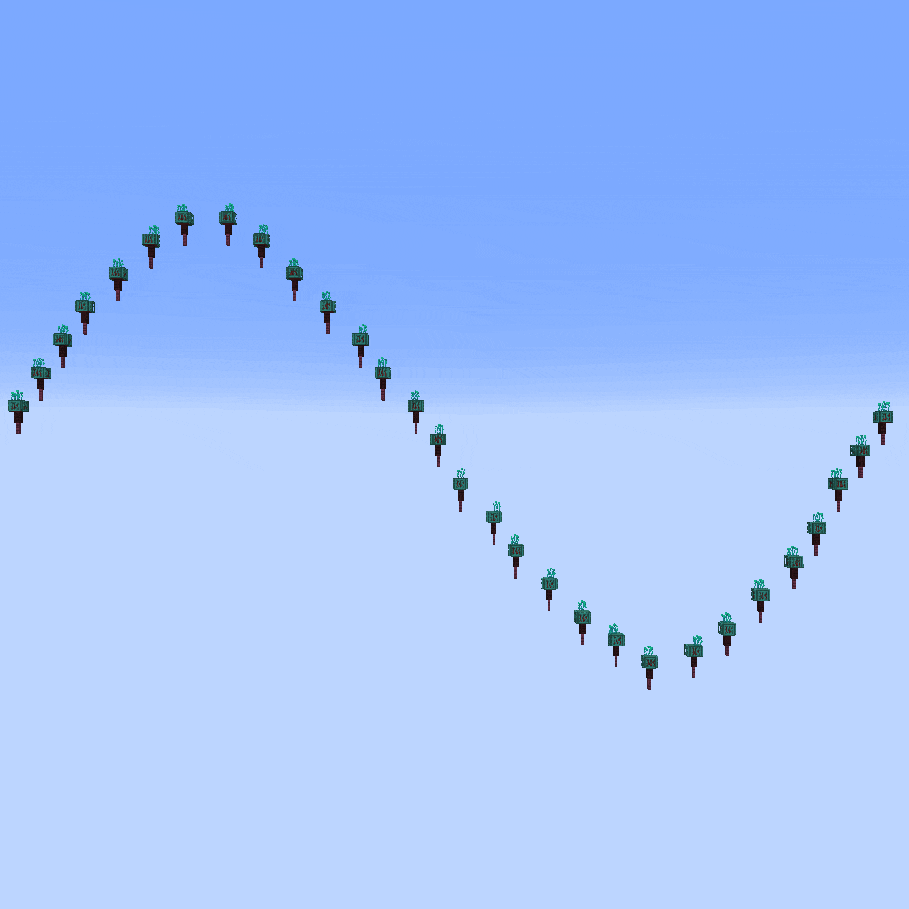

<!-- langmirror:chunk 0 -->
# 数组参数

[`//ezarray`](./#overview) 和 [`//ezbrush array`](./#overview) 沿着路径放置多个形状。以下参数适用于这些命令：

***

### 距离：<mark style="color:orange;">`-g <gap>`</mark> 

通过定义每个放置点之间的间隙距离，来控制所有放置点的紧密程度。

默认为 `0`。这意味着在直线上，每个放置点紧随前一个之后，没有间隙。

正值将增加该距离并减少总放置结构的数量。\
负值会导致放置点相互重叠。

<mark style="color:blue;">示例</mark>

` //ezarray Clipboard`` `` `**`-g <gap>`**（此处剪贴板内容恰好是一棵原版橡树，没有特定原因）

` //ezar Cl`` `` `**`-g 0`**：（默认值，放置点紧挨着彼此）

` //ezar Cl`` `` `**`-g 10`**：（放置点现在相距更远）

` //ezar Cl`` `` `**`-g -3`**（负值导致放置点重叠）

***

### 最大垂直偏移：<mark style="color:orange;">`-y <maxOffset>`</mark> 

允许你通过垂直移动放置位置，来限制相邻放置点之间的垂直距离。

专为生成跑酷（Jump'n'Runs）而设计。例如，通过设置 `-y 1`，每个放置位置永远不会比前一个位置高出超过 1 个方块。不过，这只是单向的上限。

（于 0.14.0 版本引入）

<mark style="color:blue;">示例</mark>

`//ezar Cl -g 1` 对比 `//ezar Cl -g 1` **`-y 1`**

<!-- langmirror:chunk 1 -->

***

### 渐进缩放：<mark style="color:orange;">`-q <radii>`</mark> 

与[随机缩放](placement-parameters.md#random-scaling-o)类似，此修正符允许使用相对值对放置物进行缩放，例如：1 保持原样，2 将尺寸翻倍，0.5 将尺寸减半。

缩放因子被定义为沿样条曲线的渐进过程。这意味着你可以根据需要指定任意数量的、以逗号分隔的缩放因子，样条路径将在所有条目之间进行平滑插值。

语法与 //ezspline 中相同：[#radii](../spline/common-parameters.md#radii "mention")

<mark style="color:blue;">示例</mark>

` //ezarray Clipboard`` `` `**`-q <radii>`**

` //ezar Cl`` `` `**`-q 1`**

（默认值，不应用缩放）

` //ezar Cl`` `` `**`-q 0.3,3`**

（放置物在路径开始时被缩小到 0.3 倍，并随着样条路径向末端移动而缓慢变大，直到达到原始尺寸的三倍）

` //ezar Cl`` `` `**`-q 1.5,0.5,5.0,2.0,0.2`**

（树在整个样条路径中按照给定的数值进行渐进缩放）

` //ezar Cl`` `` `**`-q 1.5,0.5,5.0,2.0,0.2 -o 0.7,1.3`**

（将渐进缩放 -q 与[随机缩放](placement-parameters.md#random-scaling-o) -o 结合使用）

<!-- langmirror:chunk 2 -->

***

### 路径参数：<mark style="color:orange;">`-p <kbParameters>`</mark> 

修改从输入（凸选区）点创建路径的方式。

参阅 //ezspline 文档：[#kb-parameters](../spline/common-parameters.md#kb-parameters "mention")

***

### 样条线朝向：<mark style="color:orange;">`-n <normalMode>`</mark> 

修改 `<primary>` 和 `<secondary>` 参数中 ORTHOGONAL 选项的行为方式。

参阅 //ezspline 文档：[#normal-mode](../spline/common-parameters.md#normal-mode "mention")

<mark style="color:blue;">示例</mark>

`//ezarray Clipboard Orthogonal Constant`**`-n <normalMode>`**

` //ezar Cl O C`` `` `**`-n CONSISTENT`**

（默认值）

` //ezar Cl O C`` `` `**`-n UPRIGHT`**

（放置物不再那么倾斜）

***

### 吸附放置物至表面：<mark style="color:orange;">`-b`</mark> 

默认情况下，结构是沿着由输入（凸选区）点引导的样条路径放置的。此标志会将放置位置移动到最近的表面方块，以防路径上的位置处于半空中或埋在方块内。


默认的最大搜索范围为 96 个方块。最大搜索范围可以在配置文件中设置。如果在该范围内未找到表面方块，则将使用原始位置。


<mark style="color:blue;">示例</mark>

对比 GIF

`//ezarray Clipboard`（放置物沿路径排列）

` //ezarray Clipboard`` `` `**`-b`**（放置位置移动到最近的表面方块）

***