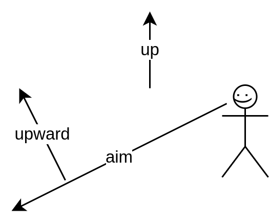
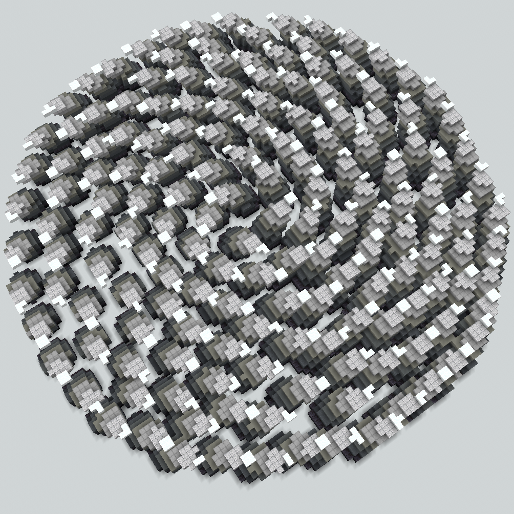
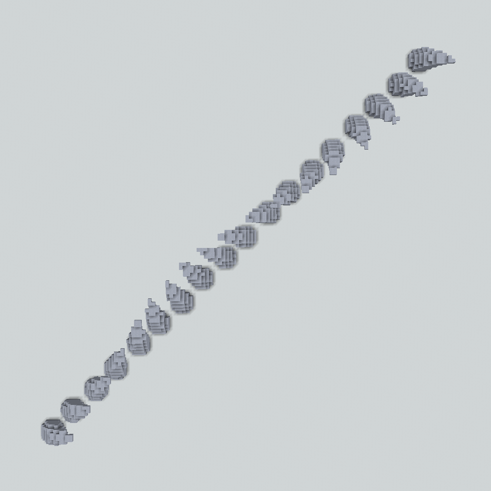
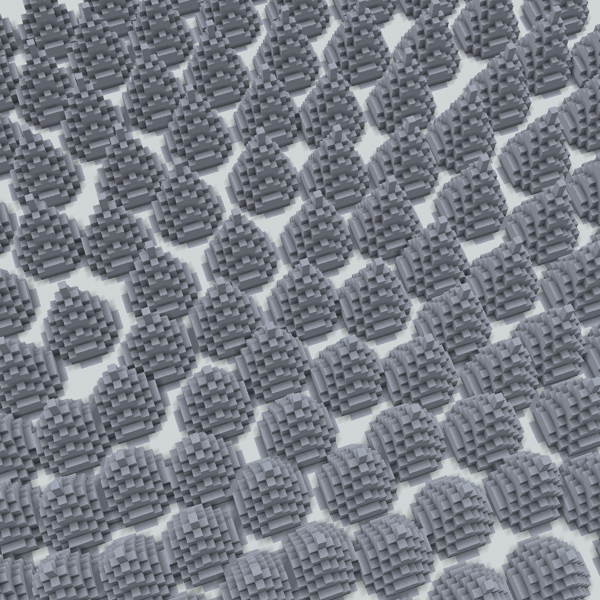
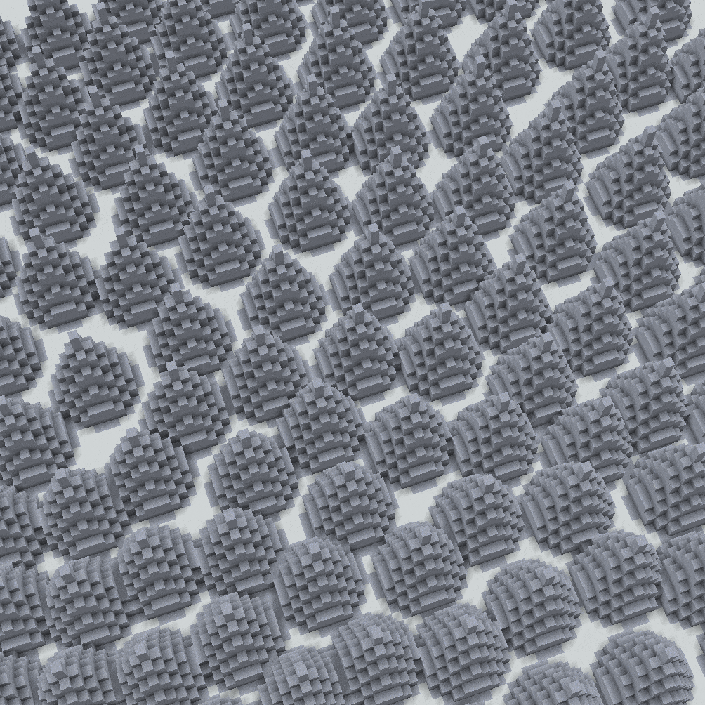

<!-- langmirror:chunk 0 -->
# 主方向+次方向对齐 (Primary+Secondary Alignment)

这两个对齐方向定义了结构放置时的*朝向 (orientation)*。

## 解释

每个结构都有一个固有的“向上”方向和一个固有的“向前”方向。默认情况下，结构在放置时其向上方向朝向（嗯，就是）上方 (+y)，其向前方向朝向前方 (+x)。

最重要的一点是，现在你可以通过定义其向上方向和向前方向的指向，来控制结构的放置方式。

我们允许用户使用两个方向来定义对齐：


**`<primary>`**（主）方向*定义*了放置后的 +y 方向。

**`<secondary>`**（次）方向*暗示*了放置后的 +x 方向。在所有垂直于主方向的方向中，所选的 +x 方向是与给定的次方向最接近的那一个。

注意：主方向和次方向不能是同一个方向。


<mark style="color:blue;">结合示例的深入解释：</mark>

假设这是我们要放置的建筑，例如它目前处于我们的 WorldEdit 剪贴板中。

作为参考，红色光束指向正 x 方向（东），蓝色光束指向正 z 方向（南），绿色光束指向正 y 方向（上）。

我们现在想使用任何 ezEdits 结构命令以各种朝向来放置它。为此，我们可以定义一个 `<primary>` 和一个 `<secondary>` 方向。让我们通过几个针对这些参数赋值的示例，尝试理解发生了什么：

我们将 `<primary>` 设置为 `up`，将 `<secondary>` 设置为 `east`（你会为此使用 [Constant](primary+secondary-alignment.md#constant) 模式。）（这些方向是默认方向）：

我们的形状以与复制时完全相同的朝向进行粘贴。向上仍然是向上，向右仍然是向右，以此类推。

现在，考虑以下三个示例：

1. **`<primary>`** 设置为 **`south`**，而 `<secondary>` 保持为 `east`：

<!-- langmirror:chunk 1 -->

请注意，在复制时原本朝向“上方”的部分（即本例中的绿色光束），现在指向了我们设置的主方向（primary）：*正南*（south）。与此同时，原本朝向*正东*（east）的部分，依然指向*正东*。作为这次 90° 旋转的结果，蓝色光束现在指向下方。

2. **`<primary>`** 被设置为向量 **`(0,1,1)`**，即指向“对角线”向上且向南的方向，而 `<secondary>` 被设置为 `east`：

再次注意，在复制时原本朝向“上方”的部分（即本例中的绿色光束），现在指向了我们设置的主方向：*对角线向上且向南*。

3. **`<primary>`** 被设置为向量 **`(1,1,0)`**，即指向对角线向上且向**东**的方向，而 `<secondary>` 被设置为 `east`：

绿色光束正确地指向了主方向，即对角线向上且向东。无论我们在 //copy 剪贴板时什么东西指向*上方*，它始终会与主方向（primary）所设置的任何方向对齐！

但现在，尽管次方向（secondary）被设置为 *east*，红色光束不再直接指向正东（而是对角线向下且向东）。这是预期的行为。

设想一下如果它指向正东：那么绿色和红色光束之间的夹角将变成 45°，而不是原始的 90°。我们的结构将会变形、弯曲或产生剪切。

因此，我们决定实现的逻辑是：在我们将结构的 +y 方向与给定的主方向对齐的同时，我们不会直接将结构的 +x 方向与给定的次方向对齐，而是选择一个与给定次方向最接近、但仍与主方向保持垂直的方向。

所以，如果主方向和次方向不完全垂直（如上例所示），次方向将被替换为最接近且依然保持垂直的向量！

<!-- langmirror:chunk 2 -->
仅供参考，这是一个展示在给定主方向下，其余垂直次要方向的演示 GIF：

最后一个例子：

**`<primary>`**（主方向）被设置为向量 **`(-1,2,-1)`**，即一个指向上方和西北的方向，而 **`<secondary>`**（次要方向）被设置为 **`west`**：

如你所见，绿色光束（即我们复制时建筑原始的上方）现在指向了我们指定的 `northwest+2*up` 方向；而红色光束（即我们复制时原始的东方）现在则在保持与主方向垂直的前提下，尽可能地指向了 `west`。

所有这些规则都独立于你当前的剪贴板内容。这是另一个处于原始朝向的结构，以及紧随其后的、按照前述示例进行对齐放置后的效果。

你能理解为什么将主方向设置为 `(-1,2-1)` 并将次要方向设置为 `west` 会导致叶子呈现出那样的朝向吗？

***

顺便提一下，所使用的命令是：

`//ezbrush place Clipboard Constant(Direction:(-1,2,-1)) Constant(Direction:west)`

或者，如果你喜欢缩写：

`//ezbr pl Cl C(D:(-1,2,-1)) C(D:west)`

通过这套主+次方向系统，我们希望你能针对任何场景下的结构放置，轻松快速地构建出理想的 3D 朝向。

***

## 概览 (Overview)

主方向和次方向可以设置为：

<!-- langmirror:chunk 3 -->
<table data-view="cards" data-full-width="false"><thead><tr><th>名称</th><th>缩写</th><th>描述</th><th data-hidden data-card-target data-type="content-ref"></th></tr></thead><tbody><tr><td><a href="primary+secondary-alignment.md#constant"><strong><code>Constant</code></strong></a></td><td><strong><code>C</code></strong></td><td>为所有放置显式设置一个恒定的方向。</td><td><a href="primary+secondary-alignment.md#constant">#constant</a></td></tr><tr><td><a href="primary+secondary-alignment.md#random"><strong><code>Random</code></strong></a></td><td><strong><code>R</code></strong></td><td>为每个放置设置随机方向。</td><td><a href="primary+secondary-alignment.md#random">#random</a></td></tr><tr><td><a href="primary+secondary-alignment.md#noise"><strong><code>Noise</code></strong></a></td><td><strong><code>N</code></strong></td><td>基于放置位置的噪声函数计算结果来确定方向。</td><td><a href="primary+secondary-alignment.md#noise">#noise</a></td></tr><tr><td><a href="primary+secondary-alignment.md#aim"><strong><code>Aim</code></strong></a></td><td><strong><code>A</code></strong></td><td>你的玩家准星指向。</td><td><a href="primary+secondary-alignment.md#aim">#aim</a></td></tr><tr><td><a href="primary+secondary-alignment.md#upward"><strong><code>Upward</code></strong></a></td><td><strong><code>U</code></strong></td><td>相对于你的准星方向最为向上的垂直方向。</td><td><a href="primary+secondary-alignment.md#upward">#upward</a></td></tr><tr><td><a href="primary+secondary-alignment.md#playerrelative"><strong><code>PlayerRelative</code></strong></a></td><td><strong><code>P</code></strong></td><td>从放置位置指向当前玩家位置的方向。</td><td><a href="primary+secondary-alignment.md#playerrelative">#playerrelative</a></td></tr><tr><td><a href="primary+secondary-alignment.md#surfacenormal"><strong><code>SurfaceNormal</code></strong></a></td><td><strong><code>S</code></strong></td><td>放置位置所在区域的近似表面法线方向。</td><td><a href="primary+secondary-alignment.md#surfacenormal">#surfacenormal</a></td></tr><tr><td><a href="primary+secondary-alignment.md#viewdiff"><strong><code>ViewDiff</code></strong></a></td><td><strong><code>V</code></strong></td><td>通过两次点击定义一个方向。仅限笔刷使用。</td><td><a href="primary+secondary-alignment.md#viewdiff">#viewdiff</a></td></tr><tr><td><a href="primary+secondary-alignment.md#expression"><strong><code>Expression</code></strong></a></td><td><strong><code>E</code></strong></td><td>通过针对每个放置位置的表达式定义方向。</td><td><a href="primary+secondary-alignment.md#expression">#expression</a></td></tr><tr><td><a href="primary+secondary-alignment.md#tangential"><strong><code>Tangential</code></strong></a></td><td><strong><code>T</code></strong></td><td>路径的切线方向。仅限数组使用。</td><td><a href="primary+secondary-alignment.md#tangential">#tangential</a></td></tr><tr><td><a href="primary+secondary-alignment.md#orthogonal"><strong><code>Orthogonal</code></strong></a></td><td><strong><code>O</code></strong></td><td>路径的法线（正交）方向。仅限数组使用。</td><td><a href="primary+secondary-alignment.md#orthogonal">#orthogonal</a></td></tr><tr><td><a href="primary+secondary-alignment.md#mixed"><strong>Mixed</strong></a></td><td>-</td><td>使用权重列表混合并组合任何其他对齐（Alignment）模式。</td><td><a href="primary+secondary-alignment.md#mixed">#mixed</a></td></tr></tbody></table>

<!-- langmirror:chunk 4 -->
***

## Settings

***

### Constant

为所有放置操作显式设置一个恒定的方向。

语法：<mark style="color:orange;">**`Constant`**</mark> 或 <mark style="color:orange;">**`Constant(Direction:<direction>)`**</mark>

缩写：<mark style="color:orange;">**`C`**</mark> 或 <mark style="color:orange;">**`C(D:<direction>)`**</mark>

如果你没有指定 `<direction>`，那么：

* 如果你正在设置 `<primary>`，默认方向为 **+y**。
* 如果你正在设置 `<secondary>`，默认方向为 **+x**。

有多种方式可以定义方向。从使用轴、罗盘方向、向量表示法，到使用玩家相对方向（如 forward、left、right 等）。专业提示：你还可以使用简单的算术运算符将方向相加，例如 `east-z+(0,0.5,0)`。专业提示²：在末尾输入 `=` 可以在输入时实时计算你的方向表达式。

<mark style="color:blue;">示例</mark>

`//ezsc Clipboard C(D:(0,2,0)) C(D:east)`

`//ezsc Clipboard C(D:(-1,2,-1)) C(D:east)`

`//ezsc Clipboard C(D:(-1,2,-1)) C(D:-aim)`

***

### Random

为每次放置操作分配随机方向。

语法：<mark style="color:orange;">**`Random`**</mark>

缩写：<mark style="color:orange;">**`R`**</mark>

<mark style="color:blue;">示例</mark>

`//ezsc Clipboard Constant Random`

<!-- langmirror:chunk 5 -->
此处仅将 `<secondary>` 设置为 Random，primary 仍保持向上。请注意我们结构的向上方向（绿色光束）如何保持向上（primary 设置为 up），但由于 secondary 是随机的，每次放置都会绕着 primary（在本例中为 y 轴）随机旋转。

`//ezsc Clipboard Random Constant`

仅将 `<primary>` 设置为 Random，secondary 仍保持向东。地形已替换为玻璃以便观察。请注意绿色光束现在指向各种方向，但所有放置的红色光束大致都指向东方。

`//ezsc Clipboard Random Random`

如果我们将两者都设置为 Random，就会得到真正的随机混沌。

***

### Noise

方向基于放置位置处噪声函数的计算结果。

语法：<mark style="color:orange;">**`Noise`**</mark> 或 <mark style="color:orange;">**`Noise(Noise:<noise>)`**</mark>

缩写：<mark style="color:orange;">**`N`**</mark> 或 <mark style="color:orange;">**`N(N:<noise>)`**</mark>

默认的 `<noise>` 为 `Perlin(Freq:0.01)`。

<mark style="color:blue;">示例</mark>

`//ezsc Clipboard Constant Noise`

* 俯视截图
* `<primary>` 仍为 up，仅将 `<secondary>` 设置为 Noise。
* 默认噪声为 Perlin 噪声。

`//ezsc Clipboard Constant Noise(N:Vor(Freq:0.02,DistReturn:cell))`

* 与上述场景相同，但使用的是 [细胞噪声 (Cellular Noise)](https://en.wikipedia.org/wiki/Voronoi_diagram#/media/File:Coloured_Voronoi_3D_slice.svg)。
* 你可以观察到每个细胞如何拥有其独特的随机方向。

<!-- langmirror:chunk 6 -->
***

### Aim (准星)

玩家的准星指向。

语法：<mark style="color:orange;">**`Aim`**</mark>

缩写：<mark style="color:orange;">**`A`**</mark>

注意：对于笔刷，`Constant(Direction:aim)` 将使用笔刷绑定时玩家的准星方向，而 `Aim` 将在每次执行笔刷动作时使用玩家当时的准星方向。

<mark style="color:blue;">示例</mark>

`//ezsc Clipboard Aim Constant`

如果我们将 `<primary>` 设置为 `Aim`，那么我们建筑的上方向（示例中为绿色光束）将与玩家当前的准星方向对齐。

图片中包含了我的玩家模型以供参考。那是我执行命令时的观察方向。_准星方向在 F3+B 模式下以细蓝线可视化显示_

***

### Upward (向上)

与你的准星方向垂直且最偏向上的方向。

语法：<mark style="color:orange;">**`Upward`**</mark>

缩写：<mark style="color:orange;">**`U`**</mark>

<mark style="color:blue;">图解</mark>

***

### PlayerRelative (玩家相对)

从放置位置指向当前玩家位置的方向。

语法：<mark style="color:orange;">**`PlayerRelative`**</mark>

缩写：<mark style="color:orange;">**`P`**</mark>

<mark style="color:blue;">示例</mark>

`//ezsc Clipboard PlayerRelative Constant`

如果你将 `<primary>` 设置为 `PlayerRelative`，那么每个建筑在放置时，其上方向都会指向你的玩家位置。

如果你仔细看，可以在图片中看到我的玩家模型。那是我执行命令的位置。

<!-- langmirror:chunk 7 -->

`//ezbr place Shape(S:Cone,P:diamond_block) PlayerRelative Constant -s 12,36,12`

***

### SurfaceNormal

放置位置所在区域的近似表面法线。

语法：<mark style="color:orange;">**`SurfaceNormal`**</mark>

缩写：<mark style="color:orange;">**`S`**</mark>

这里的[法线](https://en.wikipedia.org/wiki/Normal_\(geometry\))是指垂直于相关地形的方向。

<mark style="color:blue;">示例</mark>

`//ezbr place Shape(P:57,S:Cone) SurfaceNormal Constant -s 12,36,12`

当您手持笔刷时，可以看到我们的游戏内对齐可视化器会根据您所观察的地形部分动态地调整自身方向。

***

### ViewDiff

通过两次点击定义一个方向。仅适用于笔刷。

语法：<mark style="color:orange;">**`ViewDiff`**</mark>

缩写：<mark style="color:orange;">**`V`**</mark>

每次放置都需要一次右键点击和一次左键点击。第一次右键点击将放置位置设定在目标方块上。随后在其他地方左键点击即可定义一个方向：从您第一次（右键）点击的目标位置指向您第二次（左键）点击的位置。

<mark style="color:blue;">示例</mark>

`//ezbr place Clipboard SurfaceNormal ViewDiff`

在这里，我将主方向设置为 SurfaceNormal，并通过 ViewDiff 模式以第二次点击来控制次方向。请注意我的手部动作。您可以看到我在右键和左键点击之间交替。右键点击设定放置位置，左键点击设定 ViewDiff 方向。我们的游戏内对齐可视化器会根据您的移动和操作进行动态更新。

<!-- langmirror:chunk 8 -->

`//ezbr place Shape(S:Torus(Thickness:0.4),P:57) PlayerRelative ViewDiff -s 20,20,30 -k x -c 90`

这个圆环形状需要更多一些参数，所以这个示例比平时稍长。但需要注意的是，主对齐（Primary）被设置为 PlayerRelative，这意味着圆环的顶部始终面向玩家；而次对齐（Secondary）被设置为 ViewDiff，这意味着最终的方向由第二次点击决定。在这里，每次右键点击后，我交替在放置位置的上方和左/右侧进行左键点击，从而创建了一个相互连接的链条。

***

### Expression (表达式)

通过对每个放置位置应用表达式来定义方向。

语法：<mark style="color:orange;">**`Expression(Expression:=<expression>,Space:<space>)`**</mark>

缩写：<mark style="color:orange;">**`E(E:=<expression>,S:<space>)`**</mark>

必填参数：

* <mark style="color:orange;">**`Expression`**</mark> **(**<mark style="color:orange;">**`E`**</mark>**)**：为空间中的每个位置定义一个 3D 向量的表达式。
  * 输入变量为 <mark style="color:blue;">`x`</mark>、<mark style="color:blue;">`y`</mark>、<mark style="color:blue;">`z`</mark>。
  * 输出变量为 <mark style="color:blue;">`rx`</mark>、<mark style="color:blue;">`ry`</mark>、<mark style="color:blue;">`rz`</mark>。
  * 对于每次放置，表达式将根据相应的放置位置进行计算，其结果将用于放置的对齐。

可选参数：

<!-- langmirror:chunk 9 -->
* <mark style="color:blue;">**`Space`**</mark>**&#x20;(**<mark style="color:blue;">**`S`**</mark>**)**: 定义输入变量的域。
  * 默认为 <mark style="color:blue;">`WORLD`</mark>。
  * <mark style="color:blue;">`WORLD`</mark>: 放置位置。x, y, z 使用世界坐标。
  * <mark style="color:blue;">`LOCAL`</mark>: 当用于...
    * ezplace: 始终为 0,0,0。
    * ezscatter: 坐标经过偏移，使得区域中心为 0,0,0。
    * ezarray: x=y=0。路径起点 z=0，路径终点 z=L，其中 L 为路径长度。
  * <mark style="color:blue;">`NORMALIZED`</mark>: 当用于...
    * ezplace: 始终为 0,0,0。
    * ezscatter: 坐标相对于区域归一化，使得 x,y,z ∈ \[-1,1]。
    * ezarray: x=y=0。路径起点 z=0，路径终点 z=1。

<mark style="color:blue;">示例</mark>

`//ezsc TS(P:##Grayscale,S:Fur,T:=y) C Ex(E:"=rx=z;rz=-x",S:N)`

* <mark style="color:blue;">`TS(P:##Grayscale,S:Fur,T:=y)`</mark> 是一个灰度渐变的毛皮形状。
* <mark style="color:blue;">`C`</mark>，主方向，使用默认的向上方向。
* <mark style="color:blue;">`Ex(E:"=rx=z;rz=-x",S:N)`</mark> 将副方向设置为 (z,0,-x)，其中 x,z 是归一化后的放置位置坐标。

<!-- langmirror:chunk 10 -->
`//ezar Sh(S:Fur,P:clay) C E(E:"=rx=sin(2*pi*z);rz=cos(2*pi*z)",S:N) -g -12`

这个例子展示了在使用归一化模式时，z 坐标如何沿路径从 0 到 1 变化。

***

### 切线 (Tangential)

沿路径的切线方向。仅用于数组（arrays）。

语法：<mark style="color:orange;">**`Tangential`**</mark>

缩写：<mark style="color:orange;">**`T`**</mark>

<mark style="color:blue;">示例</mark>

`//ezarray Clipboard Tangential Constant -g 11 -o 2`

*Tangential* 方向指向放置位置处样条路径的切线方向。如果你将主方向设置为 *Tangential*，形状的顶部将沿样条线指向，如下所示。

***

### 正交 (Orthogonal)

与路径正交的方向。仅用于数组（arrays）。

语法：<mark style="color:orange;">**`Orthogonal`**</mark> 或 <mark style="color:orange;">**`Orthogonal(Angle:<angle>)`**</mark>

缩写：<mark style="color:orange;">**`O`**</mark> 或 <mark style="color:orange;">**`O(A:<angle>)`**</mark>

以度数给出的角度定义了正交方向的初始方向，其中 0° 和 360° 将朝上，90° 和 270° 朝左和朝右，而 180° 朝下（至少在样条线的第一部分是这样。如果法线模式设置为默认的 CONSISTENT，它可能会在后续路径中发生扭转）。

<mark style="color:blue;">示例</mark>

`//ezarray Clipboard Orthogonal Constant`

<!-- langmirror:chunk 11 -->
_Orthogonal_（正交）方向指向放置位置处垂直于样条曲线路径的方向。如果你将主方向设置为 _Orthogonal_，形状的顶部将像这样垂直于样条曲线路径。

这是一个演示 `<angle>` 参数的 GIF：

`//ezarray Clipboard Orthogonal Constant -n HORIZONTAL`

[-n 标志](array-parameters.md#spline-orientation-n)对正交方向有直接影响。

***

### Mixed（混合）

你可以使用权重列表组合任意数量的其他对齐模式：

语法：<mark style="color:orange;">`<weight1>%<alignment1>,<weight2>%<alignment2>,...`</mark>

对齐方向将根据给定的权重进行缩放并相加。

<mark style="color:blue;">示例</mark>

`//ezsc Sh(P:clay,S:Cone)`` `**`Constant`**` ``-s 11,30,11 -n 1`

（供参考）

`//ezsc Sh(P:clay,S:Cone)`` `**`10%C,10%R`**` ``-s 11,30,11 -n 1`

GIF 依次展示：

* `10%Constant`
* `10%Constant,1%Random`
* `10%Constant,2%Random`
* ...
* `10%Constant,10%Random`

***

## Parameters（参数）

以下标志用于调整对齐方式的计算方式。

***

### 吸附至特定方向：<mark style="color:orange;">`[-j <snapDirections>]`</mark> 

<!-- langmirror:chunk 12 -->
此参数允许您将选择的对齐方向限制在指定的子集中。例如，吸附到/仅允许基准方向（即 90° 旋转）。

可用选项：

* <mark style="color:orange;">**`MULTIPLES_90`**</mark>
  * 仅允许 90° 的倍数，即所有轴向对齐的方向。
* <mark style="color:orange;">**`MULTIPLES_45`**</mark>
  * 仅允许 45° 的倍数，即轴向对齐方向以及所有完美的对角线方向。
* <mark style="color:orange;">**`MULTIPLES_22_5`**</mark>
  * 仅允许 22.5° 的倍数。
* <mark style="color:orange;">**`MULTIPLES_15`**</mark>
  * 仅允许 15° 的倍数。
* <mark style="color:orange;">**`DIAGONALS_1_1`**</mark>
  * 仅允许轴向对齐方向，以及完美的“1:1”对角线。
* <mark style="color:orange;">**`DIAGONALS_2_1`**</mark>
  * 仅允许 <mark style="color:orange;">`DIAGONALS_1_1`</mark> 方向以及任何“2:1”对角线。
* <mark style="color:orange;">**`DIAGONALS_3_1`**</mark>
  * 仅允许 <mark style="color:orange;">`DIAGONALS_2_1`</mark> 方向以及任何“3:1”对角线。
* <mark style="color:orange;">**`DIAGONALS_4_1`**</mark>
  * 仅允许 <mark style="color:orange;">`DIAGONALS_3_1`</mark> 方向以及任何“4:1”对角线。
* <mark style="color:orange;">**`DIAGONALS_5_1`**</mark>
  * 仅允许 <mark style="color:orange;">`DIAGONALS_4_1`</mark> 方向以及任何“5:1”对角线。

<mark style="color:blue;">示例</mark>

`//ezbrush Cl Constant ViewDiff -j MULTIPLES_45`

<!-- langmirror:chunk 13 -->

***

### 扰动次要方向：<mark style="color:orange;">\[-x]</mark> 

在我们的“主要+次要”系统中，如果两个向量共线（即它们处于同一直线上），放置将会失败。

通过启用此标志，ezEdits 会尝试通过对次要方向进行微小扰动来规避这种情况。

***