<!-- langmirror:chunk 0 -->
# 散布参数 (Scatter Parameters)

[`//ezscatter`](./#overview) 和 [`//ezbrush scatter`](./#overview) 用于在区域内放置多个结构。这些命令选择的位置可以通过本页描述的参数进行自定义。

`scatter` 首先从由 `-h <region>` 定义的区域中提取所有表面方块（所有与空气接触的非空气方块）。你可以使用 `-d <directions>` & `-e <threshold>` 以及 `-m <mask>` 来过滤掉不符合特定条件的表面。在剩余的表面上，将根据给定的密度 `-n <density>` 和均匀度 `-u <iterations>` 计算放置位置分布并放置结构。

***

### 散布区域：<mark style="color:orange;">`-h <region>`</mark> 

确定散布放置位置的区域。

* 默认值为：
  * 对于 `//ezscatter`：你当前选择的区域
    * <mark style="color:blue;">`-h Active(UseOriginalPosition:true)`</mark>
  * 对于 `//ezbrush scatter`：点击位置周围 40x40x40 的长方体区域。
    * <mark style="color:blue;">`-h Box(Dimensions:"40,40,40")`</mark>

可用选项：

* <mark style="color:orange;">**`Box`**</mark> (<mark style="color:orange;">**`B`**</mark>)：长方体区域。（命名为 Box 是为了可以使用单字母缩写）
* <mark style="color:orange;">**`Ellipsoid`**</mark> (<mark style="color:orange;">**`E`**</mark>)：椭球体区域
* <mark style="color:orange;">**`Cylinder`**</mark> (<mark style="color:orange;">**`C`**</mark>)：圆柱体区域
  * 前三者的尺寸可以使用 <mark style="color:blue;">**`Dimensions`**</mark> (<mark style="color:blue;">**`D`**</mark>) 参数设置，例如 `Box(Dimensions:"60,30,60")` 或 `B(D:"60,30,60")`。默认值为 `"40,40,40"`。

<!-- langmirror:chunk 1 -->
* <mark style="color:orange;">**`Saved`**</mark> (<mark style="color:orange;">**`S`**</mark>)：使用 `//ezsel save` 保存的选区。
  * 需要你定义 <mark style="color:blue;">**`Name`**</mark> (<mark style="color:blue;">**`N`**</mark>) 参数，选择你保存的选区之一。
* <mark style="color:orange;">**`Active`**</mark> (<mark style="color:orange;">**`A`**</mark>)：你当前选中的区域。
  * 与前三种区域选项不同，最后这两个选项在世界中具有固有的位置。你可以选择通过将它们移动到玩家位置 (`//ezsc`) 或点击位置 (`//ezbr sc`) 来覆盖其位置，或者使用 <mark style="color:blue;">**`UseOriginalPosition`**</mark> (<mark style="color:blue;">**`P`**</mark>) 参数来使用其固有位置。\
    实际上，`//ezsc` 的区域参数默认值为 `-h Active(UseOriginalPosition:true)`。如果你将其设置为 false，则执行命令时区域会偏移到你的玩家位置。
* 默认情况下，区域的中心位于目标位置。你可以使用 <mark style="color:blue;">**`Offset`**</mark> (<mark style="color:blue;">**`O`**</mark>) 参数定义偏移量，使其相对于目标位置移动。默认值为 `(0,0,0)`。

<mark style="color:blue;">示例</mark>

示例命令：`//ezbrush scatter Clipboard`` `**`-h <region>`**

Gif 演示了以下选项，在同一位置各使用了一次笔刷：

* <mark style="color:orange;">`-h Box`</mark>
* <mark style="color:orange;">`-h Cylinder`</mark>
* <mark style="color:orange;">`-h Saved(Name:$triangle)`</mark>
* <mark style="color:orange;">`-h Saved(Name:$triangle,Offset:(0,0,10))`</mark>
<!-- langmirror:chunk 2 -->
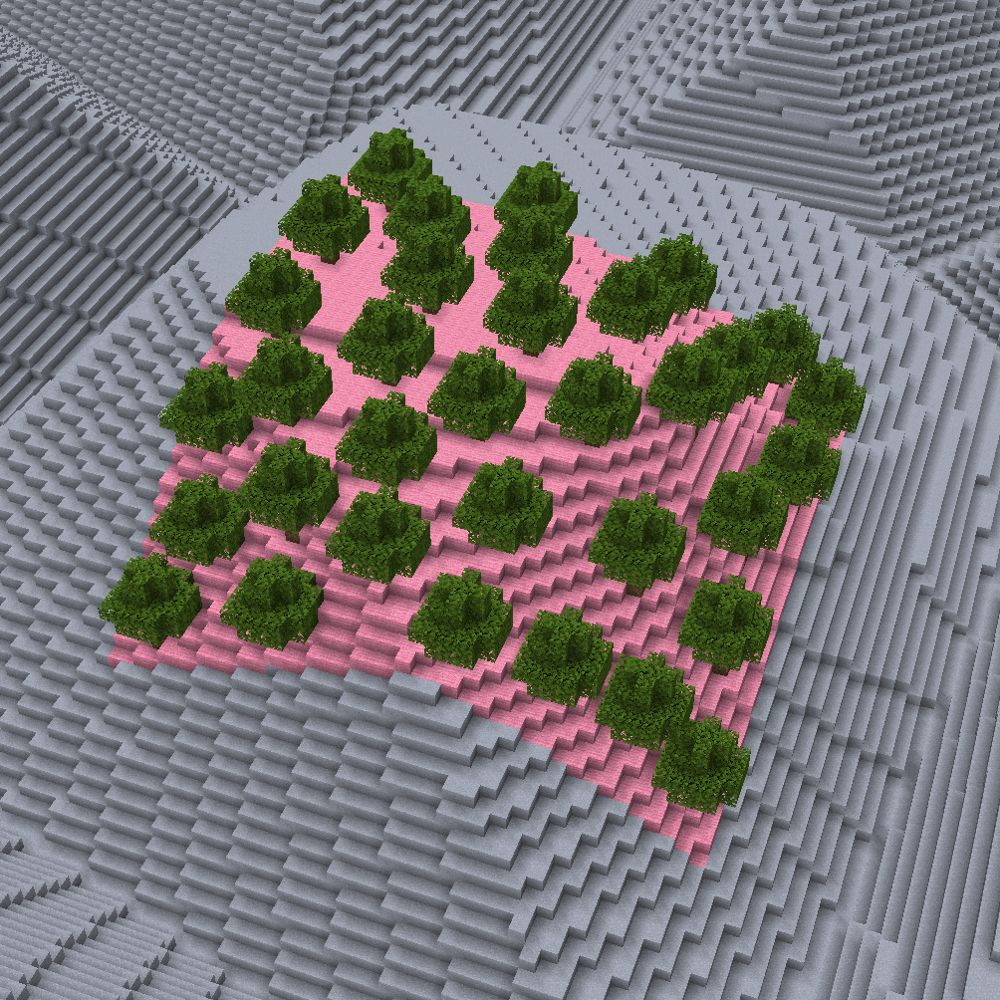

其中 `$triangle` 只是我使用 //ezsel 保存的某个 3 点多面体选区。

为了清晰起见，选区使用粉色羊毛进行了可视化（使用了 [-l 标志](scatter-parameters.md#mask-cover-pattern-l)）。

***

### 方向过滤器：<mark style="color:orange;">`-d <directions>`</mark> 和 <mark style="color:orange;">`-e <threshold>`</mark> 

允许过滤掉位于朝向特定方向的表面上的放置位置。

`-d <directions>` 参数定义了放置点所在表面必须朝向的基本方向列表（up, down, north, east, south, west）。如果放置位置不满足此条件，则不会在该处放置结构。

`-e <threshold>` 参数定义了放置位置的表面法线必须与 `-d` 给出的任何方向对齐到何种程度。值越高，过滤效果越强。

`-d` 默认为空列表（无）。

`-e` 默认为 0.5。期望值范围为 -1 到 1。

<mark style="color:blue;">示例</mark>

`//ezsc Clipboard S C`` `**`-d <directions>`** **`-e <threshold>`**

**`-d west,up`** **`-e 0.5`**（散布点必须位于朝向西面或上方的表面上。）

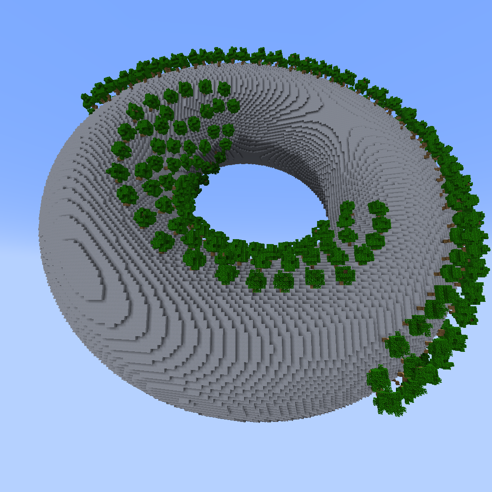

**`-d up`** **`-e <threshold>`**（散布点必须位于大致向上的表面上）

* 开始于 **`-e -1.0`**（最弱的过滤阈值，所有形状都会被放置）
* 暂停于 **`-e 0.0`**（一半的方向被过滤掉）
* 结束于 **`-e 1.0`**（最强的过滤阈值，不再放置任何形状）。

<!-- langmirror:chunk 3 -->
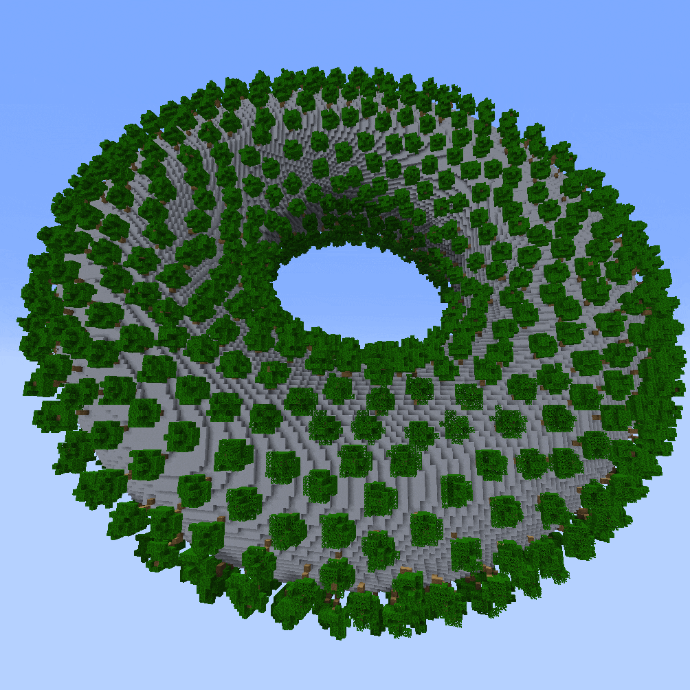

***

### 蒙版过滤器: <mark style="color:orange;">`-m <mask>`</mark> 

启用过滤功能，排除掉不匹配由 `-m <mask>` 指定的蒙版的放置位置。放置位置必须满足该蒙版，结构才会被放置。

<mark style="color:blue;">示例</mark>

`//ezsc Clipboard S C`` `**`-m <mask>`** （剪贴板为原版默认橡树）

使用以下蒙版：

* **`-m red`** （仅选择红羊毛方块上的放置位置）
* **`-m !red`** （选择除红羊毛方块以外任何位置的放置位置）
* **`-m =y>95`** （仅选择 Y 轴高度大于 95 的放置位置）

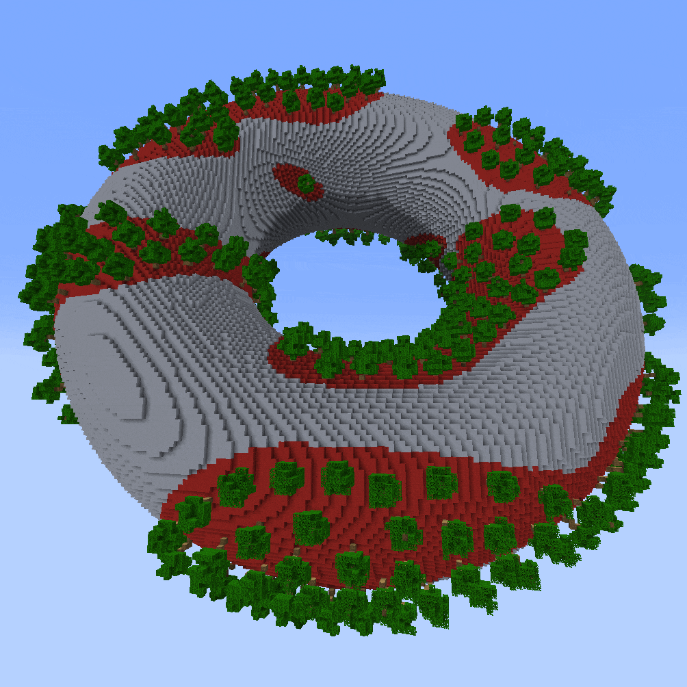

***

### 密度: <mark style="color:orange;">`-n <density>`</mark> 

通过指定密度百分比来决定放置多少个结构。

密度值是一个百分比。它决定了结构会放置在表面方块的百分之多少。具体而言，它决定了在应用方向过滤器和蒙版过滤器 _之后_ 剩余位置的百分比。

更准确地说：设 _N_ 为剩余的表面方块（例如，在不使用任何过滤器时，即为 `//count [!air]&[~air]` 的结果），那么最终放置的结构数量等于 _N \* density / 100_。


百分号 "%" 是可选的。`0.5` 会被解析为 `0.5%`。


<mark style="color:blue;">示例</mark>

**`//ezsc Clipboard C C -n <density>`** （剪贴板为原版默认橡树）

**`-n 2%`** （默认）或 **`-n 2`** （`%` 是可选的）：

<!-- langmirror:chunk 4 -->
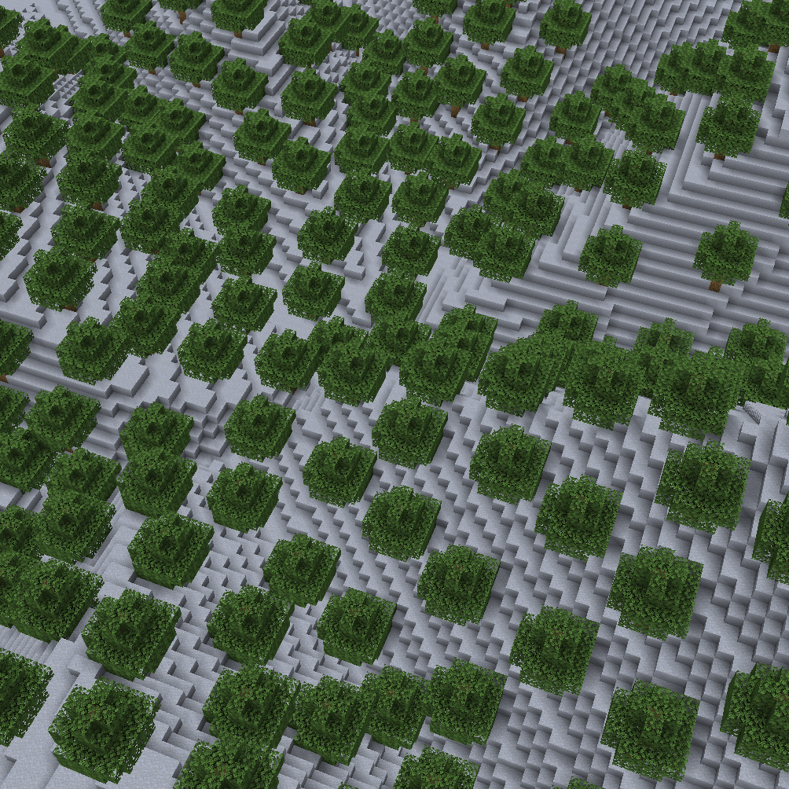

**`-n 0.5%`**

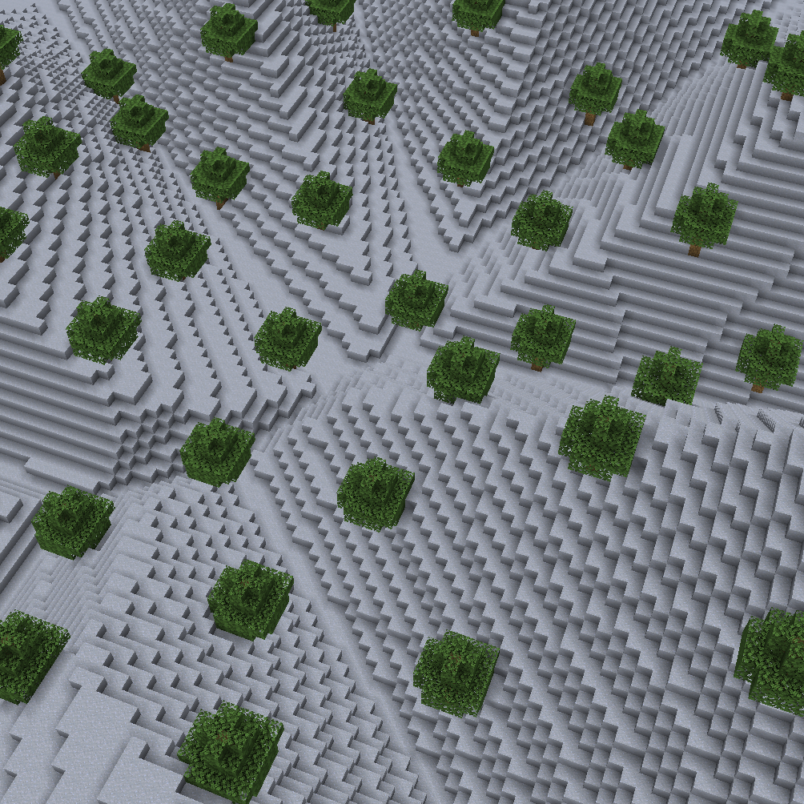

**`-n 5%`**

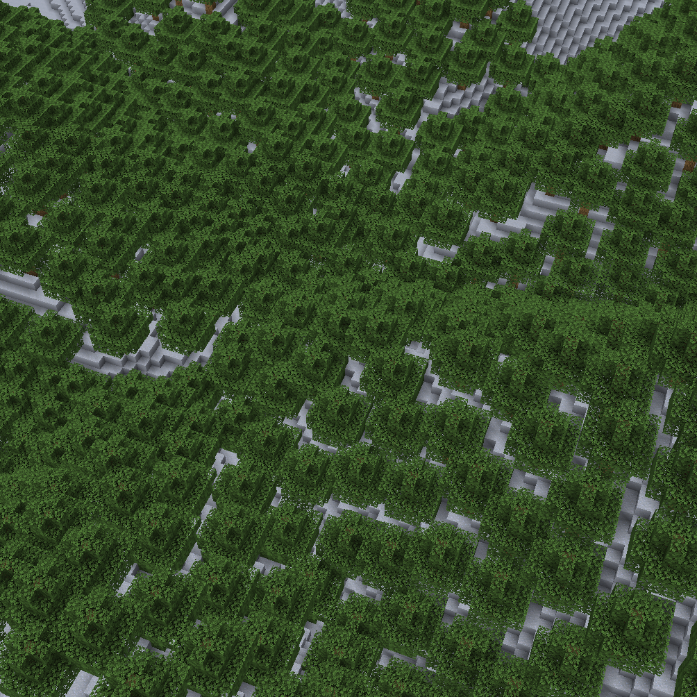

使用 <code>-d</code> 或 <code>-m</code> 时的注意事项：

密度指定了在 **剩余** 表面方块中进行放置的百分比。

例如，如果你使用蒙版过滤器将放置限制在选区内极少数出现的特定方块上，例如在以下区域使用 `-m sea_lantern`：

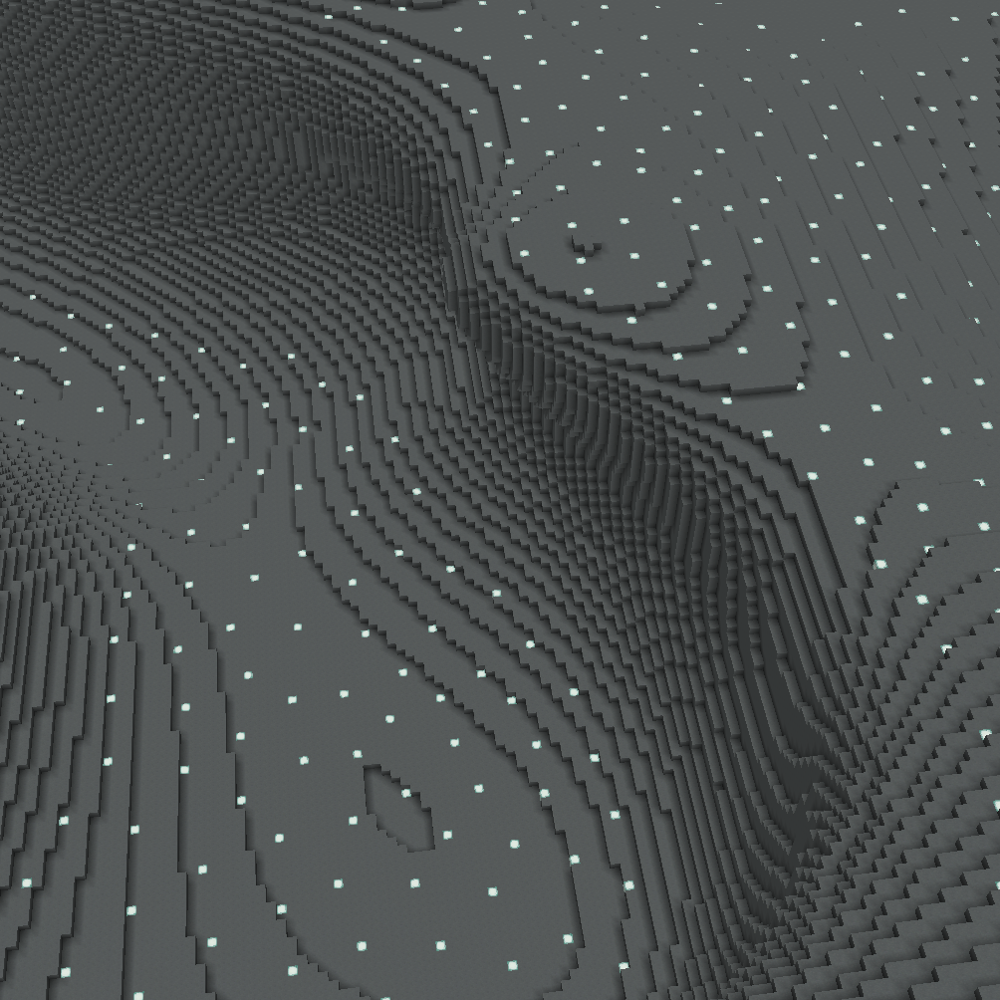

那么默认密度 `-n 2%` 意味着在所有（接触空气的）海晶灯方块中，只有 2% 会被选为放置位置。因此执行 `//ezsc Clipboard -m sea_lantern` 的结果为：

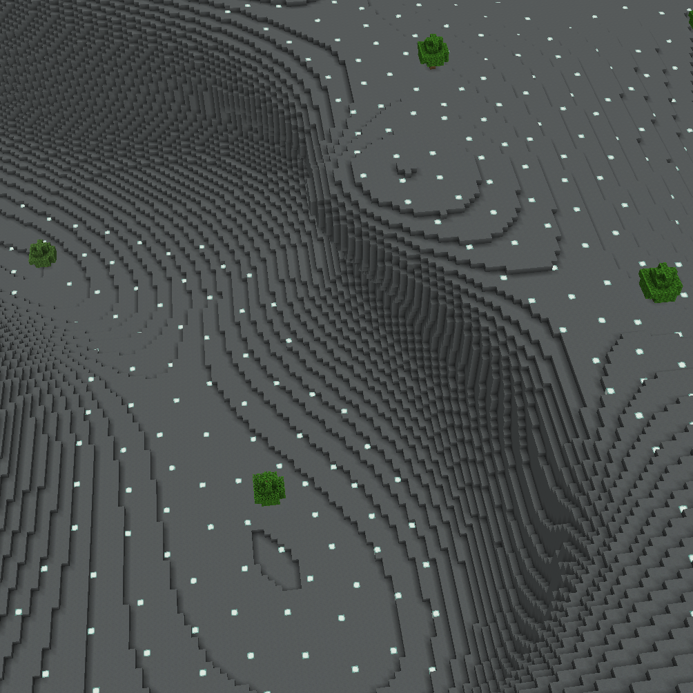

对于这类想要在每个特定方块实例处都放置结构的情况，你应该使用 `-n 100%`。在本例中执行 `//ezsc Clipboard -m sea_lantern -n 100%` 的结果为：

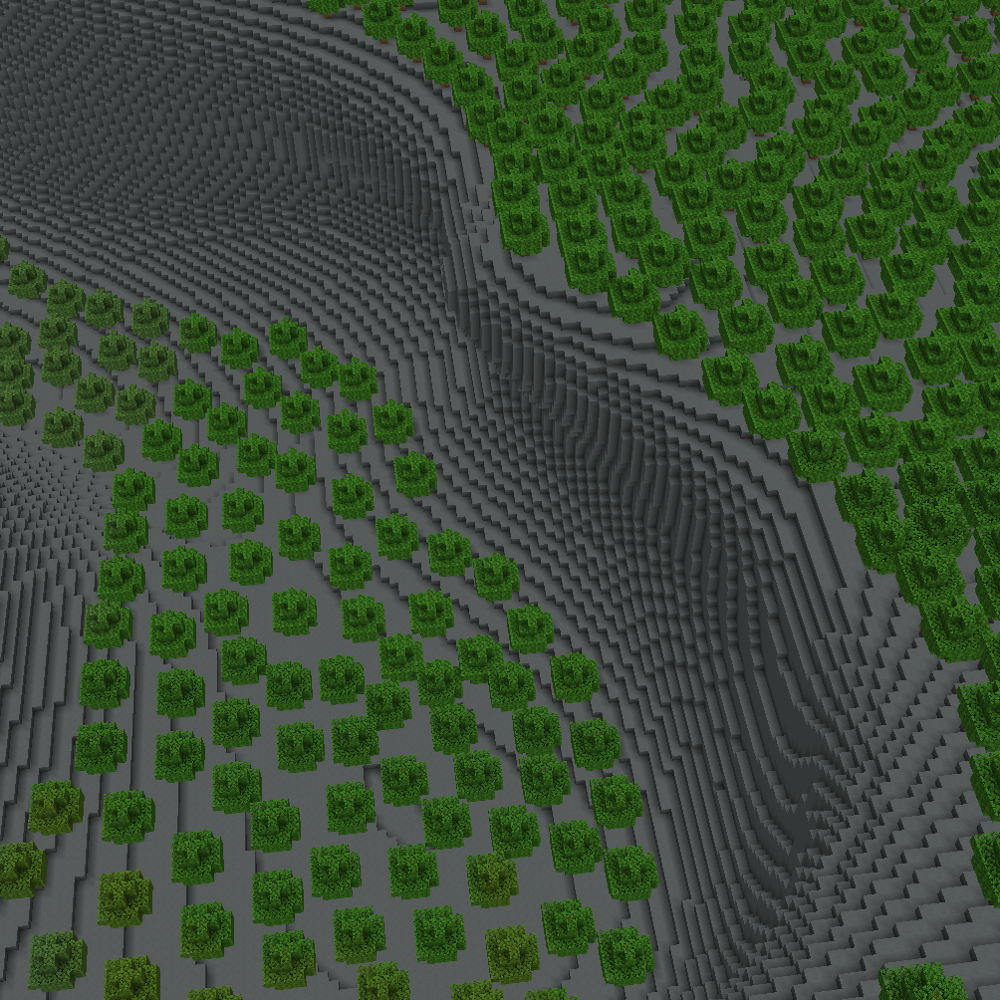

***

### 分布种子：<mark style="color:orange;">`-i <seed>`</mark> 

设置随机数生成器的种子，用于选择初始随机放置位置。

默认值为 `-1`（随机种子），这意味着每次执行 scatter 命令时，放置位置都会有所不同。

***

### 均匀度：<mark style="color:orange;">`-u <iterations>`</mark> 

决定所有放置位置的分布均匀程度。期望值为包含 0 在内的正整数。

默认值为 `15`。

<!-- langmirror:chunk 5 -->
均匀化算法的工作原理是：首先从完全随机的放置位置开始，然后通过迭代相互排斥所有位置。此参数用于设置执行排斥迭代的次数。因此，0 意味着区域内的放置位置是纯随机的。

<mark style="color:blue;">示例</mark>

`//ezsc Clipboard C C`` `**`-u <iterations>`**（剪贴板中为默认的原版橡树）

* `-u 0`（完全随机分布）
* `-u 2`（轻微均匀分布）
* `-u 20`（非常均匀的分布）

从 **`-u 0`** 开始到 **`-u 20`** 结束的 GIF 演示：

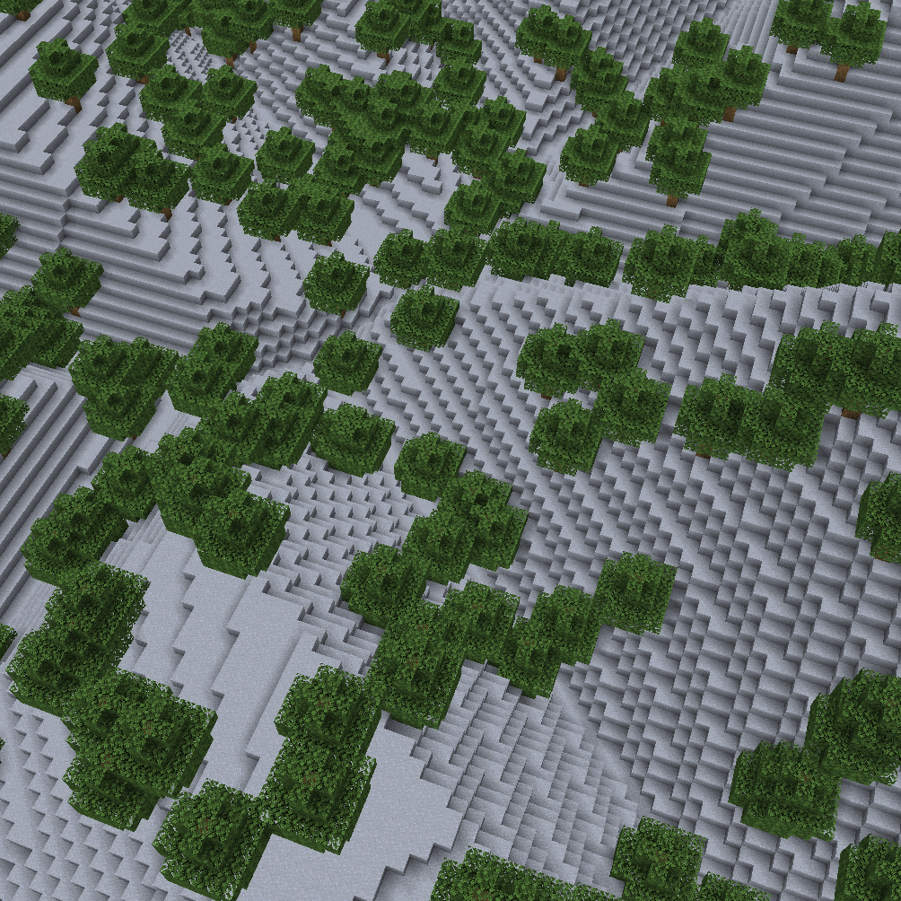

***

### 蒙版覆盖方块：<mark style="color:orange;">`-l <pattern>`</mark> 

在放置完所有结构后，将区域内所有符合 [蒙版过滤器 (`-m`)](scatter-parameters.md#mask-filter-m) 且未受影响的表面方块替换为给定的方块。（必须设置 `-m` 才能使此标志生效。）

这是一个小众的实用选项，适用于以下情况：你在相邻区域多次应用散布，但不希望在之前已经散布过的区域放置结构。因此，通过使用此标志，你可以（在工作流中临时地）用给定方块覆盖区域内的所有表面方块，这样任何后续与已覆盖区域重叠的散布操作都不会在那里放置结构，因为表面方块已被“覆盖”。

<mark style="color:blue;">示例</mark>

`//ezbrush scatter Clipboard -m clay`

在**不使用** `-l` 标志的情况下运行 ezbrush scatter，会导致点击区域重叠的地方放置过于密集，这可能不是预期的结果。

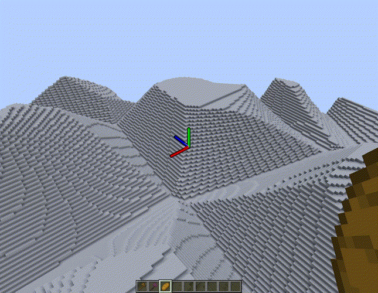

`//ezbrush scatter Clipboard -m clay -l pink`

<!-- langmirror:chunk 6 -->
运行 ezbrush scatter **并使用** `-l pink`（在这种情况下，粉色羊毛只是随机选择的方块），将覆盖受影响的区域。结合 `-m clay` 蒙版过滤器，后续的笔刷点击将不会在这些区域放置任何新形状，即使区域重叠也是如此。

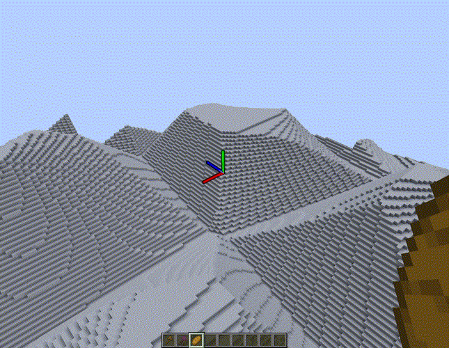

***

### 修剪选区外部分：<mark style="color:orange;">`-t`</mark> 

默认情况下，`scatter` 会在当前选定的区域内确定放置位置，但如果放置位置位于当前选定区域的边界，则可能会将方块放置在区域之外。你可以使用 `-t` 标志切除任何此类方块（防止它们被放置）。

开启此标志类似于在运行命令时配合 `//gmask #region`（至少对于 `//ezscatter` 而言）。

<mark style="color:blue;">示例</mark>

如果这是我们选择的区域：

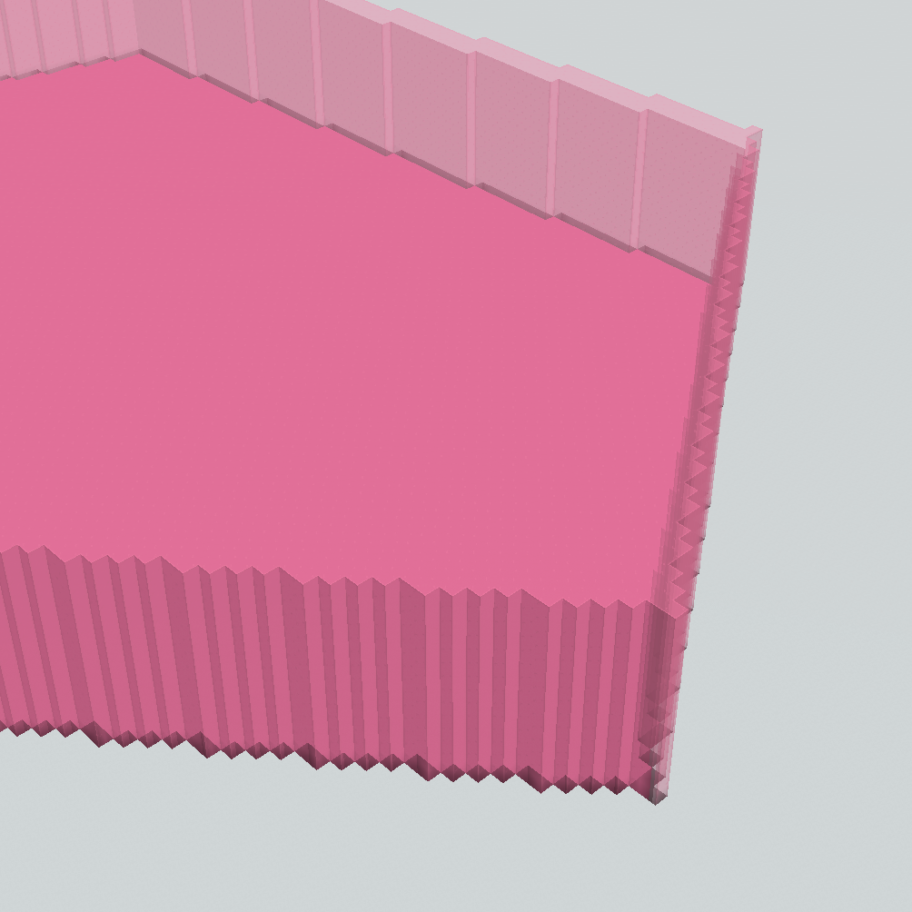

那么在不带该标志的情况下执行 ezsc 命令，可能会导致方块被放置在区域之外。只有放置点/原点位置被限制在区域内。

不带 `-t` 标志：

`//ezsc Cl C C -s 15,21,15 -n 0.5%`

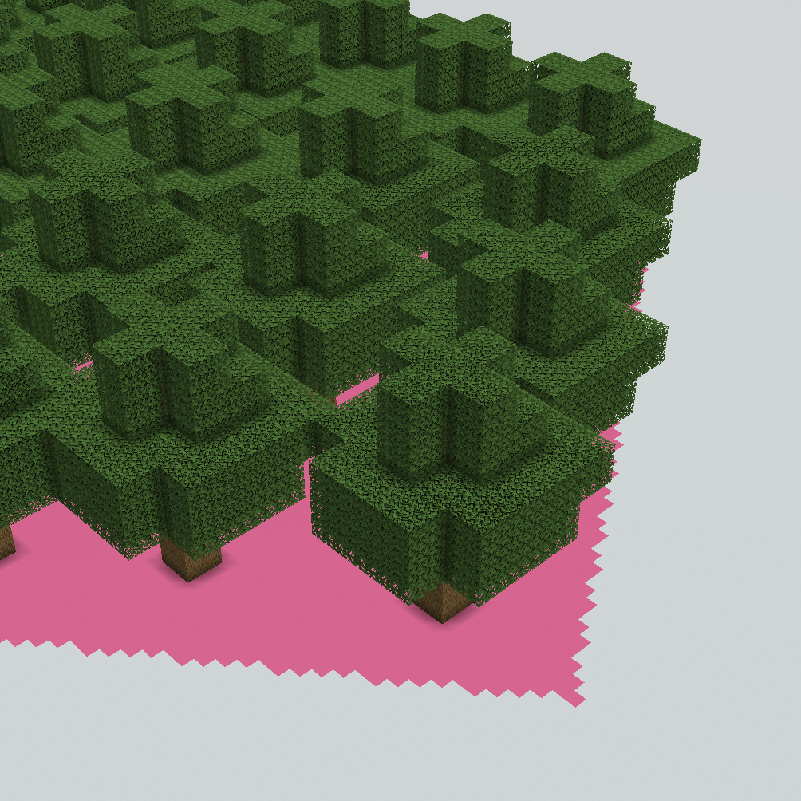

带 `-t` 标志：

`//ezsc Cl C C -s 15,21,15 -n 0.5%`` `**`-t`**

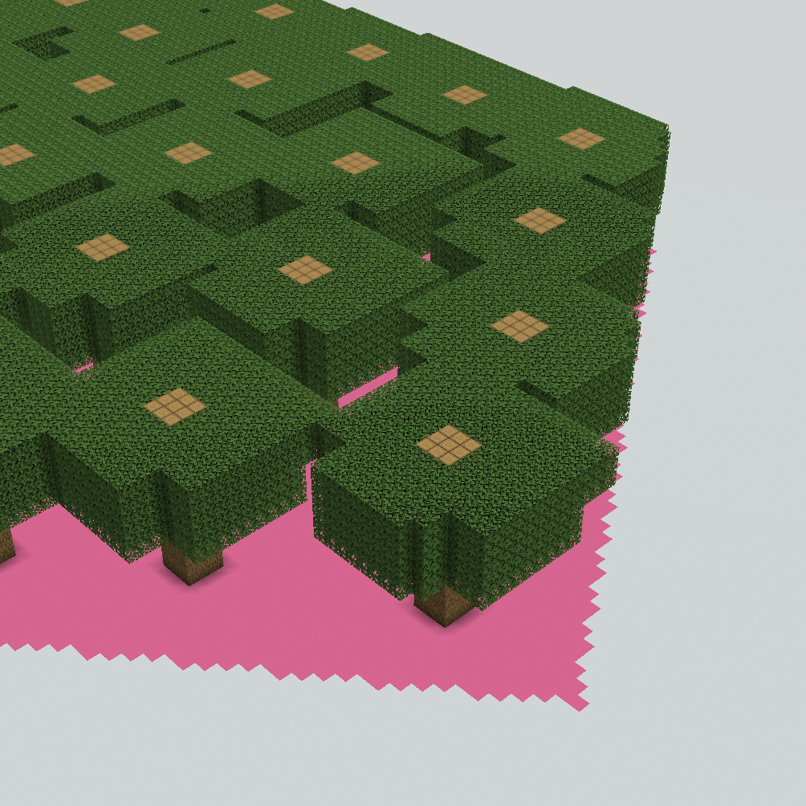

***