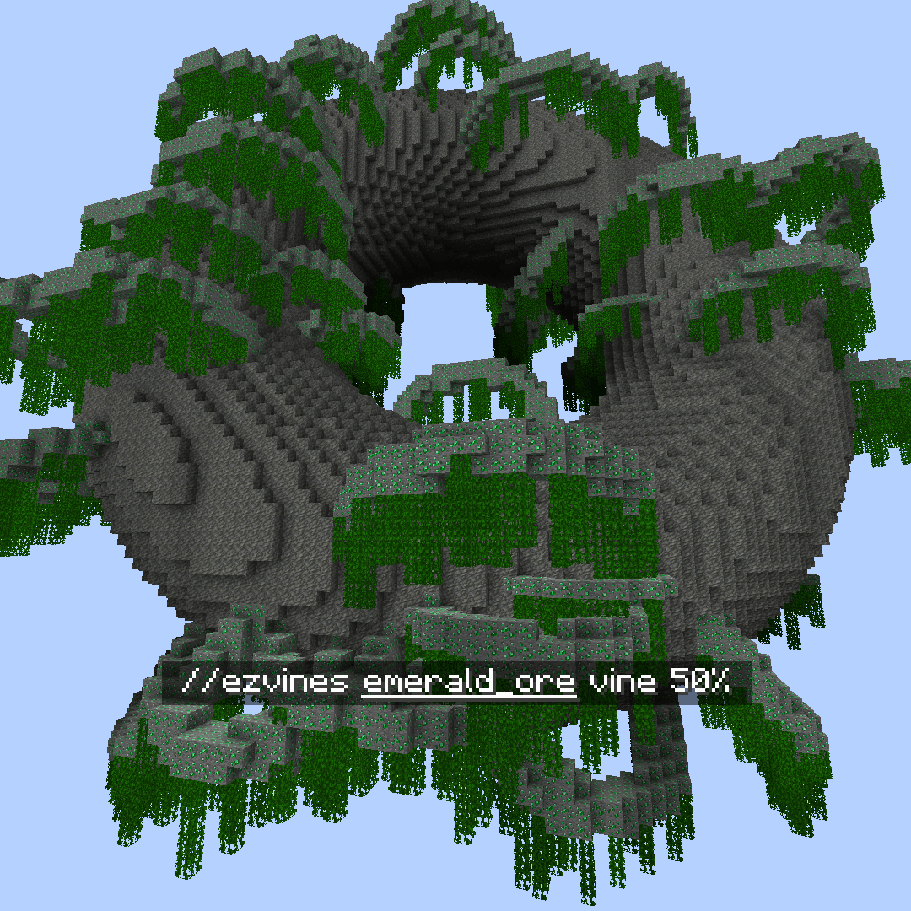
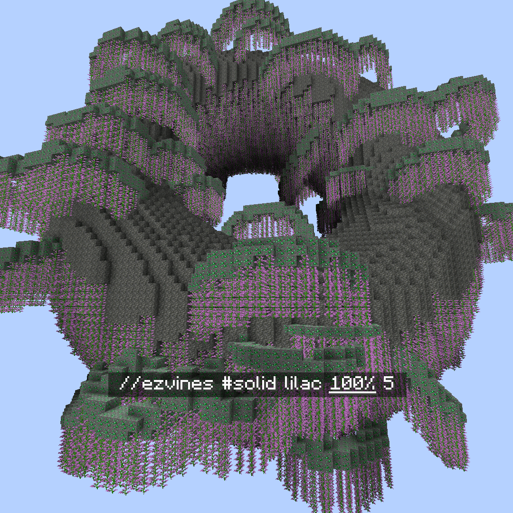

# Region

A miscellaneous collection of commands which operate within your selected region.

### `//ezvines`

Vines

**`//ezvines <mask> <pattern> [percentage] [min_length] [max_length]`**

**`Alias: //vines`**

* **Mask**: Specifies the mask matching blocks to hang "vines" from.&#x20;
* **Pattern**: Determines the pattern of blocks to place.&#x20;
* **Percentage** (Default: 10%): Sets the percentage of blocks to hang vines from.&#x20;
* **Min Length** (Default: 2): Specifies the minimum vine length.&#x20;
* **Max Length** (Default: 5): Defines the maximum vine length.

 **`<mask>`**

 **`[percentage]`**

 **`[min_length] [max_length]`**

### `//ezmoss`

Moss

**`//ezmoss <pattern> [amount] [smooth_radii] [smooth_iterations]`**

**`Alias: //moss`**

* **Pattern**: Determines the block pattern to use for the moss.&#x20;
* **Amount** (Default: 2.0): Specifies the amount of moss to place. Decimal values are allowed, and values are somewhat arbitrary.&#x20;
* **Smooth Radii** (Default: 1): Sets the smoothing radii for the moss placement. Can be one radius or three comma-separated radii, in the order of East/West, Up/Down, North/South.&#x20;
* **Smooth Iterations** (Default: 5): Defines the number of smoothing iterations to apply.

 **`[amount]`**

 **`[smooth_radii]`**

 **`[smooth_radii]`**

 **`[smooth_iterations]`**

### `//ezslabmerge`

SlabMerge

**`//ezslabmerge <mask> [-b] [-t]`**

**`Alias: //slabmerge`**

* **Mask**: Specifies the mask to select which blocks to affect within the region.&#x20;
* **-b**: When used, will also convert bottom slabs to full blocks.&#x20;
* **-t**: When used, will also convert top slabs to full blocks.&#x20;

### `//ezstatecyle`

StateCycle

**`//ezstatecycle <mask> <state>`**

**`Alias: //statecycle`**

* **Mask**: Specifies the mask to select which blocks to affect within the region.&#x20;
* **State**: Identifies the block state value to cycle through for each block in the selection.

### `//eznoisegen`

NoiseGen

**`//eznoisegen <palette> <noise> [lowerThreshold] [upperThreshold] [-z <scale>] [-s <seed>] [-l <smear>] [-o <offset>] [-chnt]`**

**`Aliases: //noisegen | //ng`**

* **Palette**: Specifies the palette of blocks to use.&#x20;
* **Noise**: Defines the noise preset to use.&#x20;
* **Lower Threshold** (Default: 0): Sets the lower threshold for noise generation, with support for WorldEdit expressions.&#x20;
* **Upper Threshold** (Default: 0.5): Sets the upper threshold for noise generation, with support for WorldEdit expressions.&#x20;
* **-z** (Default: 1): Adjusts the scale of the noise.&#x20;
* **-s** (Default: -1): Sets the noise seed.&#x20;
* **-l** (Default: 0): Applies a vertical smear to 3D noise.&#x20;
* **-o** (Default: (0,0,0)): Offsets the noise generation coordinates by a given vector (X,Y,Z).&#x20;
* **-c**: When used, centers the noise generation on the world coordinates of the selection.&#x20;
* **-h**: Activates heightmap mode using 2D noise. \
  _Heightmap mode is only compatible with Cuboid, Cylinder, or Polygon region types._
* **-n**: Uses normalized (-1 to 1) selection-centered coordinates for noise generation.
* **-t**: Enables smooth mode, specifically for snow, water, and lava blocks in the palette \[Applicable only in heightmap mode].

