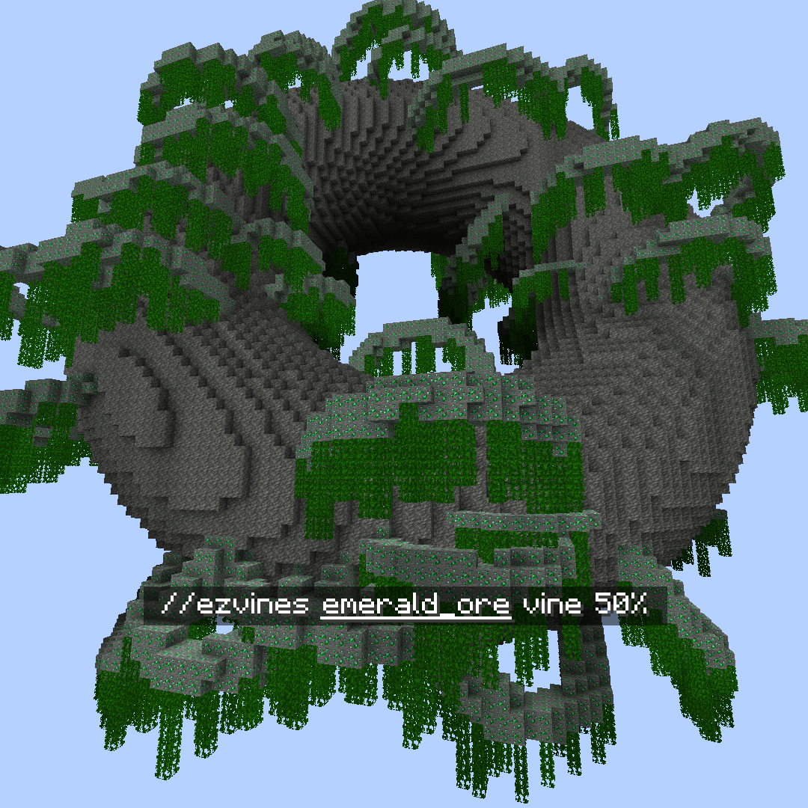
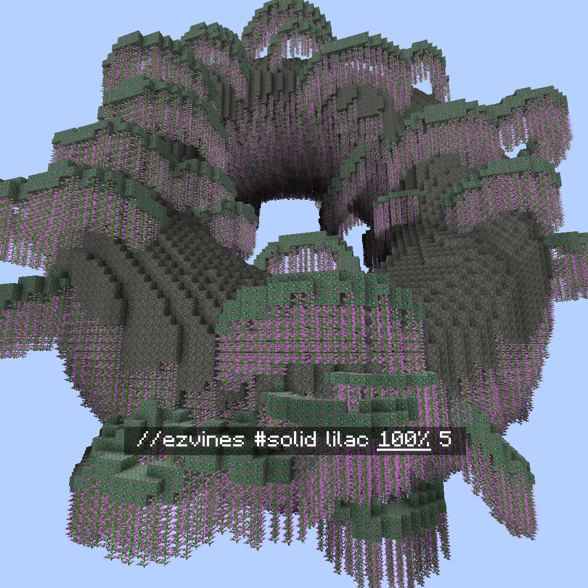
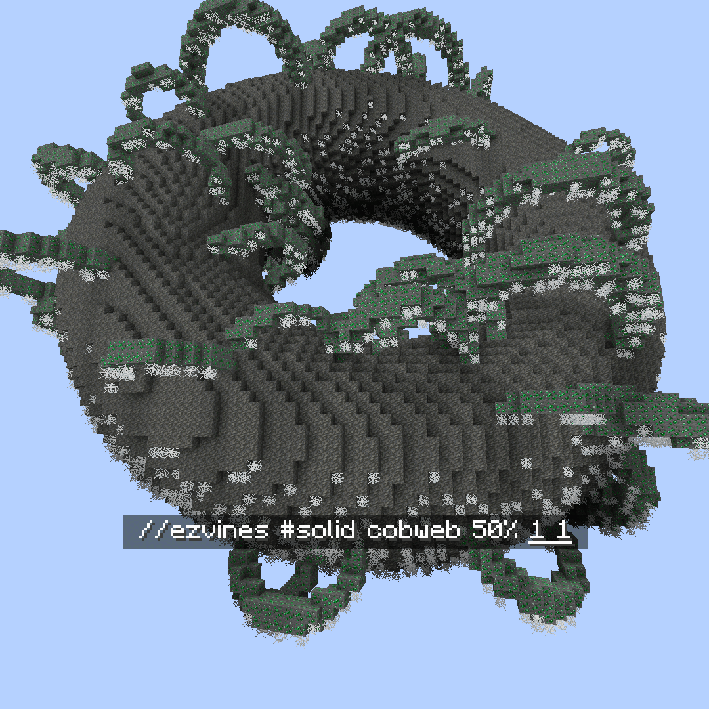
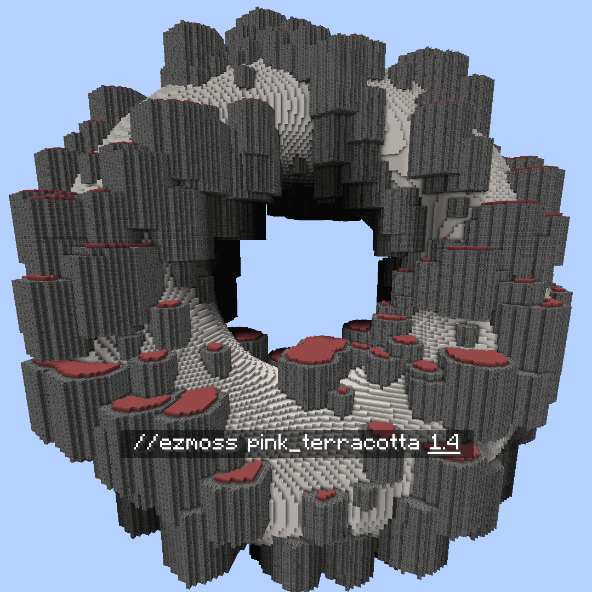
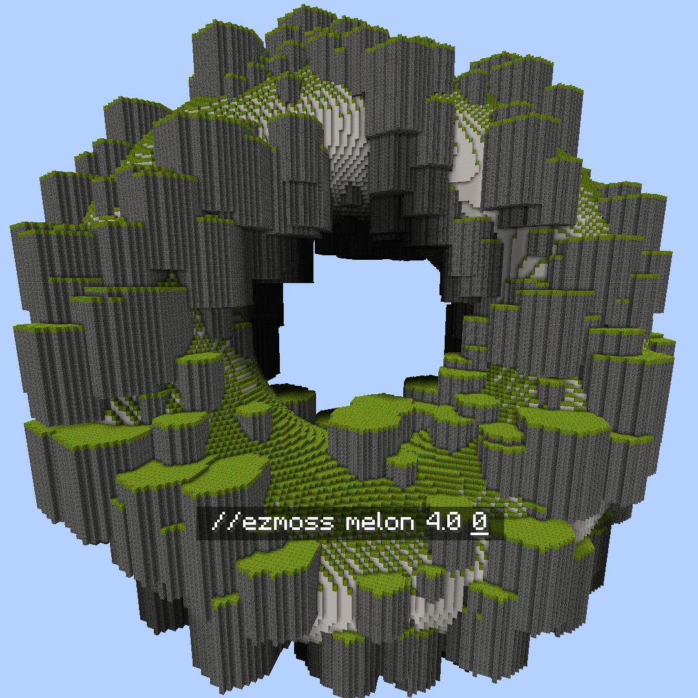
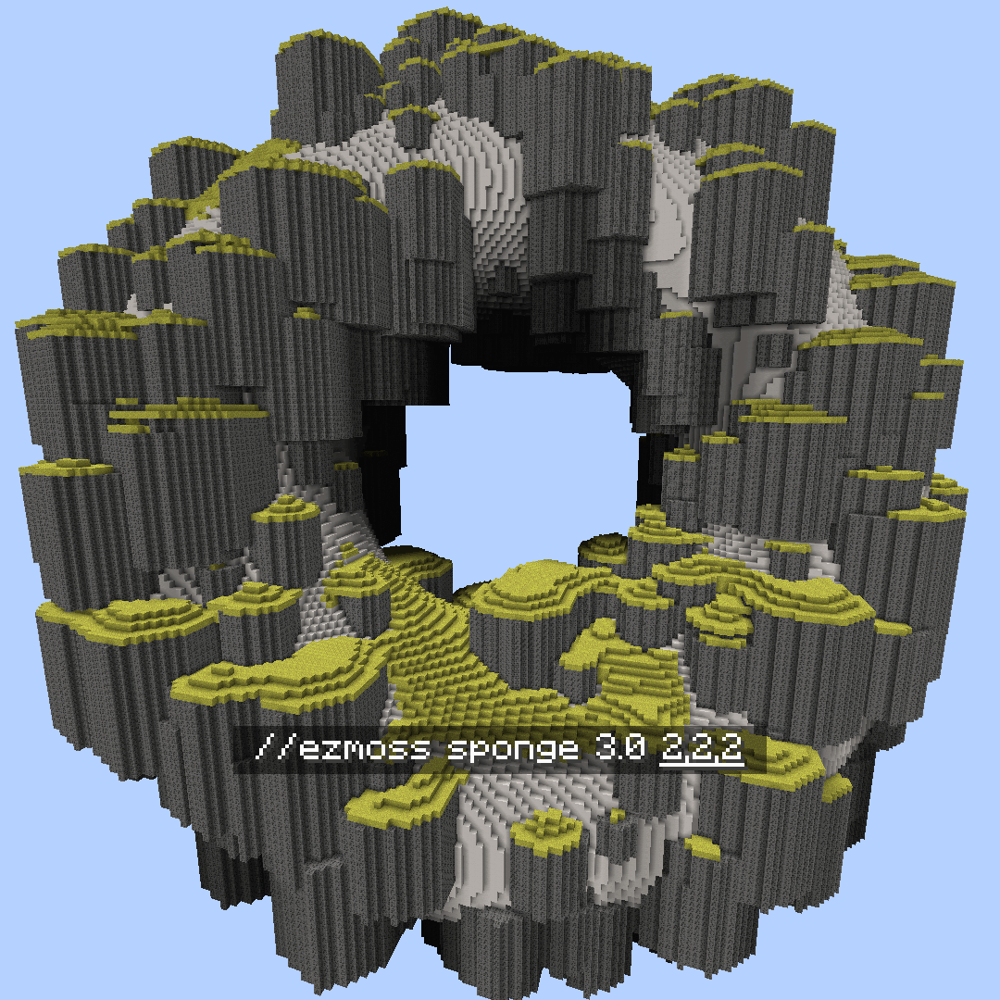
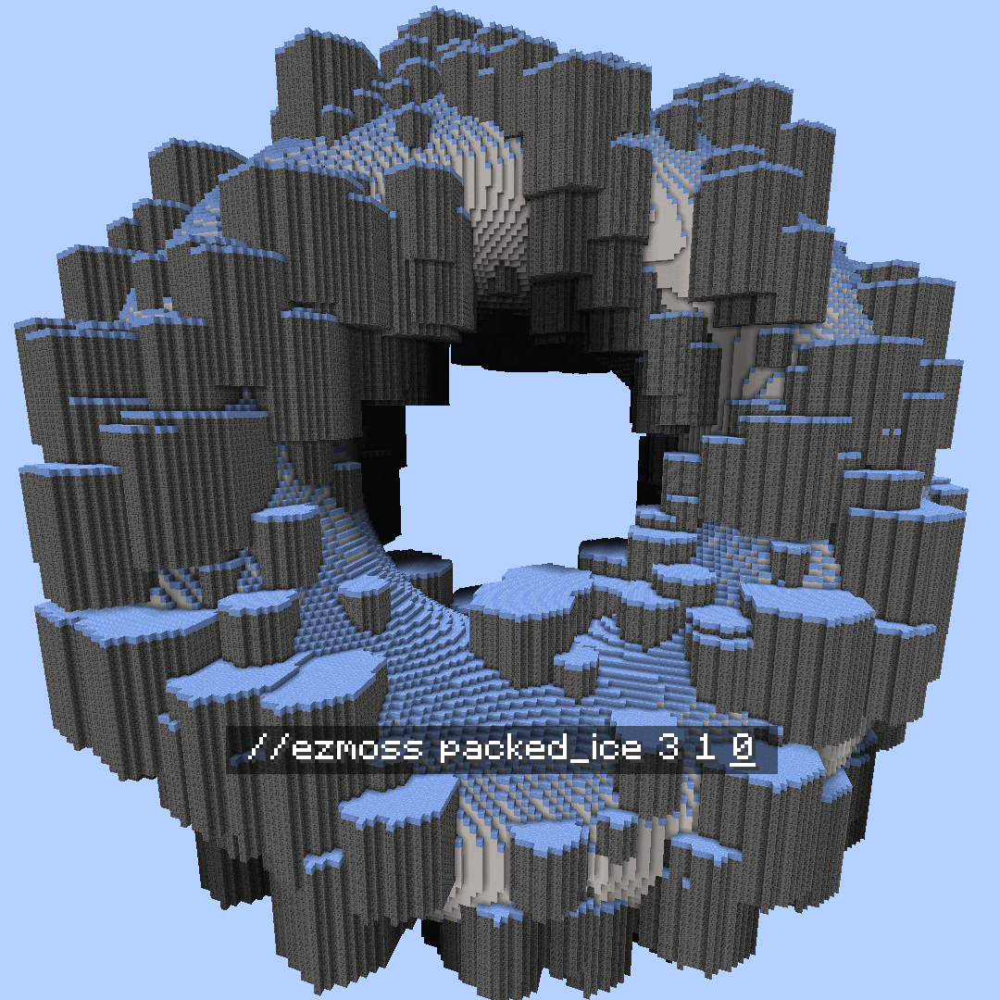

<!-- langmirror:chunk 0 -->
# 区域

一个杂项命令集合，用于在您选定的区域内操作。

### `//ezvines`

藤蔓

**`//ezvines <mask> <pattern> [percentage] [min_length] [max_length]`**

**`别名: //vines`**

* **Mask**: 指定蒙版以匹配要悬挂"藤蔓"的方块。
* **Pattern**: 确定要放置的方块图案。
* **Percentage** (默认: 10%): 设置悬挂藤蔓的方块百分比。
* **Min Length** (默认: 2): 指定藤蔓的最小长度。
* **Max Length** (默认: 5): 定义藤蔓的最大长度。

 **`<mask>`**

 **`[percentage]`**

 **`[min_length] [max_length]`**

### `//ezmoss`

苔藓

**`//ezmoss <pattern> [amount] [smooth_radii] [smooth_iterations]`**

**`别名: //moss`**

* **Pattern**: 确定用于苔藓的方块图案。
* **Amount** (默认: 2.0): 指定要放置的苔藓数量。允许使用小数值，数值有些任意。
* **Smooth Radii** (默认: 1): 设置苔藓放置的平滑半径。可以是一个半径或三个逗号分隔的半径，顺序为东/西、上/下、北/南。
* **Smooth Iterations** (默认: 5): 定义要应用的平滑迭代次数。

 **`[amount]`**

 **`[smooth_radii]`**

<!-- langmirror:chunk 1 -->
 **`[smooth_radii]`**

 **`[smooth_iterations]`**

### `//ezslabmerge`

SlabMerge

**`//ezslabmerge <mask> [-b] [-t]`**

**`别名: //slabmerge`**

* **Mask**: 指定蒙版以选择区域内要影响的方块。
* **-b**: 使用时，也会将下半砖转换为完整方块。
* **-t**: 使用时，也会将上半砖转换为完整方块。

### `//ezstatecyle`

StateCycle

**`//ezstatecycle <mask> <state>`**

**`别名: //statecycle`**

* **Mask**: 指定蒙版以选择区域内要影响的方块。
* **State**: 标识要为选区中每个方块循环切换的方块状态值。

