<!-- langmirror:chunk 0 -->
# 2D 样条形状

以下 `//ezsp` 子命令的功能是将预定义的 2D 形状样条沿样条路径扫略。

***

## 语法

**`//ezspline 2d`** <mark style="color:orange;">**`<shape>`**</mark> <mark style="color:orange;">**`<pattern>`**</mark> [**`<radii>`**](common-parameters.md#radii) [**`[-t <angle>]`**](common-parameters.md#twist) [**`[-p <kbParameters>]`**](common-parameters.md#kb-parameters) [**`[-q <quality>]`**](common-parameters.md#quality) [**`[-n <normalMode>]`**](common-parameters.md#normal-mode) [**`[-h]`**](common-parameters.md#help-page)

* <mark style="color:orange;">**`<shape>`**</mark> : 2D 形状定义了样条的横截面。从下方列表中选择一个。
* <mark style="color:orange;">**`<pattern>`**</mark>: 指定构成样条的方块，例如 `clay`。

_其余参数在_ [_通用参数_](common-parameters.md) _子页面中有详细说明。_

***

## <mark style="color:orange;">`<shape>`</mark> 列表

<!-- langmirror:chunk 1 -->
<table data-view="cards"><thead><tr><th></th><th data-hidden data-card-cover data-type="files"></th><th data-hidden data-card-target data-type="content-ref"></th></tr></thead><tbody><tr><td><strong><code>Circle</code></strong> (<strong><code>Ci</code></strong>) (圆形)</td><td><a href="../../.gitbook/assets/SplinesSimple.png">SplinesSimple.png</a></td><td><a href="2d-spline-shapes.md#circle-spline">#circle-spline</a></td></tr><tr><td><strong><code>Square</code></strong> (<strong><code>Sq</code></strong>) (正方形)</td><td><a href="../../.gitbook/assets/Splines2DSquare.png">Splines2DSquare.png</a></td><td><a href="2d-spline-shapes.md#square-spline">#square-spline</a></td></tr><tr><td><strong><code>Diamond</code></strong> (<strong><code>Di</code></strong>) (菱形)</td><td><a href="../../.gitbook/assets/Splines2DDiamond.png">Splines2DDiamond.png</a></td><td><a href="2d-spline-shapes.md#diamond-spline">#diamond-spline</a></td></tr><tr><td><strong><code>RoundedSquare</code></strong> (<strong><code>RS</code></strong>) (圆角正方形)</td><td><a href="../../.gitbook/assets/Splines2DRoundedSquare.png">Splines2DRoundedSquare.png</a></td><td><a href="2d-spline-shapes.md#roundedsquare-spline">#roundedsquare-spline</a></td></tr><tr><td><strong><code>SuperCircle</code></strong> (<strong><code>SC</code></strong>) (超圆形)</td><td><a href="../../.gitbook/assets/SplinesSuperCircle.gif">SplinesSuperCircle.gif</a></td><td><a href="2d-spline-shapes.md#supercircle-spline">#supercircle-spline</a></td></tr><tr><td><strong><code>CirclesCircle</code></strong> (<strong><code>CC</code></strong>) (圆中圆)</td><td><a href="../../.gitbook/assets/SplinesCirclesCircle.gif">SplinesCirclesCircle.gif</a></td><td><a href="2d-spline-shapes.md#circlescircle-spline">#circlescircle-spline</a></td></tr><tr><td><strong><code>Polygon</code></strong> (<strong><code>Po</code></strong>) (多边形)</td><td><a href="../../.gitbook/assets/SplinesPolygon.gif">SplinesPolygon.gif</a></td><td><a href="2d-spline-shapes.md#polygon-spline">#polygon-spline</a></td></tr><tr><td><strong><code>Rectangle</code></strong> (<strong><code>Re</code></strong>) (矩形)</td><td><a href="../../.gitbook/assets/SplinesRectangle.gif">SplinesRectangle.gif</a></td><td><a href="2d-spline-shapes.md#rectangle-spline">#rectangle-spline</a></td></tr><tr><td>Star (<strong><code>St</code></strong>) (星形)</td><td><a href="../../.gitbook/assets/SplinesStar.gif">SplinesStar.gif</a></td><td><a href="2d-spline-shapes.md#star-spline">#star-spline</a></td></tr><tr><td><strong><code>Flower</code></strong> (<strong><code>Fl</code></strong>) (花形)</td><td><a href="../../.gitbook/assets/SplinesFlower.gif">SplinesFlower.gif</a></td><td><a href="2d-spline-shapes.md#flower-spline">#flower-spline</a></td></tr></tbody></table>

<!-- langmirror:chunk 2 -->
***

#### 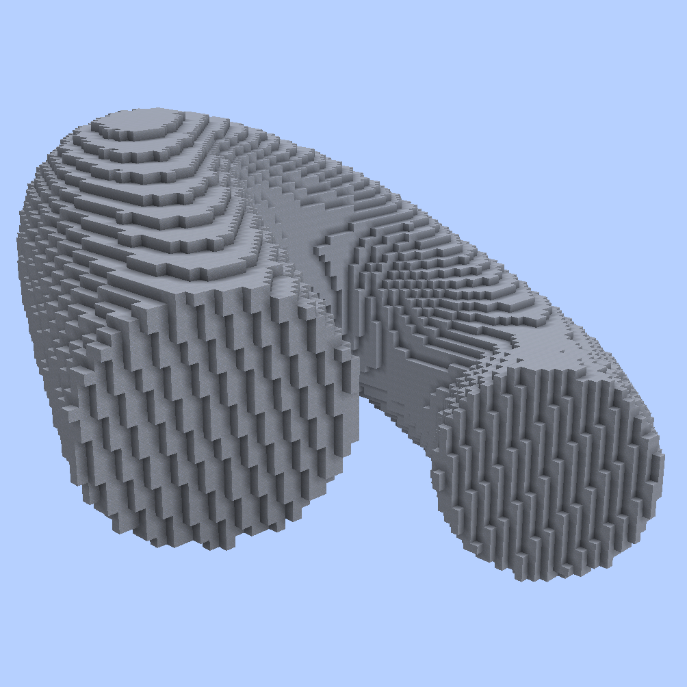

### `//ezspline 2d`` `<mark style="color:orange;">`Circle (Ci)`</mark>`(`<mark style="color:blue;">`//ezspline basic`</mark>`)` 

<mark style="color:blue;">圆形样条线 (Circle Spline)</mark>

**`//ezsp 2d Circle`** [**`<pattern>`**](2d-spline-shapes.md#syntax) [**`<radii>`**](common-parameters.md#radii) [**`[-t <angle>]`**](common-parameters.md#twist) [**`[-p <kbParameters>]`**](common-parameters.md#kb-parameters) [**`[-q <quality>]`**](common-parameters.md#quality) [**`[-n <normalMode>]`**](common-parameters.md#normal-mode) [**`[-h]`**](common-parameters.md#help-page)

沿着样条线路径生成一个简单的圆柱状样条线。

* _圆柱形状没有参数。_

`//ezsp basic` 是 `//ezsp 2d Circle` 的别名。

***

#### 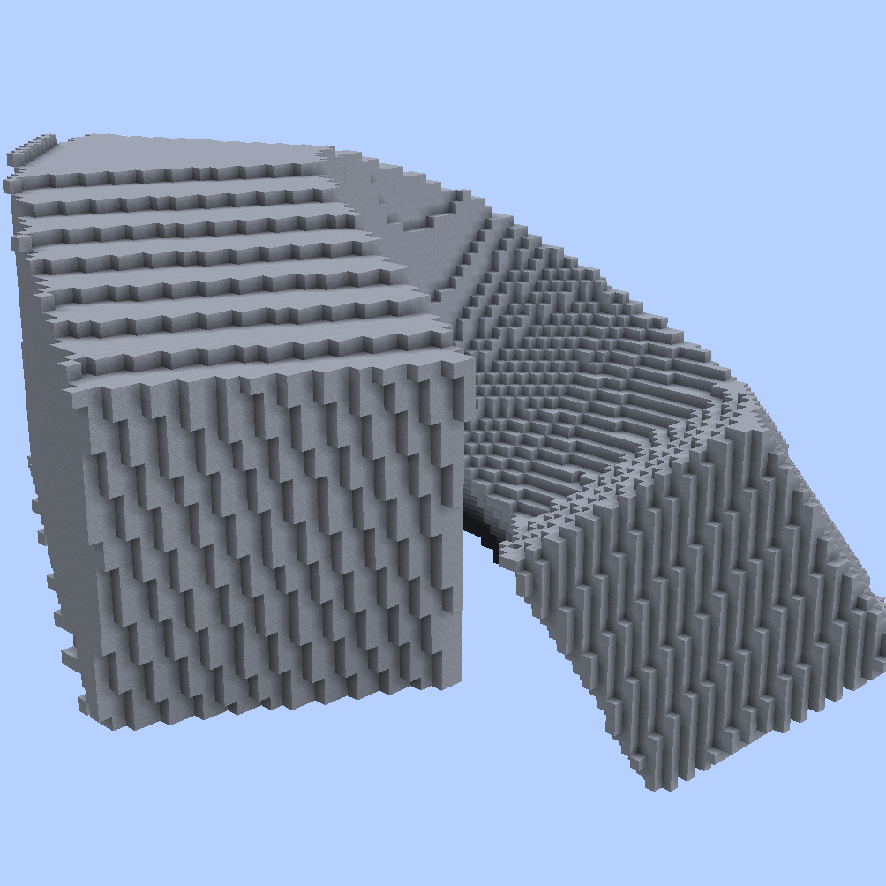

### `//ezspline 2d`` `<mark style="color:orange;">`Square (Sq)`</mark> 

<mark style="color:blue;">方形样条线 (Square Spline)</mark>

**`//ezsp 2d Square`** [**`<pattern>`**](2d-spline-shapes.md#syntax) [**`<radii>`**](common-parameters.md#radii) [**`[-t <angle>]`**](common-parameters.md#twist) [**`[-p <kbParameters>]`**](common-parameters.md#kb-parameters) [**`[-q <quality>]`**](common-parameters.md#quality) [**`[-n <normalMode>]`**](common-parameters.md#normal-mode) [**`[-h]`**](common-parameters.md#help-page)

<!-- langmirror:chunk 3 -->
沿着样条路径生成一个简单的正方形样条。

* _正方形形状没有参数。_

***

#### 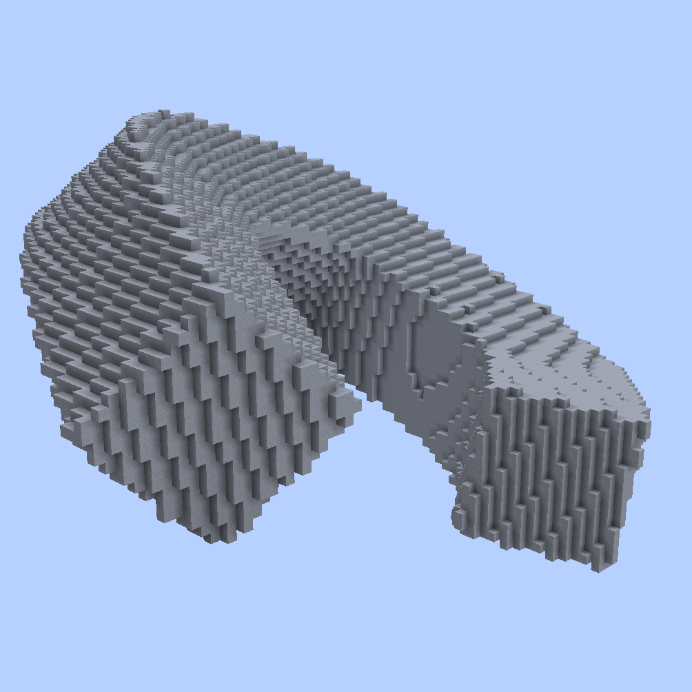

### `//ezspline 2d`` `<mark style="color:orange;">`Diamond (Di)`</mark> 

<mark style="color:blue;">菱形样条 (Diamond Spline)</mark>

**`//ezsp 2d Diamond`** [**`<pattern>`**](2d-spline-shapes.md#syntax) [**`<radii>`**](common-parameters.md#radii) [**`[-t <angle>]`**](common-parameters.md#twist) [**`[-p <kbParameters>]`**](common-parameters.md#kb-parameters) [**`[-q <quality>]`**](common-parameters.md#quality) [**`[-n <normalMode>]`**](common-parameters.md#normal-mode) [**`[-h]`**](common-parameters.md#help-page)

沿着样条路径生成一个简单的菱形样条。

* _菱形形状没有参数。_

***

#### 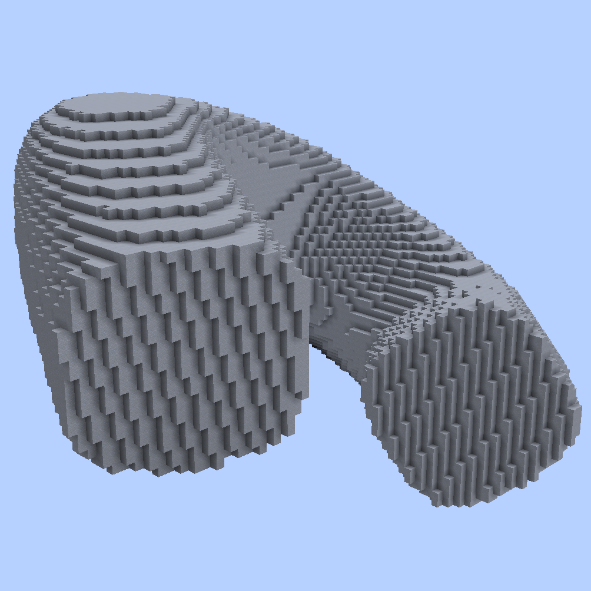

### `//ezspline 2d`` `<mark style="color:orange;">`RoundedSquare (RS)`</mark> 

<mark style="color:blue;">圆角正方形样条 (RoundedSquare Spline)</mark>

**`//ezsp 2d RoundedSquare`** [**`<pattern>`**](2d-spline-shapes.md#syntax) [**`<radii>`**](common-parameters.md#radii) [**`[-t <angle>]`**](common-parameters.md#twist) [**`[-p <kbParameters>]`**](common-parameters.md#kb-parameters) [**`[-q <quality>]`**](common-parameters.md#quality) [**`[-n <normalMode>]`**](common-parameters.md#normal-mode) [**`[-h]`**](common-parameters.md#help-page)

<!-- langmirror:chunk 4 -->
沿着样条路径生成一个简单的圆角正方形样条。

* _RoundedSquare 形状没有参数。_

***

#### 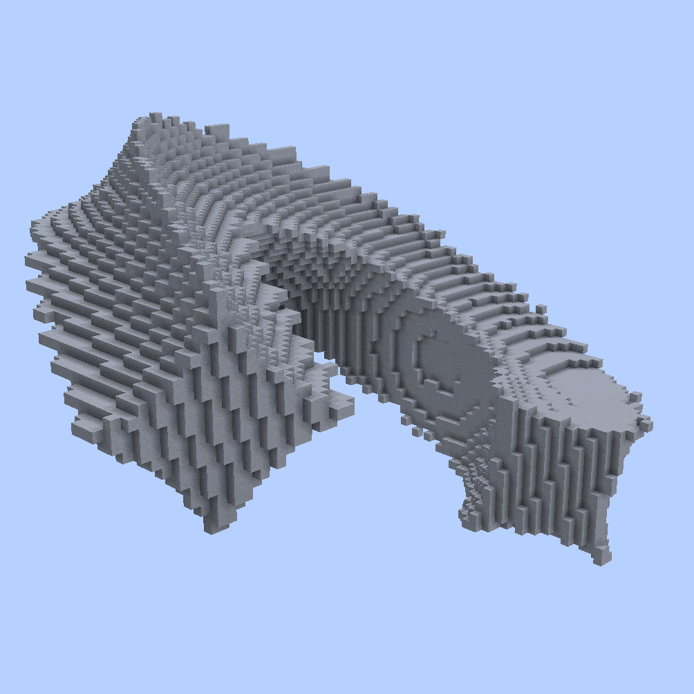

### `//ezspline 2d`` `<mark style="color:orange;">`SuperCircle (SC)`</mark> 

<mark style="color:blue;">超圆样条 (SuperCircle Spline)</mark>

**`//ezsp 2d SuperCircle([`**<mark style="color:orange;">**`Exponent:<value>`**</mark>**`])`** [**`<pattern>`**](2d-spline-shapes.md#syntax) [**`<radii>`**](common-parameters.md#radii) [**`[-t <angle>]`**](common-parameters.md#twist) [**`[-p <kbParameters>]`**](common-parameters.md#kb-parameters) [**`[-q <quality>]`**](common-parameters.md#quality) [**`[-n <normalMode>]`**](common-parameters.md#normal-mode) [**`[-h]`**](common-parameters.md#help-page)

沿着样条路径生成一个以给定超圆形状为横截面的样条。

* **`[`**<mark style="color:orange;">**`Exponent:<value>`**</mark>**`]`** (<mark style="color:orange;">**`E`**</mark>) (默认值: 2.0)
  * 决定形状。
    * 低于 1 为星形，1 为菱形，2 为圆形，高于 2 则趋近于正方形。
  * 参见 [https://www.desmos.com/calculator/vewqf5sc0x](https://www.desmos.com/calculator/vewqf5sc0x)

示例：

`//ezsp 2d SuperCircle(`<mark style="color:orange;">`Exponent:`</mark><mark style="color:orange;">**`0.5`**</mark>`) clay 15`

<!-- langmirror:chunk 5 -->
此 GIF 演示了使用以下指数值 `0.5, 1.0, 2.0, 3.0, 99.0` 运行上述命令的过程：

***

#### 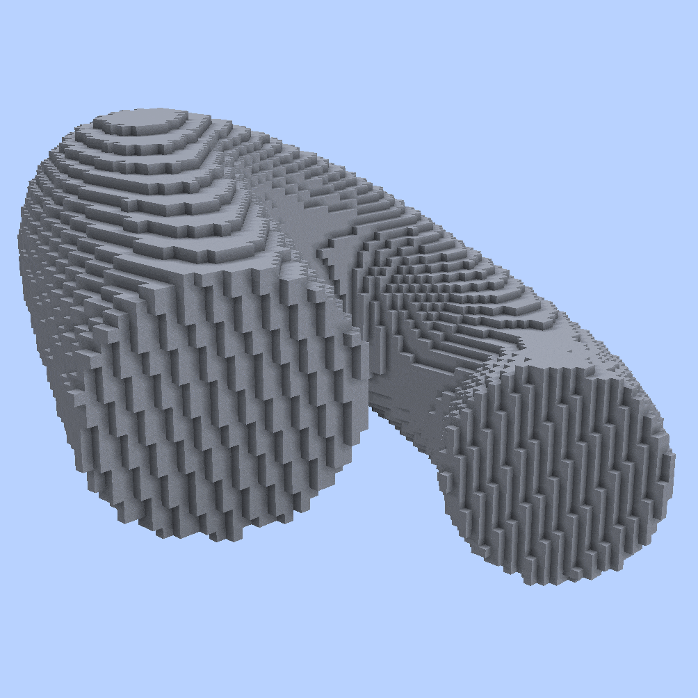

### `//ezspline 2d`` `<mark style="color:orange;">`CirclesCircle (CC)`</mark> (<mark style="color:blue;">`//ezspline rope`</mark>`)` 

<mark style="color:blue;">CirclesCircle 样条线</mark>

**`//ezsp 2d CirclesCircle([`**<mark style="color:orange;">**`Count:<value>`**</mark>**`],[`**<mark style="color:orange;">**`Filled:<boolean>`**</mark>**`])`** [**`<pattern>`**](2d-spline-shapes.md#syntax) [**`<radii>`**](common-parameters.md#radii) [**`[-t <angle>]`**](common-parameters.md#twist) [**`[-p <kbParameters>]`**](common-parameters.md#kb-parameters) [**`[-q <quality>]`**](common-parameters.md#quality) [**`[-n <normalMode>]`**](common-parameters.md#normal-mode) [**`[-h]`**](common-parameters.md#help-page)

沿样条线路径彼此相邻地生成多个圆柱样条线。

<!-- langmirror:chunk 6 -->
* **`[`**<mark style="color:orange;">**`Count:<value>`**</mark>**`]`** (<mark style="color:orange;">**`C`**</mark>) (默认值: 3)
  * 决定圆中圆结构中包含多少个圆。必须在 1 到 12 之间。
* **`[`**<mark style="color:orange;">**`Filled:<boolean>`**</mark>**`]`** (<mark style="color:orange;">**`F`**</mark>) (默认值: false)
  * 决定内部是否应该填充。

参见 [https://www.desmos.com/calculator/ht9tak6nri](https://www.desmos.com/calculator/ht9tak6nri)

示例：

`//ezsp 2d CC(`<mark style="color:orange;">`Count:`</mark><mark style="color:orange;">**`1`**</mark>`) clay 15`

以下 GIF 是通过运行上述命令生成的，在本例中，每次将 <mark style="color:orange;">Count</mark> 参数从 **1** 递增到 **10**：

`//ezspline 2d CirclesCircle`` `<mark style="color:orange;">**`-t 90`**</mark>` ``clay 10`

以下样条曲线可以使用上述命令生成，它只是应用了 [twist 参数](common-parameters.md#twist)：

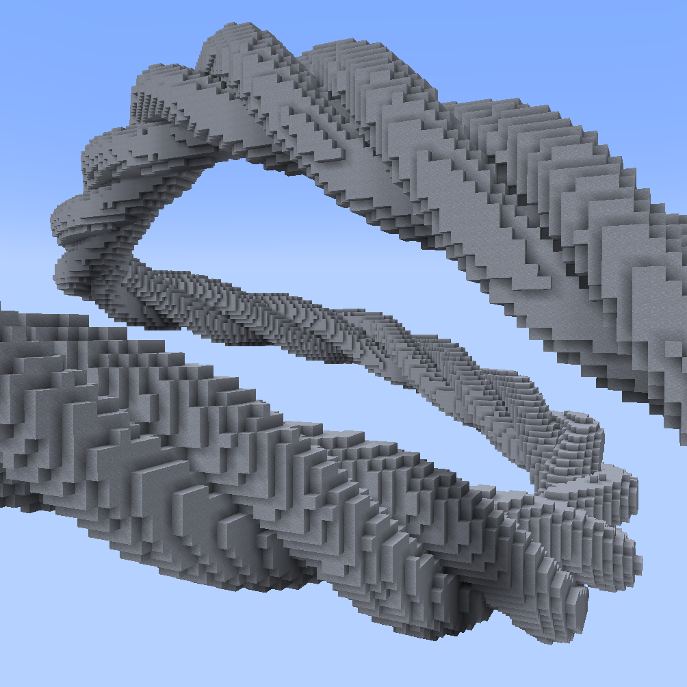

或者通过使用 `//ezspline rope clay 10`

<mark style="color:blue;">`//ezspline rope`</mark> 是 <mark style="color:orange;">`//ezspline 2d CirclesCircle`</mark><mark style="color:orange;">` `</mark><mark style="color:orange;">**`-t 90`**</mark> 的别名

***

#### 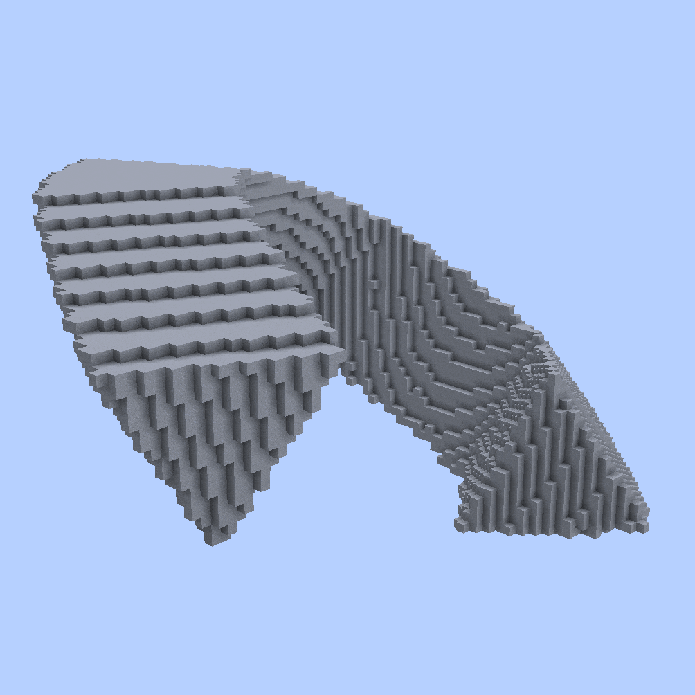

<!-- langmirror:chunk 7 -->
### `//ezspline 2d`` `<mark style="color:orange;">`Polygon (Po)`</mark> 

<mark style="color:blue;">多边形样条线</mark>

**`//ezsp 2d Polygon([`**<mark style="color:orange;">**`Sides:<value>`**</mark>**`])`** [**`<pattern>`**](2d-spline-shapes.md#syntax) [**`<radii>`**](common-parameters.md#radii) [**`[-t <angle>]`**](common-parameters.md#twist) [**`[-p <kbParameters>]`**](common-parameters.md#kb-parameters) [**`[-q <quality>]`**](common-parameters.md#quality) [**`[-n <normalMode>]`**](common-parameters.md#normal-mode) [**`[-h]`**](common-parameters.md#help-page)

沿着样条线路径生成一个多边形形状的样条线。

* **`[`**<mark style="color:orange;">**`Sides:<value>`**</mark>**`]`** (<mark style="color:orange;">**`S`**</mark>) (默认值: 5):
  * 多边形的边数。3 代表三角形，4 代表正方形，5 代表五边形，依此类推。数值必须至少为 3。
  * 参见 [https://www.desmos.com/calculator/eemibllcg8](https://www.desmos.com/calculator/eemibllcg8)

示例：

`//ezsp 2d Polygon(`<mark style="color:orange;">`Sides:`</mark><mark style="color:orange;">**`3`**</mark>`) clay 15`

下方的 GIF 是通过运行上述命令生成的，并每次递增边数（Sides）参数，在本例中从 3 一直增加到 8：

***

#### 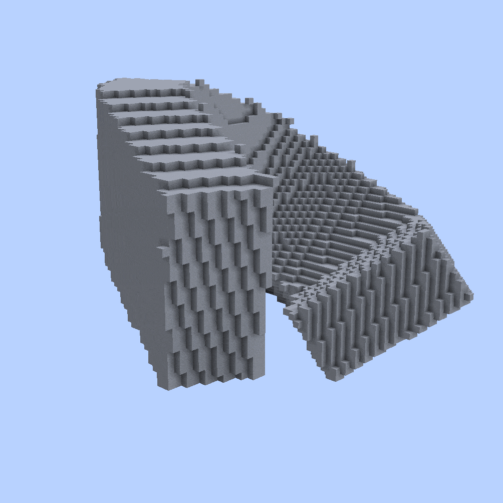

<!-- langmirror:chunk 8 -->
### `//ezspline 2d`` `<mark style="color:orange;">`Rectangle (Re)`</mark> 

<mark style="color:blue;">矩形样条线 (Rectangle Spline)</mark>

**`//ezsp 2d Rectangle([`**<mark style="color:orange;">**`X1:<value>`**</mark>**`],[`**<mark style="color:orange;">**`Y1:<value>`**</mark>**`],[`**<mark style="color:orange;">**`X2:<value>`**</mark>**`],[`**<mark style="color:orange;">**`Y2:<value>`**</mark>**`])`** [**`<pattern>`**](2d-spline-shapes.md#syntax) [**`<radii>`**](common-parameters.md#radii) [**`[-t <angle>]`**](common-parameters.md#twist) [**`[-p <kbParameters>]`**](common-parameters.md#kb-parameters) [**`[-q <quality>]`**](common-parameters.md#quality) [**`[-n <normalMode>]`**](common-parameters.md#normal-mode) [**`[-h]`**](common-parameters.md#help-page)

沿着样条线路径生成一个矩形形状的样条线。

<!-- langmirror:chunk 9 -->
* **`[`**<mark style="color:orange;">**`X1:<value>`**</mark>**`]`** (默认值: -1.0):
  * 定义矩形第一个角的 x 坐标位置。取值范围在 -1 到 1 之间。
* **`[`**<mark style="color:orange;">**`Y1:<value>`**</mark>**`]`** (默认值: -1.0):
  * 定义矩形第一个角的 y 坐标位置。取值范围在 -1 到 1 之间。
* **`[`**<mark style="color:orange;">**`X2:<value>`**</mark>**`]`** (默认值: 1.0):
  * 定义矩形第二个角的 x 坐标位置。取值范围在 -1 到 1 之间。
* **`[`**<mark style="color:orange;">**`Y2:<value>`**</mark>**`]`** (默认值: 1.0):
  * 定义矩形第二个角的 y 坐标位置。取值范围在 -1 到 1 之间。

(<mark style="color:red;">**`!`**</mark>) 我们提供了一个简洁的小型交互式图表，你可以在其中放置你的矩形，并查看哪些数值与之对应，反之亦然：[https://www.desmos.com/calculator/jqyaujpdsk](https://www.desmos.com/calculator/jqyaujpdsk)

示例：

* 上方的 "Hi" 是通过运行以下一系列命令生成的：
  * `//ezsp 2d`` `<mark style="color:orange;">`Re(x1:`</mark><mark style="color:orange;">**`-1.0`**</mark><mark style="color:orange;">`,y1:`</mark><mark style="color:orange;">**`-1.0`**</mark><mark style="color:orange;">`,x2:`</mark><mark style="color:orange;">**`-0.6`**</mark><mark style="color:orange;">`,y2:`</mark><mark style="color:orange;">**`1.0`**</mark><mark style="color:orange;">`)`</mark>` ``clay 12`
    * (H 的左侧柱体)

<!-- langmirror:chunk 10 -->
  * `//ezsp 2d`` `<mark style="color:orange;">`Re(x1:`</mark><mark style="color:orange;">**`-0.2`**</mark><mark style="color:orange;">`,y1:`</mark><mark style="color:orange;">**`-1.0`**</mark><mark style="color:orange;">`,x2:`</mark><mark style="color:orange;">**`0.2`**</mark><mark style="color:orange;">`,y2:`</mark><mark style="color:orange;">**`1.0`**</mark><mark style="color:orange;">`)`</mark>` ``clay 12`
    * (H 的左侧竖笔)
  * `//ezsp 2d`` `<mark style="color:orange;">`Re(x1:`</mark><mark style="color:orange;">**`-1.0`**</mark><mark style="color:orange;">`,y1:`</mark><mark style="color:orange;">**`-0.2`**</mark><mark style="color:orange;">`,x2:`</mark><mark style="color:orange;">**`0.2`**</mark><mark style="color:orange;">`,y2:`</mark><mark style="color:orange;">**`0.2`**</mark><mark style="color:orange;">`)`</mark>` ``clay 12`
    * (H 的中间横笔)
  * `//ezsp 2d`` `<mark style="color:orange;">`Re(x1:`</mark><mark style="color:orange;">**`0.6`**</mark><mark style="color:orange;">`,y1:`</mark><mark style="color:orange;">**`-1.0`**</mark><mark style="color:orange;">`,x2:`</mark><mark style="color:orange;">**`1.0`**</mark><mark style="color:orange;">`,y2:`</mark><mark style="color:orange;">**`0.2`**</mark><mark style="color:orange;">`)`</mark>` ``clay 12`
    * (i 的竖笔)

<!-- langmirror:chunk 11 -->
  * `//ezsp 2d`` `<mark style="color:orange;">`Re(x1:`</mark><mark style="color:orange;">**`0.6`**</mark><mark style="color:orange;">`,y1:`</mark><mark style="color:orange;">**`0.6`**</mark><mark style="color:orange;">`,x2:`</mark><mark style="color:orange;">**`1.0`**</mark><mark style="color:orange;">`,y2:`</mark><mark style="color:orange;">**`1.0`**</mark><mark style="color:orange;">`)`</mark>` ``clay 12`
    * (字母 i 的圆点)

***

#### 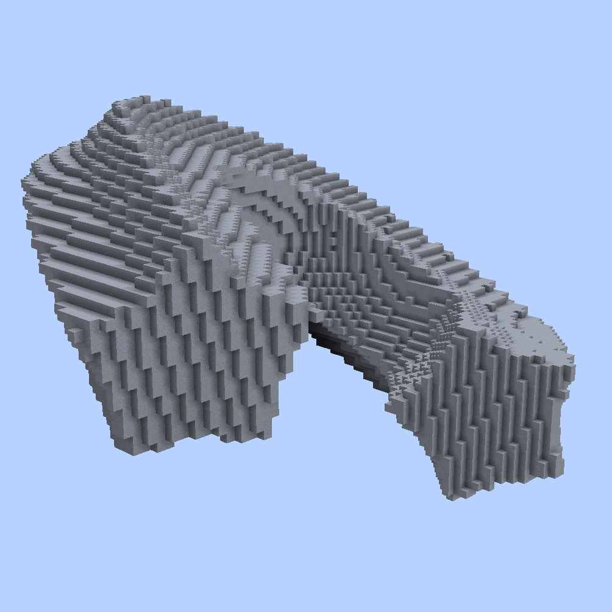

### `//ezspline 2d`` `<mark style="color:orange;">`Star (St)`</mark> 

<mark style="color:blue;">星形样条 (Star Spline)</mark>

**`//ezsp 2d Star([`**<mark style="color:orange;">**`Sides:<value>`**</mark>**`],[`**<mark style="color:orange;">**`Depth:<value>`**</mark>**`])`** [**`<pattern>`**](2d-spline-shapes.md#syntax) [**`<radii>`**](common-parameters.md#radii) [**`[-t <angle>]`**](common-parameters.md#twist) [**`[-p <kbParameters>]`**](common-parameters.md#kb-parameters) [**`[-q <quality>]`**](common-parameters.md#quality) [**`[-n <normalMode>]`**](common-parameters.md#normal-mode) [**`[-h]`**](common-parameters.md#help-page)

沿样条路径生成星形样条。

<!-- langmirror:chunk 12 -->
* **`[`**<mark style="color:orange;">**`Sides:<value>`**</mark>**`]`** (<mark style="color:orange;">**`S`**</mark>) (默认值: 5):
  * 多边形的边数。3 代表三角形，4 代表正方形，5 代表五边形，依此类推。必须至少为 3。
* **`[`**<mark style="color:orange;">**`Depth:<value>`**</mark>**`]`** (<mark style="color:orange;">**`D`**</mark>) (默认值: 0.5):
  * 设置星形褶皱向中心切入的深度。介于 0 和 1 之间。
  * 0 模拟多边形，
  * 接近 1 的值会导致极细的尖刺。
* (<mark style="color:red;">**`!`**</mark>) 参见 [https://www.desmos.com/calculator/gqclaezcxc](https://www.desmos.com/calculator/gqclaezcxc)

***

#### 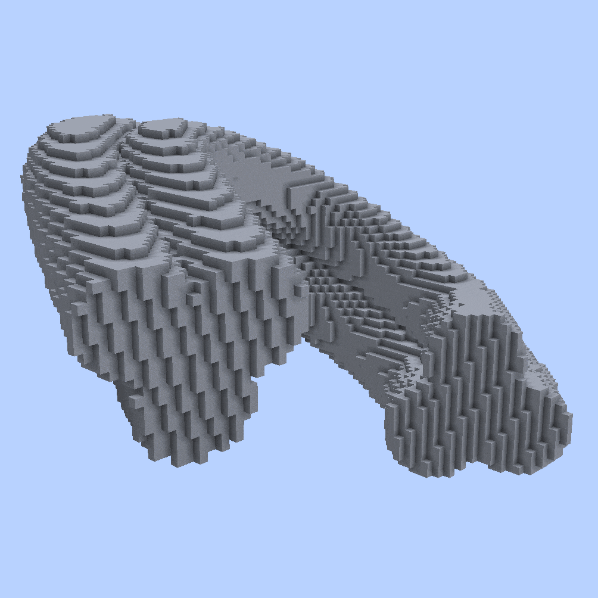

### `//ezspline 2d`` `<mark style="color:orange;">`Flower (Fl)`</mark> 

<mark style="color:blue;">花形样条线 (Flower Spline)</mark>

**`//ezsp 2d Flower([`**<mark style="color:orange;">**`Count:<value>`**</mark>**`],[`**<mark style="color:orange;">**`Depth:<value>`**</mark>**`])`** [**`<pattern>`**](2d-spline-shapes.md#syntax) [**`<radii>`**](common-parameters.md#radii) [**`[-t <angle>]`**](common-parameters.md#twist) [**`[-p <kbParameters>]`**](common-parameters.md#kb-parameters) [**`[-q <quality>]`**](common-parameters.md#quality) [**`[-n <normalMode>]`**](common-parameters.md#normal-mode) [**`[-h]`**](common-parameters.md#help-page)

<!-- langmirror:chunk 13 -->
沿着样条路径生成一个花朵形状的样条。

* **`[`**<mark style="color:orange;">**`Count:<value>`**</mark>**`]`** (<mark style="color:orange;">**`S`**</mark>) (默认值: 5):
  * 花瓣的数量。
* **`[`**<mark style="color:orange;">**`Depth:<value>`**</mark>**`]`** (<mark style="color:orange;">**`D`**</mark>) (默认值: 0.5):
  * 设置花瓣之间的褶皱向中心切入的深度。取值范围在 0 到 1 之间。
* (<mark style="color:red;">**`!`**</mark>) 参见 [https://www.desmos.com/calculator/tah7yjltyr](https://www.desmos.com/calculator/tah7yjltyr)

***