<!-- langmirror:chunk 0 -->
# 3D 样条形状 (3D Spline Shapes)

本页面介绍了 `//ezspline 3d` 子命令，其功能是沿样条路径生成嵌入的 3D 样条形状。

***

## 语法

**`//ezspline 3d`** <mark style="color:orange;">**`<shape>`**</mark> <mark style="color:orange;">**`<pattern>`**</mark> [**`<radii>`**](common-parameters.md#radii) [**`[-s <stretch>]`**](common-parameters.md#stretch-s-less-than-stretchfactor-greater-than) [**`[-t <angle>]`**](common-parameters.md#twist) [**`[-p <kbParameters>]`**](common-parameters.md#kb-parameters) [**`[-q <quality>]`**](common-parameters.md#quality) [**`[-n <normalMode>]`**](common-parameters.md#normal-mode) [**`[-h]`**](common-parameters.md#help-page)

* <mark style="color:orange;">**`<shape>`**</mark> : 从下方列表中选择一个形状。
* <mark style="color:orange;">**`<pattern>`**</mark>: 指定构成样条的方块，例如 `clay`。

_其余参数在_ [_通用参数 (Common Parameters)_](common-parameters.md) _子页面中有详细说明。_

***

## <mark style="color:orange;">**`<shape>`**</mark> 列表

<!-- langmirror:chunk 1 -->
<table data-view="cards"><thead><tr><th></th><th data-hidden data-card-cover data-type="files"></th><th data-hidden data-card-target data-type="content-ref"></th></tr></thead><tbody><tr><td><strong><code>Beads</code> (珠串)</strong> (<strong><code>Be</code></strong>)</td><td><a href="../../.gitbook/assets/SplinesBeads.png">SplinesBeads.png</a></td><td><a href="3d-spline-shapes.md#bead-spline">#bead-spline</a></td></tr><tr><td><strong><code>Cubes</code> (立方体)</strong> (<strong><code>Cu</code></strong>)</td><td><a href="../../.gitbook/assets/SplinesCubes.gif">SplinesCubes.gif</a></td><td><a href="3d-spline-shapes.md#cubes-spline">#cubes-spline</a></td></tr><tr><td><strong><code>Braids</code> (辫状)</strong> (<strong><code>Br</code></strong>)</td><td><a href="../../.gitbook/assets/SplinesBraids.gif">SplinesBraids.gif</a></td><td></td></tr><tr><td><strong><code>Oscillate</code> (振荡)</strong> (<strong><code>Os</code></strong>)</td><td><a href="../../.gitbook/assets/SplineOscillate.gif">SplineOscillate.gif</a></td><td><a href="3d-spline-shapes.md#oscillation-spline">#oscillation-spline</a></td></tr><tr><td><strong><code>Fishnet</code> (鱼网)</strong> (<strong><code>Fi</code></strong>)</td><td><a href="../../.gitbook/assets/SplinesFishnet.gif">SplinesFishnet.gif</a></td><td><a href="3d-spline-shapes.md#fishnet-spline">#fishnet-spline</a></td></tr><tr><td><strong><code>Chainlink</code> (链环)</strong> (<strong><code>Ch</code></strong>)</td><td><a href="../../.gitbook/assets/SplinesChainlink.gif">SplinesChainlink.gif</a></td><td><a href="3d-spline-shapes.md#chain-link-spline">#chain-link-spline</a></td></tr><tr><td><strong><code>Rings</code> (圆环)</strong> (<strong><code>Ri</code></strong>)</td><td><a href="../../.gitbook/assets/SplinesRings.gif">SplinesRings.gif</a></td><td><a href="3d-spline-shapes.md#rings-spline">#rings-spline</a></td></tr><tr><td><strong><code>Scales</code> (鳞片)</strong> (<strong><code>Sc</code></strong>)</td><td><a href="../../.gitbook/assets/SplinesScales.gif">SplinesScales.gif</a></td><td><a href="3d-spline-shapes.md#scales-spline">#scales-spline</a></td></tr><tr><td><strong><code>Noodles</code> (面条)</strong> (<strong><code>No</code></strong>)</td><td><a href="../../.gitbook/assets/SplinesNoodles.gif">SplinesNoodles.gif</a></td><td><a href="3d-spline-shapes.md#noodles-spline">#noodles-spline</a></td></tr></tbody></table>

<!-- langmirror:chunk 2 -->
***

#### 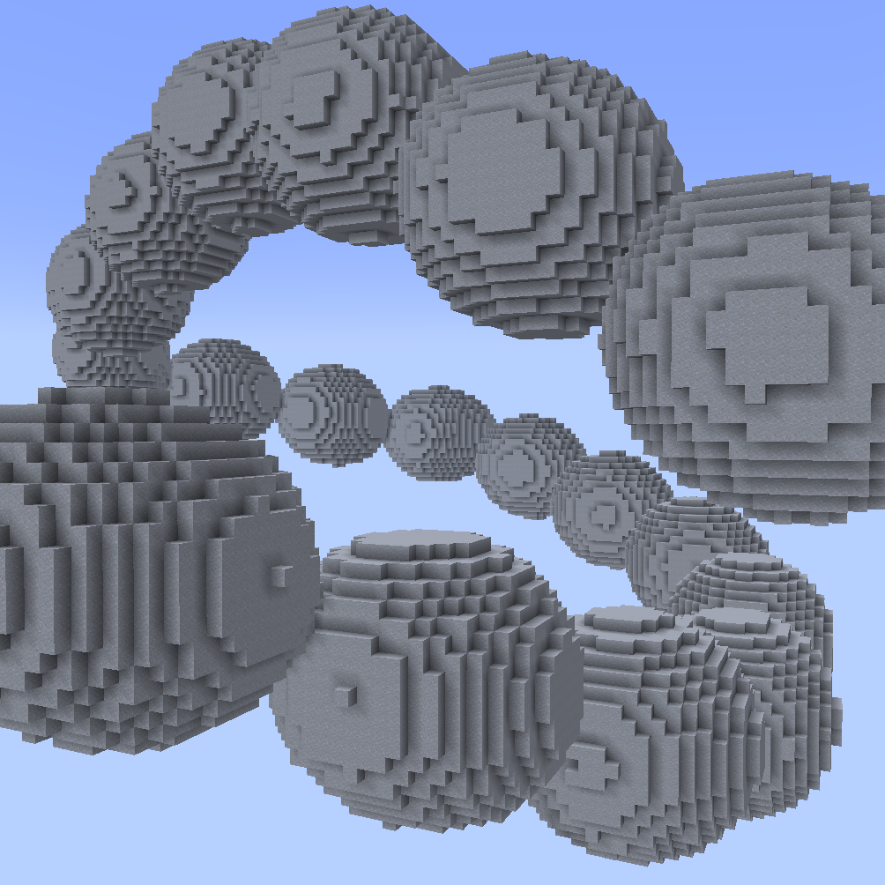

### `//ezspline 3d`` `<mark style="color:orange;">`Beads (Be)`</mark> 

<mark style="color:blue;">珠串样条线 (Bead spline)</mark>

**`//ezsp 3d Beads`** [**`<pattern>`**](3d-spline-shapes.md#syntax) [**`<radii>`**](common-parameters.md#radii) [**`[-s <stretch>]`**](common-parameters.md#stretch-s-less-than-stretchfactor-greater-than) [**`[-t <angle>]`**](common-parameters.md#twist) [**`[-p <kbParameters>]`**](common-parameters.md#kb-parameters) [**`[-q <quality>]`**](common-parameters.md#quality) [**`[-n <normalMode>]`**](common-parameters.md#normal-mode) [**`[-h]`**](common-parameters.md#help-page)

沿选定点位生成珠串形状的样条线。

* _珠串形状没有参数。_

**示例：**

`//ezsp 3d`` `<mark style="color:orange;">`Beads`</mark>` ``clay 10`

_此形状也可以通过_ [_Rings_](3d-spline-shapes.md#ezspline-3d-rings) _形状并配合以下参数组合来实现：`Rings(E:0,T:1,G:0,M:2,N:2)`_

***

#### 

### `//ezspline 3d`` `<mark style="color:orange;">`Cubes (Cu)`</mark> 

<mark style="color:blue;">方块样条线 (Cubes Spline)</mark>

<!-- langmirror:chunk 3 -->
**`//ezsp 3d Cubes([`**<mark style="color:orange;">**`Gap:<value>`**</mark>**`])`** [**`<pattern>`**](3d-spline-shapes.md#syntax) [**`<radii>`**](common-parameters.md#radii) [**`[-s <stretch>]`**](common-parameters.md#stretch-s-less-than-stretchfactor-greater-than) [**`[-t <angle>]`**](common-parameters.md#twist) [**`[-p <kbParameters>]`**](common-parameters.md#kb-parameters) [**`[-q <quality>]`**](common-parameters.md#quality) [**`[-n <normalMode>]`**](common-parameters.md#normal-mode) [**`[-h]`**](common-parameters.md#help-page)

沿选定位置生成一组扭曲的立方体。

* **`[`**<mark style="color:orange;">**`Gap:<value>`**</mark>**`]`** (<mark style="color:orange;">**`G`**</mark>) (默认值: 0.5):
  * 设置立方体之间的间隙

(<mark style="color:blue;">**`!`**</mark>) 我们提供了一个交互式 3D 图表供您尝试所有参数：[https://www.desmos.com/3d/xbmia9wiwo](https://www.desmos.com/3d/xbmia9wiwo)

**示例：**

`//ezsp 3d`` `<mark style="color:orange;">`Cubes`</mark>` ``clay 7`

默认间隙为 0.5

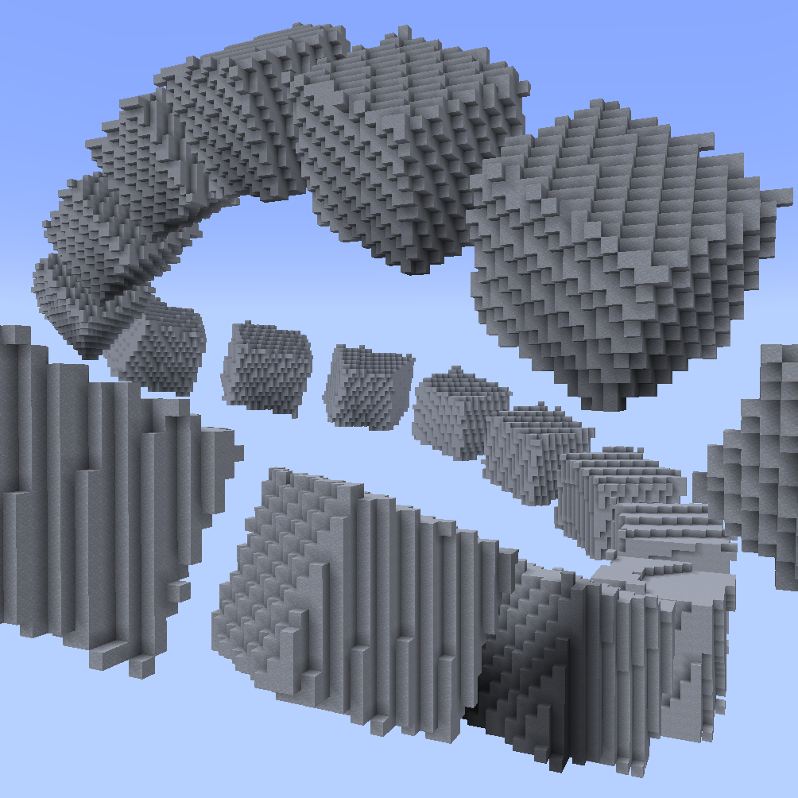

`//ezsp 3d`` `<mark style="color:orange;">`Cubes(Gap:0.0)`</mark>` ``clay 7`

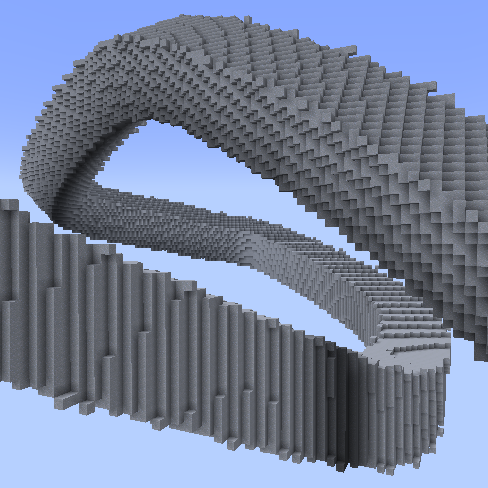

`//ezsp 3d`` `<mark style="color:orange;">`Cubes(Gap:1.0)`</mark>` ``clay 7`

<!-- langmirror:chunk 4 -->
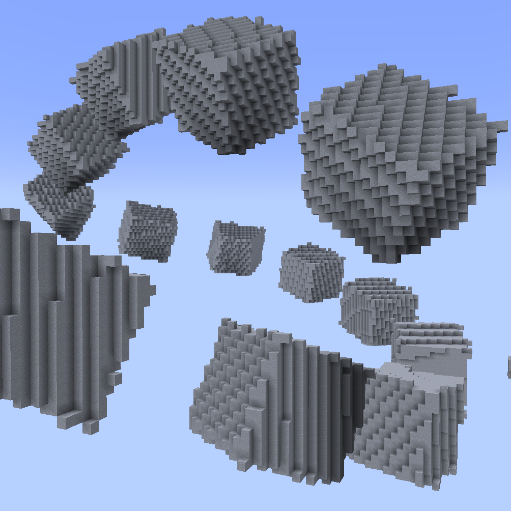

`//ezsp 3d`` `<mark style="color:orange;">`Cu(G:2.0)`</mark>` ``clay 7`

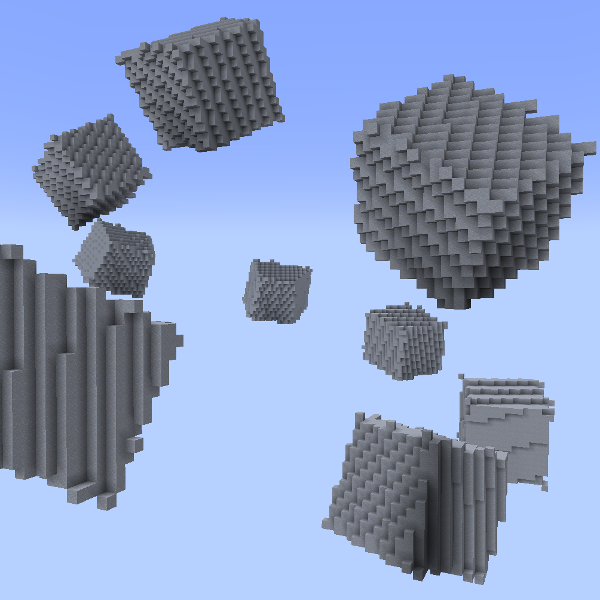

***

#### 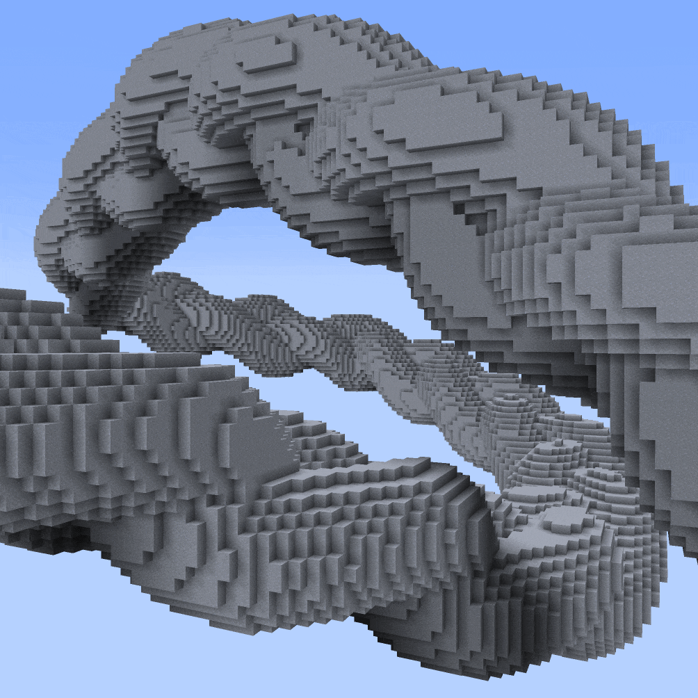

### `//ezspline 3d`` `<mark style="color:orange;">`Braids (Br)`</mark> 

<mark style="color:blue;">Braids（编织绳）样条</mark>

**`//ezsp 3d Braids([`**<mark style="color:orange;">**`Thickness:<value>`**</mark>**`])`** [**`<pattern>`**](3d-spline-shapes.md#syntax) [**`<radii>`**](common-parameters.md#radii) [**`[-s <stretch>]`**](common-parameters.md#stretch-s-less-than-stretchfactor-greater-than) [**`[-t <angle>]`**](common-parameters.md#twist) [**`[-p <kbParameters>]`**](common-parameters.md#kb-parameters) [**`[-q <quality>]`**](common-parameters.md#quality) [**`[-n <normalMode>]`**](common-parameters.md#normal-mode) [**`[-h]`**](common-parameters.md#help-page)

沿选定点生成编织绳形状的样条。

* **`[`**<mark style="color:orange;">**`Thickness:<value>`**</mark>**`]`** (<mark style="color:orange;">**`T`**</mark>) (默认值: 0.5):
  * 设置单个编织股的相对厚度

(<mark style="color:blue;">**`!`**</mark>) 我们提供了一个交互式 3D 图表来尝试所有参数： [https://www.desmos.com/3d/89xdz5xmsh](https://www.desmos.com/3d/89xdz5xmsh)

<!-- langmirror:chunk 5 -->
**示例：**

`//ezsp 3d`` `<mark style="color:orange;">`Braids`</mark>` ``clay 7`

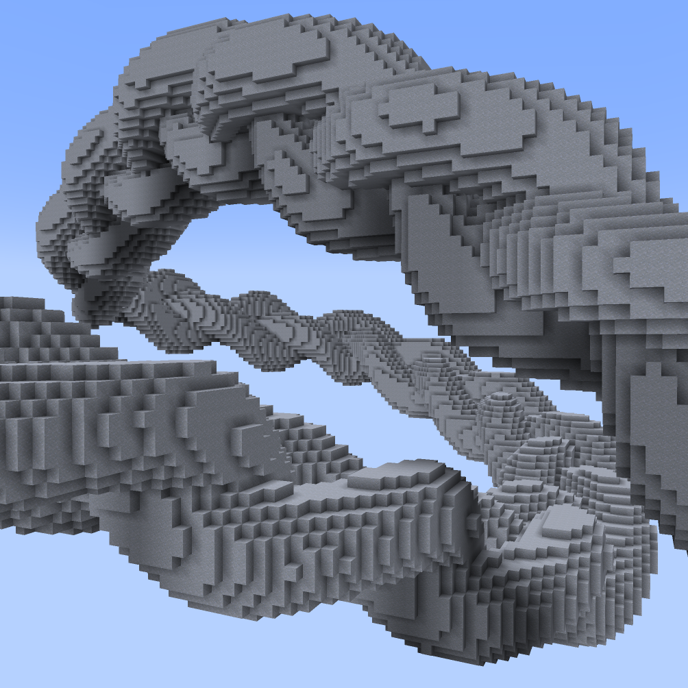

`//ezsp 3d`` `<mark style="color:orange;">`Braids(Thickness:0.2)`</mark>` ``clay 7`

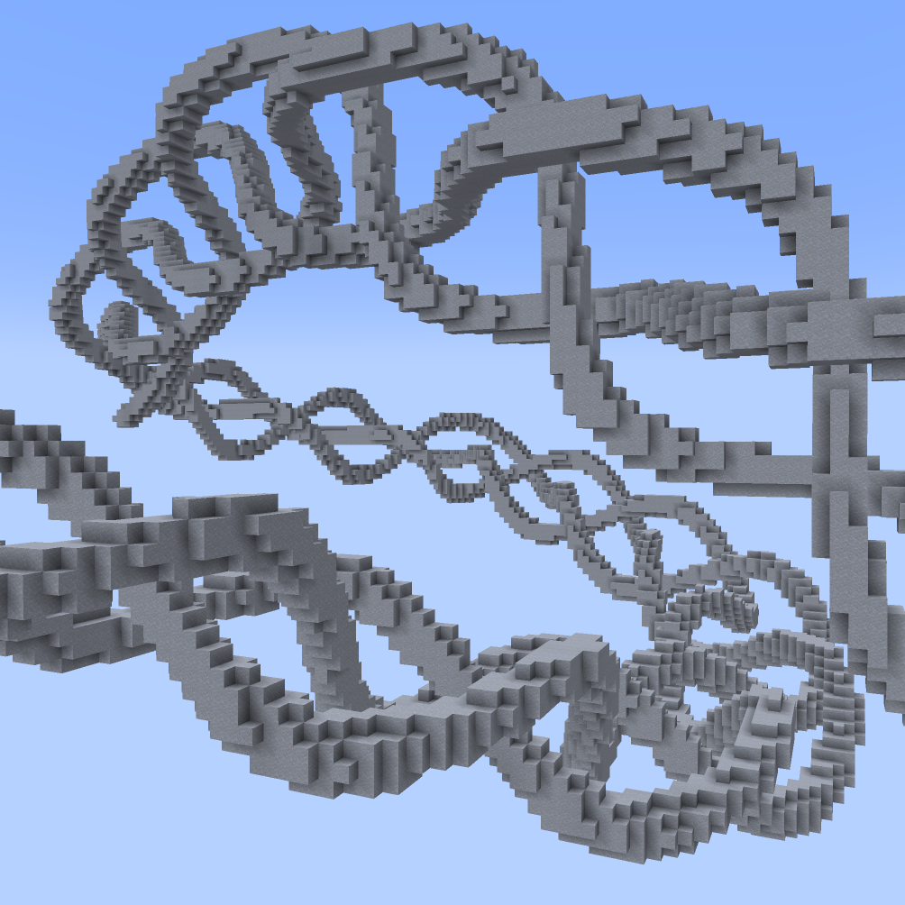

`//ezsp 3d`` `<mark style="color:orange;">`Br(G:1)`</mark>` ``clay 7`

***

#### 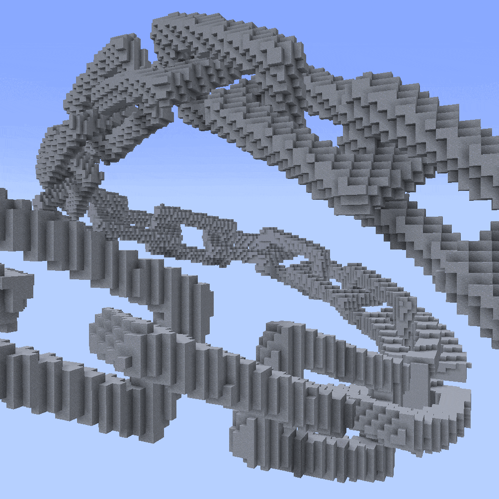

### `//ezspline 3d`` `<mark style="color:orange;">`Chainlink (Ch)`</mark> 

<mark style="color:blue;">链环样条线 (Chain-Link Spline)</mark>

<!-- langmirror:chunk 6 -->
**`//ezsp 3d Chainlink([`**<mark style="color:orange;">**`Extrusion:<value>`**</mark>**`],[`**<mark style="color:orange;">**`Thickness:<value>`**</mark>**`],[`**<mark style="color:orange;">**`Gap:<value>`**</mark>**`],[`**<mark style="color:orange;">**`MajorExponent:<value>`**</mark>**`],[`**<mark style="color:orange;">**`MinorExponent:<value>`**</mark>**`],[`**<mark style="color:orange;">**`Place:<value>`**</mark>**`])`** [**`<pattern>`**](3d-spline-shapes.md#syntax) [**`<radii>`**](common-parameters.md#radii) [**`[-s <stretch>]`**](common-parameters.md#stretch-s-less-than-stretchfactor-greater-than) [**`[-t <angle>]`**](common-parameters.md#twist) [**`[-p <kbParameters>]`**](common-parameters.md#kb-parameters) [**`[-q <quality>]`**](common-parameters.md#quality) [**`[-n <normalMode>]`**](common-parameters.md#normal-mode) [**`[-h]`**](common-parameters.md#help-page)

沿着选定的位置生成一个高度可自定义的链环形状样条曲线。

<!-- langmirror:chunk 7 -->
* **`[`**<mark style="color:orange;">**`Extrusion:<value>`**</mark>**`]`** (<mark style="color:orange;">**`E`**</mark>) (默认值: 0.2):
  * 沿链条方向为每个独立链环增加的长度。
* **`[`**<mark style="color:orange;">**`Thickness:<value>`**</mark>**`]`** (<mark style="color:orange;">**`T`**</mark>) (默认值: 1.0):
  * 每个链环的内半径/次半径。
* **`[`**<mark style="color:orange;">**`Gap:<value>`**</mark>**`]`** (<mark style="color:orange;">**`G`**</mark>) (默认值: 0.0):
  * 每个链环的偏移量，用于调整链条中链环的重叠程度。
* **`[`**<mark style="color:orange;">**`MajorExponent:<value>`**</mark>**`]`** (<mark style="color:orange;">**`M`**</mark>) (默认值: 3.0):
  * 定义单个链环外部形状的指数。
* **`[`**<mark style="color:orange;">**`MinorExponent:<value>`**</mark>**`]`** (<mark style="color:orange;">**`N`**</mark>) (默认值: 3.0):
  * 定义单个链环横截面形状的指数。
* **`[`**<mark style="color:orange;">**`Place:<value>`**</mark>**`]`** (<mark style="color:orange;">**`P`**</mark>) (默认值: "BOTH"):
  * 在 "FIRST"、"SECOND" 或 "BOTH" 之间选择，以仅放置一半的链环或全部放置。

(<mark style="color:red;">**`!`**</mark>) 我们提供了一个交互式 3D 图表来尝试所有参数（非常巧妙）： [https://www.desmos.com/3d/yvrsv605mf](https://www.desmos.com/3d/yvrsv605mf)

**示例：**

<!-- langmirror:chunk 8 -->
`//ezsp 3d`` `<mark style="color:orange;">`Chainlink`</mark>` ``clay 10`

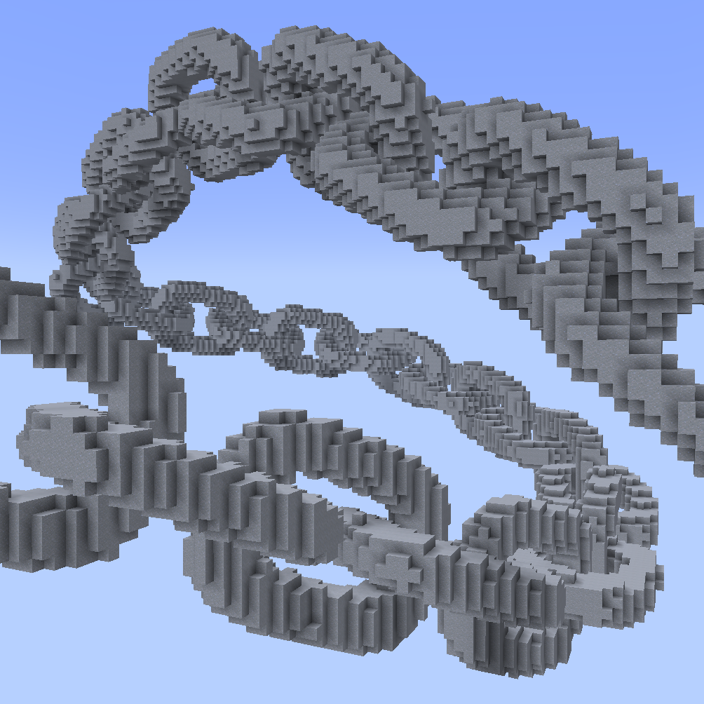

`//ezsp 3d`` `<mark style="color:orange;">`Chainlink(M:99,N:99,Extrusion:0.6)`</mark>` ``clay 10`

* `M:99` 负责使链环呈现矩形（而非椭圆形）。
* `N:99` 负责使方形链环的横截面呈现正方形。

`//ezsp 3d`` `<mark style="color:orange;">`Chainlink(M:1,N:1,E:0.7,G:-0.2,T:1.2)`</mark>` ``clay 11`

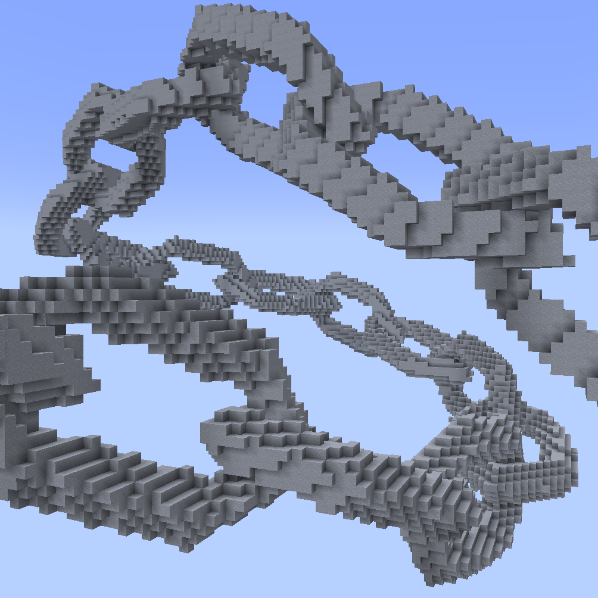

`//ezsp 3d`` `<mark style="color:orange;">`Chainlink(M:2,N:2,E:0,G:1)`</mark>` ``clay 11`

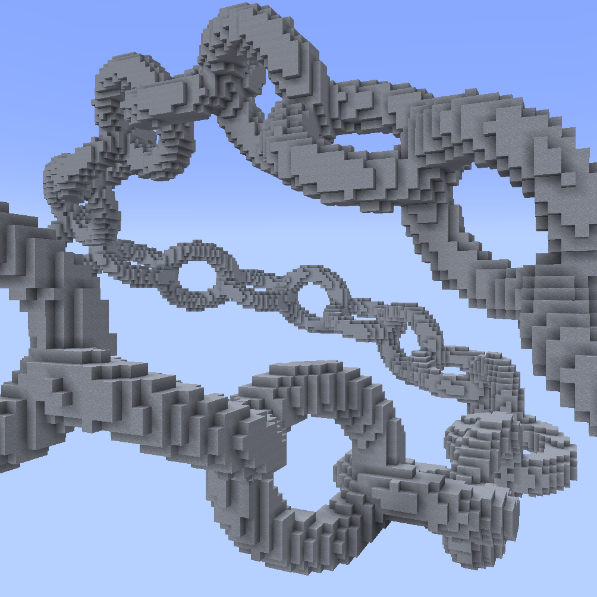

`//ezspline 3d`` `<mark style="color:orange;">`Chainlink(P:FIRST)`</mark> <mark style="color:red;">`red_terracotta`</mark>` ``10`

`//ezspline 3d`` `<mark style="color:orange;">`Chainlink(P:SECOND)`</mark> <mark style="color:blue;">`blue_wool`</mark>` ``10`

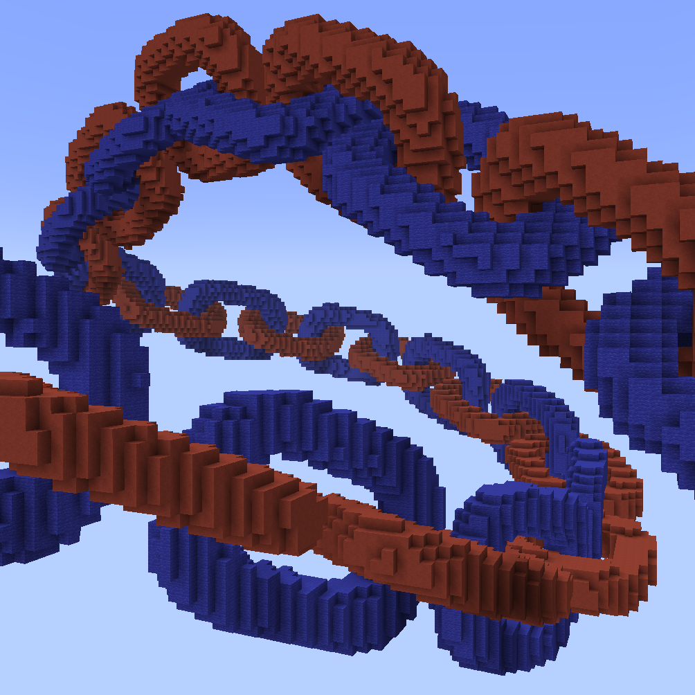

***

#### 

### `//ezspline 3d`` `<mark style="color:orange;">`Fishnet (Fi)`</mark> 

<mark style="color:blue;">鱼网样条 (Fishnet Spline)</mark>

<!-- langmirror:chunk 9 -->
**`//ezsp 3d Fishnet([`**<mark style="color:orange;">**`Spacing:<value>`**</mark>**`],[`**<mark style="color:orange;">**`Depth:<value>`**</mark>**`],[`**<mark style="color:orange;">**`Width:<value>`**</mark>**`])`** [**`<pattern>`**](3d-spline-shapes.md#syntax) [**`<radii>`**](common-parameters.md#radii) [**`[-s <stretch>]`**](common-parameters.md#stretch-s-less-than-stretchfactor-greater-than) [**`[-t <angle>]`**](common-parameters.md#twist) [**`[-p <kbParameters>]`**](common-parameters.md#kb-parameters) [**`[-q <quality>]`**](common-parameters.md#quality) [**`[-n <normalMode>]`**](common-parameters.md#normal-mode) [**`[-h]`**](common-parameters.md#help-page)

沿选定位置生成鱼网状样条曲线。

* **`[`**<mark style="color:orange;">**`Spacing:<value>`**</mark>**`]`** (<mark style="color:orange;">**`S`**</mark>) (默认值: 1.0):
  * 网格线条之间的间距。
* **`[`**<mark style="color:orange;">**`Depth:<value>`**</mark>**`]`** (<mark style="color:orange;">**`D`**</mark>) (默认值: 0.2):
  * 网格中每根线条的深度。即它向样条曲线中心突出的程度。
* **`[`**<mark style="color:orange;">**`Width:<value>`**</mark>**`]`** (<mark style="color:orange;">**`W`**</mark>) (默认值: 0.2):
  * 每根线条的宽度。

<!-- langmirror:chunk 10 -->
(<mark style="color:blue;">**`!`**</mark>) 我们提供了一个交互式 3D 图表，供您尝试所有参数（非常实用）：[https://www.desmos.com/3d/eww8fzzyuj](https://www.desmos.com/3d/eww8fzzyuj)

**示例：**

`//ezspline 3d`` `<mark style="color:orange;">`Fishnet`</mark>` ``clay 10`

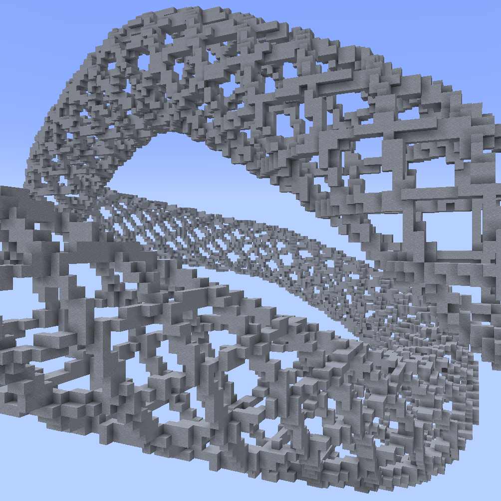

`//ezsp 3d`` `<mark style="color:orange;">`Fishnet(Spacing:2.0)`</mark>` ``clay 10`

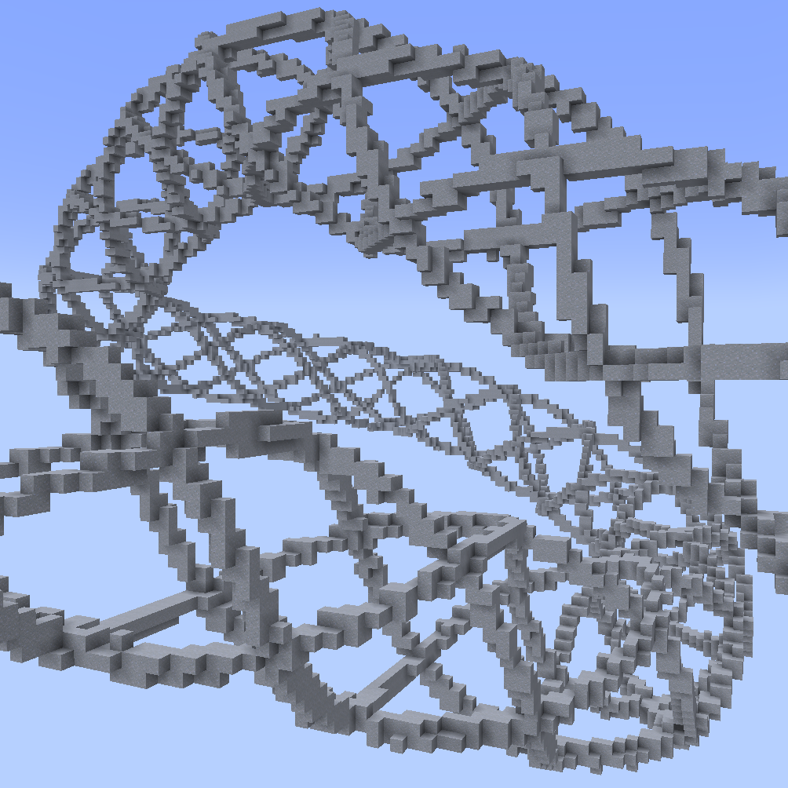

`//ezsp 3d`` `<mark style="color:orange;">`Fishnet(S:2.0,Depth:1.0,Width:0.3)`</mark>` ``clay 10`

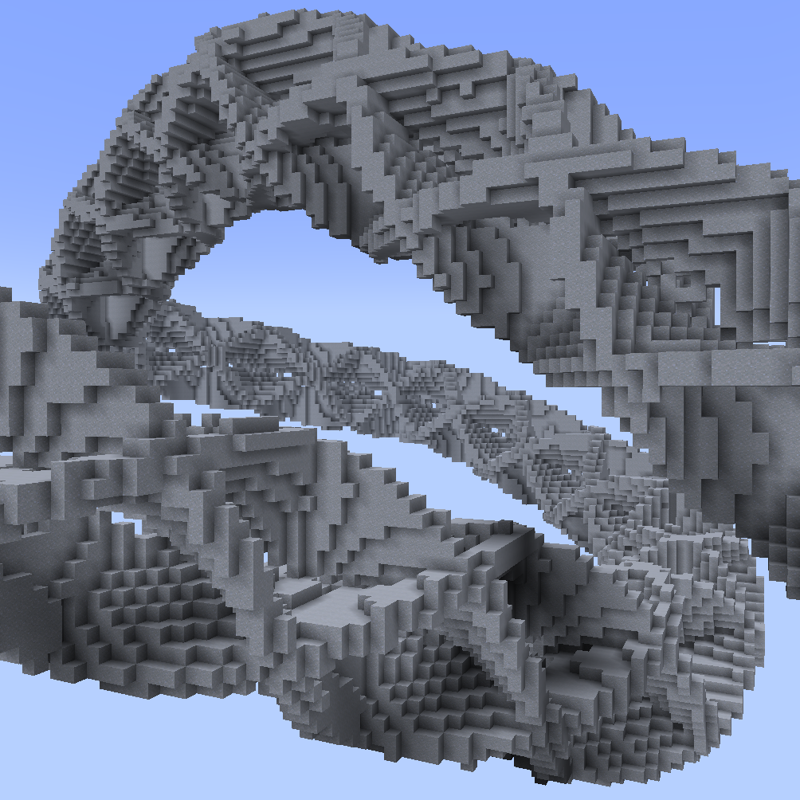

`//ezsp 3d`` `<mark style="color:orange;">`Fi(S:2.0,D:0.5,W:0.5)`</mark>` ``clay 10`

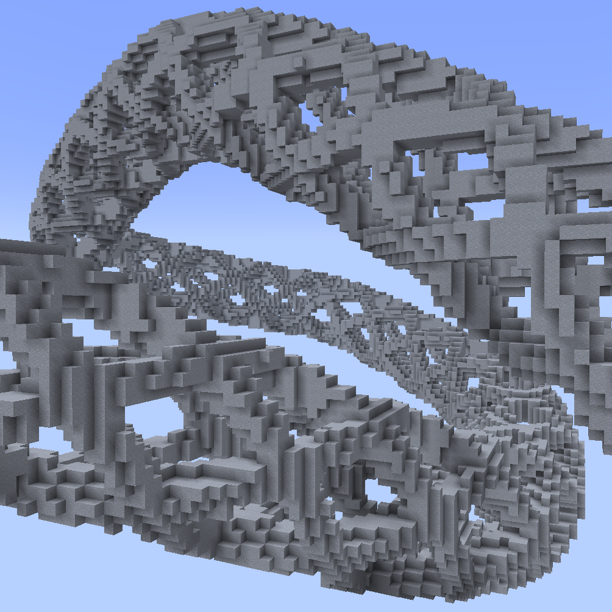

***

#### 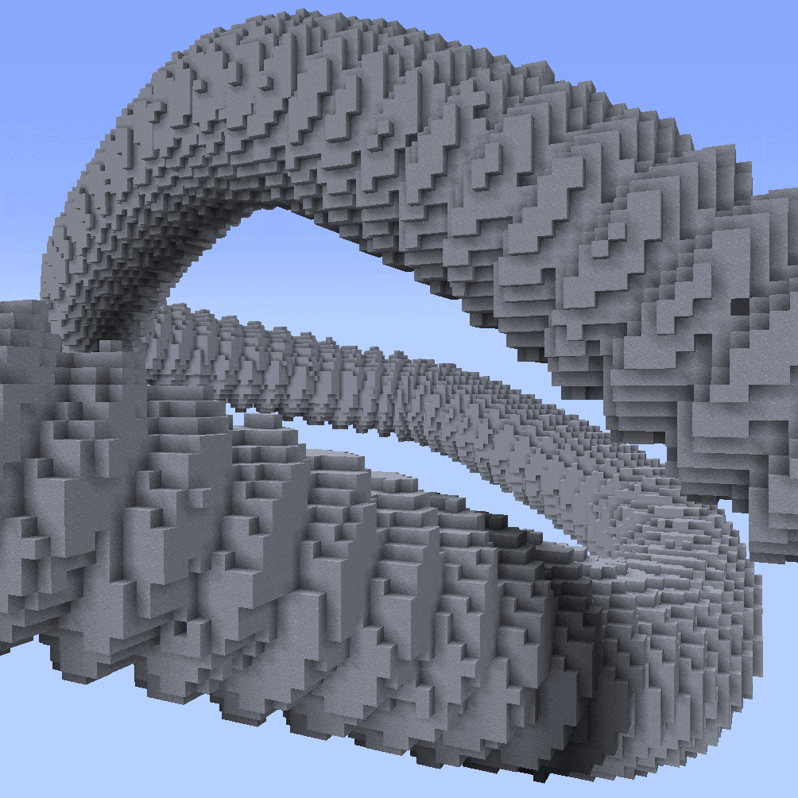

### `//ezspline 3d`` `<mark style="color:orange;">`Oscillate (Os)`</mark> 

<mark style="color:blue;">摆动样条线 (Oscillation Spline)</mark>

<!-- langmirror:chunk 11 -->
**`//ezsp 3d Oscillate([`**<mark style="color:orange;">**`Depth:<value>`**</mark>**`],[`**<mark style="color:orange;">**`Interval:<value>`**</mark>**`])`** [**`<pattern>`**](3d-spline-shapes.md#syntax) [**`<radii>`**](common-parameters.md#radii)[**`[-s <stretch>]`**](common-parameters.md#stretch-s-less-than-stretchfactor-greater-than) [**`[-t <angle>]`**](common-parameters.md#twist) [**`[-p <kbParameters>]`**](common-parameters.md#kb-parameters) [**`[-q <quality>]`**](common-parameters.md#quality) [**`[-n <normalMode>]`**](common-parameters.md#normal-mode) [**`[-h]`**](common-parameters.md#help-page)

在选定位置之间生成一个厚度呈振荡变化的样条曲线。

* **`[`**<mark style="color:orange;">**`Depth:<value>`**</mark>**`]`** (<mark style="color:orange;">**`D`**</mark>) (默认值: 0.2):
  * 指定脊线切入样条表面的深度（以方块为单位）。
* **`[`**<mark style="color:orange;">**`Interval:<value>`**</mark>**`]`** (<mark style="color:orange;">**`I`**</mark>) (默认值: 0.5):
  * 指定每条脊线之间的距离。

(<mark style="color:blue;">**`!`**</mark>) 我们提供了一个交互式 3D 图表，用于调节所有参数：[https://www.desmos.com/3d/xilpdwcnom](https://www.desmos.com/3d/xilpdwcnom)

示例：

`//ezspline 3d`` `<mark style="color:orange;">`Oscillate`</mark>` ``clay 10`

使用默认值 <mark style="color:orange;">`Depth:0.2`</mark> 和 <mark style="color:orange;">`Interval:0.5`</mark>

<!-- langmirror:chunk 12 -->

`//ezsp 3d`` `<mark style="color:orange;">`Oscillate(Depth:0.6)`</mark>` ``clay 10`

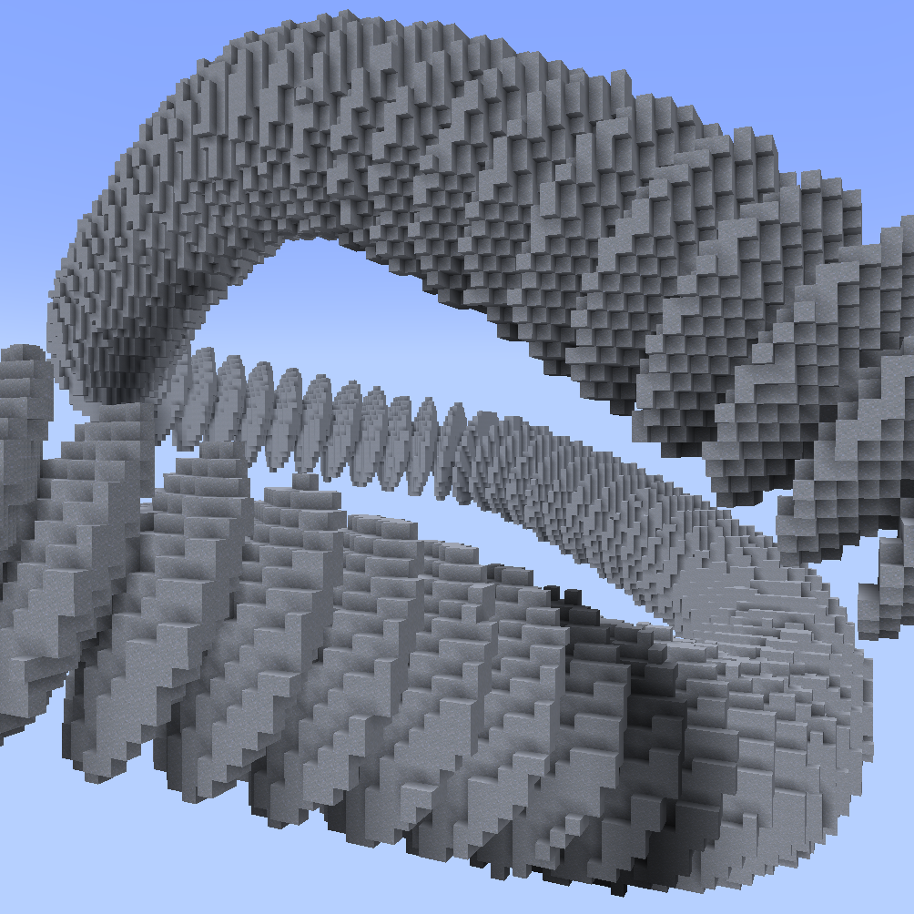

`//ezsp 3d`` `<mark style="color:orange;">`Oscillate(Depth:0.6,Interval:1.5)`</mark>` ``clay 10`

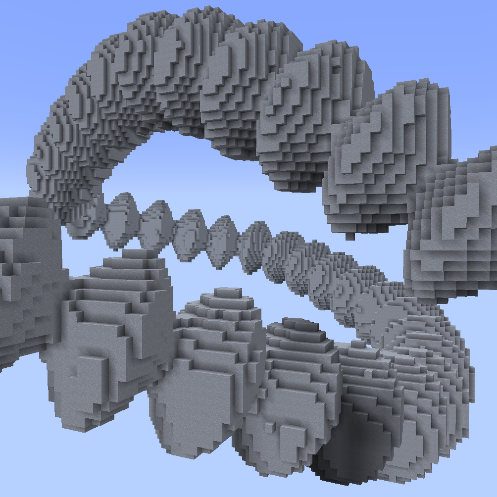

`//ezsp 3d`` `<mark style="color:orange;">`Oscillate(Depth:0.2,Interval:1.5)`</mark>` ``clay 10`

可以缩写为 <mark style="color:orange;">`Os(D:0.2,I:1.5)`</mark>

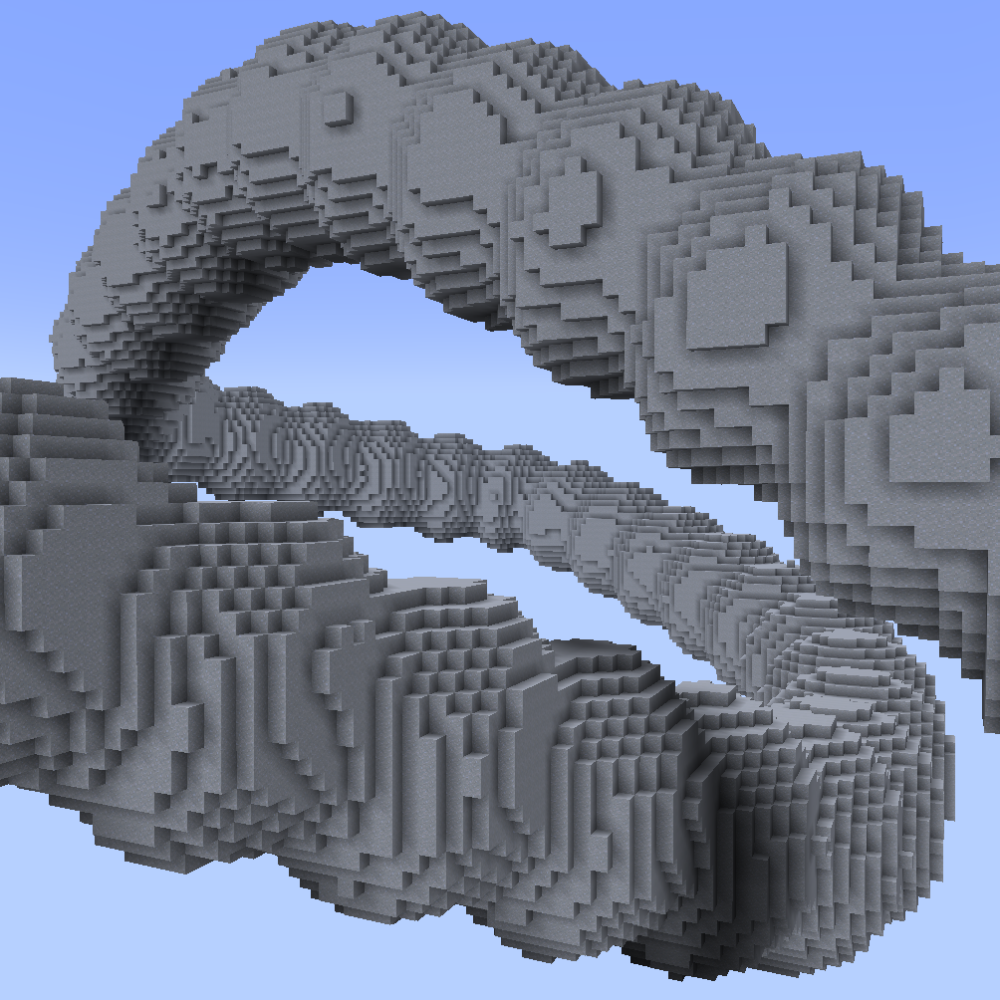

***

#### 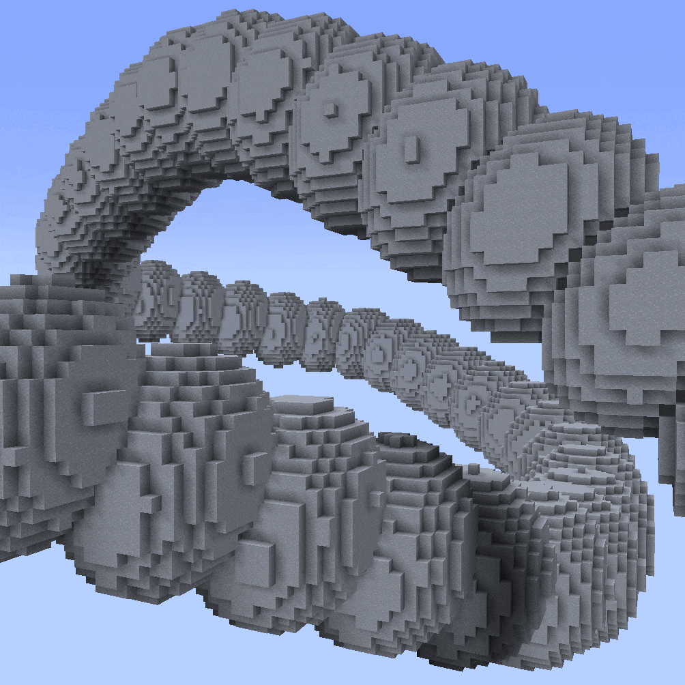

### `//ezspline 3d`` `<mark style="color:orange;">`Rings (Ri)`</mark> 

<mark style="color:blue;">圆环样条 (Rings Spline)</mark>

<!-- langmirror:chunk 13 -->
**`//ezsp Rings([`**<mark style="color:orange;">**`Extrusion:<value>`**</mark>**`],[`**<mark style="color:orange;">**`Thickness:<value>`**</mark>**`],[`**<mark style="color:orange;">**`Gap:<value>`**</mark>**`],[`**<mark style="color:orange;">**`MajorExponent:<value>`**</mark>**`],[`**<mark style="color:orange;">**`MinorExponent:<value>`**</mark>**`])`** [**`<pattern>`**](3d-spline-shapes.md#syntax) [**`<radii>`**](common-parameters.md#radii)[**`[-s <stretch>]`**](common-parameters.md#stretch-s-less-than-stretchfactor-greater-than) [**`[-t <angle>]`**](common-parameters.md#twist) [**`[-p <kbParameters>]`**](common-parameters.md#kb-parameters) [**`[-q <quality>]`**](common-parameters.md#quality) [**`[-n <normalMode>]`**](common-parameters.md#normal-mode) [**`[-h]`**](common-parameters.md#help-page)

沿着样条曲线路径生成高度可自定义的重复圆环/立方体/球体样条。

<!-- langmirror:chunk 14 -->
* **`[`**<mark style="color:orange;">**`Extrusion:<value>`**</mark>**`]`** (<mark style="color:orange;">**`E`**</mark>) (默认值: 0.2):
  * 沿链条为每个独立环节增加的长度值。
* **`[`**<mark style="color:orange;">**`Thickness:<value>`**</mark>**`]`** (<mark style="color:orange;">**`T`**</mark>) (默认值: 0.15):
  * 每个圆环的厚度。较小的值会导致中间的孔洞变大。1.0 会生成一个（超）球体。
* **`[`**<mark style="color:orange;">**`Gap:<value>`**</mark>**`]`** (<mark style="color:orange;">**`G`**</mark>) (默认值: 0.0):
  * 每个圆环体之间的相对间隙大小。0 表示没有间隙，所有圆环体紧密相连。1 表示间距正好是一个圆环体的大小。负值会导致重叠。
* **`[`**<mark style="color:orange;">**`MajorExponent:<value>`**</mark>**`]`** (<mark style="color:orange;">**`M`**</mark>) (默认值: 2.0):
  * 定义单个圆环体外部形状的指数。
* **`[`**<mark style="color:orange;">**`MinorExponent:<value>`**</mark>**`]`** (<mark style="color:orange;">**`N`**</mark>) (默认值: 2.0):
  * 定义单个圆环体横截面形状的指数。

(<mark style="color:red;">**`!`**</mark>) 我们提供了一个交互式 3D 图表来尝试所有参数（非常实用）：[https://www.desmos.com/3d/eukcghnohc](https://www.desmos.com/3d/eukcghnohc)

***

#### 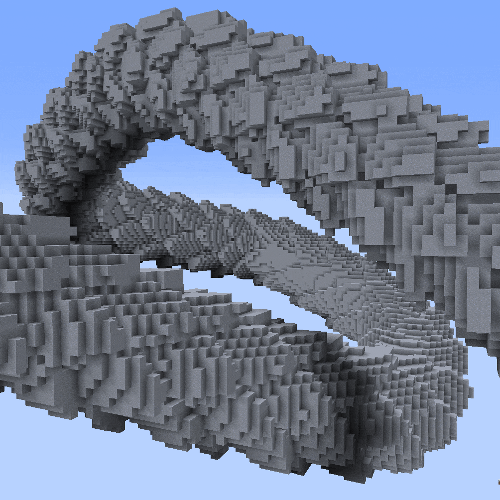

<!-- langmirror:chunk 15 -->
### `//ezspline 3d`` `<mark style="color:orange;">`Scales (Sc)`</mark> 

<mark style="color:blue;">鳞片样条 (Scales Spline)</mark>

**`//ezsp Scales([`**<mark style="color:orange;">**`Scale:<value>`**</mark>**`],[`**<mark style="color:orange;">**`HorizontalOffset:<value>`**</mark>**`],[`**<mark style="color:orange;">**`VerticalOffset:<value>`**</mark>**`],[`**<mark style="color:orange;">**`MajorExponent:<value>`**</mark>**`],[`**<mark style="color:orange;">**`MinorExponent:<value>`**</mark>**`],[`**<mark style="color:orange;">**`Angle:<value>`**</mark>**`],[`**<mark style="color:orange;">**`DepthMultiplier:<value>`**</mark>**`])`** [**`<pattern>`**](3d-spline-shapes.md#syntax) [**`<radii>`**](common-parameters.md#radii)[**`[-s <stretch>]`**](common-parameters.md#stretch-s-less-than-stretchfactor-greater-than) [**`[-t <angle>]`**](common-parameters.md#twist) [**`[-p <kbParameters>]`**](common-parameters.md#kb-parameters) [**`[-q <quality>]`**](common-parameters.md#quality) [**`[-n <normalMode>]`**](common-parameters.md#normal-mode) [**`[-h]`**](common-parameters.md#help-page)

生成一个高度可自定义的样条，其表面带有类似鳞片的 3D 纹理。

<!-- langmirror:chunk 16 -->
* <mark style="color:orange;">**`Columns`**</mark>**&#x20;(**<mark style="color:orange;">**`C`**</mark>**).** (默认: 8):
  * 设置每“层”应容纳多少块瓦片。
* <mark style="color:orange;">**`HorizontalOffset`**</mark> **(**<mark style="color:orange;">**`H`**</mark>**).** (默认: 1.05):
  * 决定每块瓦片在侧向上的间距。
* <mark style="color:orange;">**`VerticalOffset`**</mark> **(**<mark style="color:orange;">**`V`**</mark>**).** (默认: 1.2):
  * 决定每块瓦片沿样条曲线路径方向的间距。
* <mark style="color:orange;">**`MajorExponent`**</mark> **(**<mark style="color:orange;">**`M`**</mark>**).** (默认: 1.4):
  * 定义瓦片形状的指数。
* <mark style="color:orange;">**`MinorExponent`**</mark> **(**<mark style="color:orange;">**`N`**</mark>**).** (默认: 14.0):
  * 定义每块瓦片横截面形状的指数。
* <mark style="color:orange;">**`Angle`**</mark> **(**<mark style="color:orange;">**`A`**</mark>**).** (默认: 14.0):
  * 定义每块瓦片的朝向。
* <mark style="color:orange;">**`DepthMultiplier`**</mark> **(**<mark style="color:orange;">**`D`**</mark>**).** (默认: 1.0):
  * 调整瓦片之间隆起处的深度。
  * 大于 1 的值会挖除方块。
  * 小于 1 的值会填充更多方块。

<!-- langmirror:chunk 17 -->
(<mark style="color:red;">**`!`**</mark>) 我们提供了一个交互式 3D 图表来尝试所有参数（非常精妙）：[https://www.desmos.com/3d/ymmixtkdgf](https://www.desmos.com/3d/ymmixtkdgf)

示例：

`//ezsp 3d`` `<mark style="color:orange;">`Sc(c:8,d:1.2)`</mark>` ``clay 22,9`

<mark style="color:blue;">`//ezt ambient clay ##EnchantedBright`</mark>

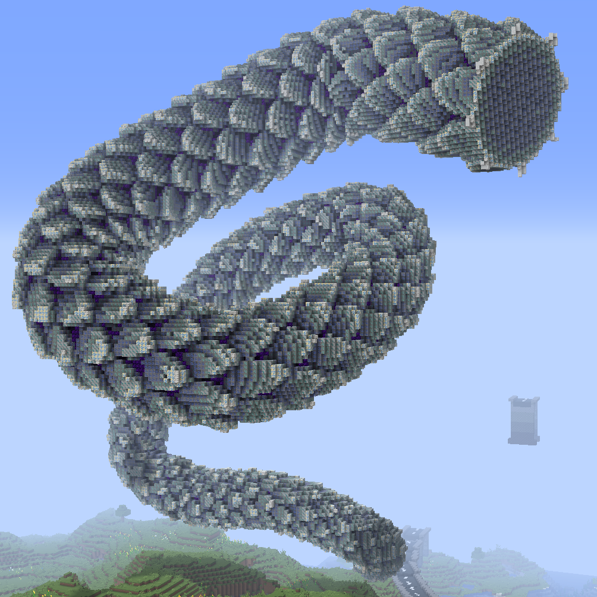

***

#### 

### `//ezspline 3d`` `<mark style="color:orange;">`Noodles (No)`</mark> 

<mark style="color:blue;">Noodles 样条线 (Noodles Spline)</mark>

<!-- langmirror:chunk 18 -->
**`//ezsp Noodles([`**<mark style="color:orange;">**`Amount:<value>`**</mark>**`],[`**<mark style="color:orange;">**`Density:<value>`**</mark>**`],[`**<mark style="color:orange;">**`Frequency:<value>`**</mark>**`],[`**<mark style="color:orange;">**`Tangle:<value>`**</mark>**`],[`**<mark style="color:orange;">**`Width:<value>`**</mark>**`],[`**<mark style="color:orange;">**`Seed:<value>`**</mark>**`])`** [**`<pattern>`**](3d-spline-shapes.md#syntax) [**`<radii>`**](common-parameters.md#radii)[**`[-s <stretch>]`**](common-parameters.md#stretch-s-less-than-stretchfactor-greater-than) [**`[-t <angle>]`**](common-parameters.md#twist) [**`[-p <kbParameters>]`**](common-parameters.md#kb-parameters) [**`[-q <quality>]`**](common-parameters.md#quality) [**`[-n <normalMode>]`**](common-parameters.md#normal-mode) [**`[-h]`**](common-parameters.md#help-page)

实验性样条线，生成一组扭曲、交织且互不相交的子样条线。

* **`[`**<mark style="color:orange;">**`Amount:<value>`**</mark>**`]`** (<mark style="color:orange;">**`A`**</mark>) (默认值: 12):
  * 交织线条的数量。
* **`[`**<mark style="color:orange;">**`Tangle:<value>`**</mark>**`]`** (<mark style="color:orange;">**`T`**</mark>) (默认值: 3.0):
  * 决定面条状线条交织和移动的幅度。较低的值会产生完全笔直的面条。较高的值会产生更混乱的路径。
  * 

<!-- langmirror:chunk 19 -->
* **`[`**<mark style="color:orange;">**`Density:<value>`**</mark>**`]`** (<mark style="color:orange;">**`D`**</mark>) (默认值: 70%):
  * 通过指定横截面中填充材料与空气的比例，间接决定面条（noodles）的宽度。100% 会使面条达到最大厚度，以便在给定的样条曲线半径内仍能容纳指定数量的面条。因此，较大的值不会给面条留出太多的移动空间，从而导致路径出现异常。较小的值则会在面条之间留下较大的空气间隙。
  * 示例：100% 时的样条曲线横截面
  * 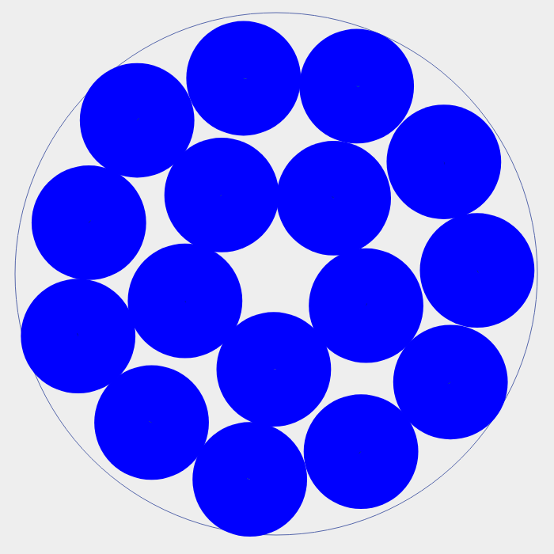
  * 示例：50% 时的样条曲线横截面（面条数量相同）
  * 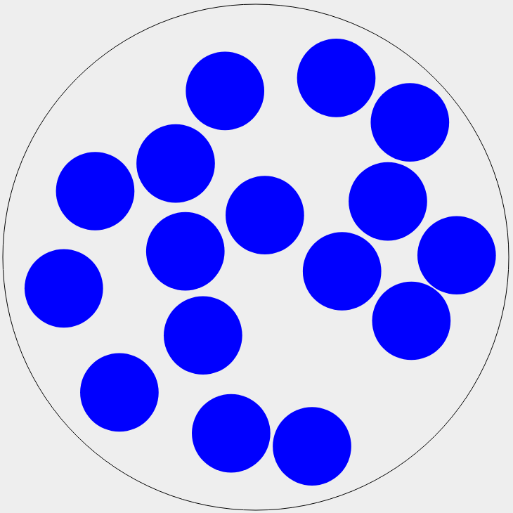
  * 密度越小，单个面条的半径越小。与 width 参数的区别：确定的半径用于碰撞检测。width 参数对面条之间的碰撞没有影响。
  * 
* **`[`**<mark style="color:orange;">**`Width:<value>`**</mark>**`]`** (<mark style="color:orange;">**`W`**</mark>) (默认值: 0.8):
  * 所有面条的相对宽度乘数，独立于面条碰撞检测。面条碰撞是在宽度为 1.0 时计算的。此参数定义了渲染/放置面条时的宽度。这意味着大于 1 的值会导致面条相互重叠、穿插，而小于 1 的值则确保所有面条之间存在空气间隙。
  * 
* **`[`**<mark style="color:orange;">**`Frequency:<value>`**</mark>**`]`** (<mark style="color:orange;">**`F`**</mark>) (默认值: 0.5):
  * 设置负责随机扰动的底层噪声的频率值。较高的值会导致抖动。

<!-- langmirror:chunk 20 -->
* **`[`**<mark style="color:orange;">**`Seed:<value>`**</mark>**`]`** (<mark style="color:orange;">**`S`**</mark>) (默认值: -1 (随机)):
  * 设置负责随机扰动的底层噪声种子。

***