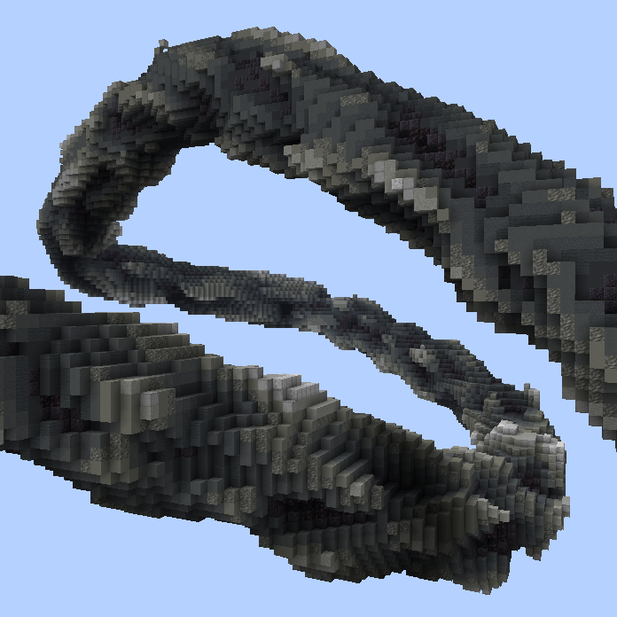
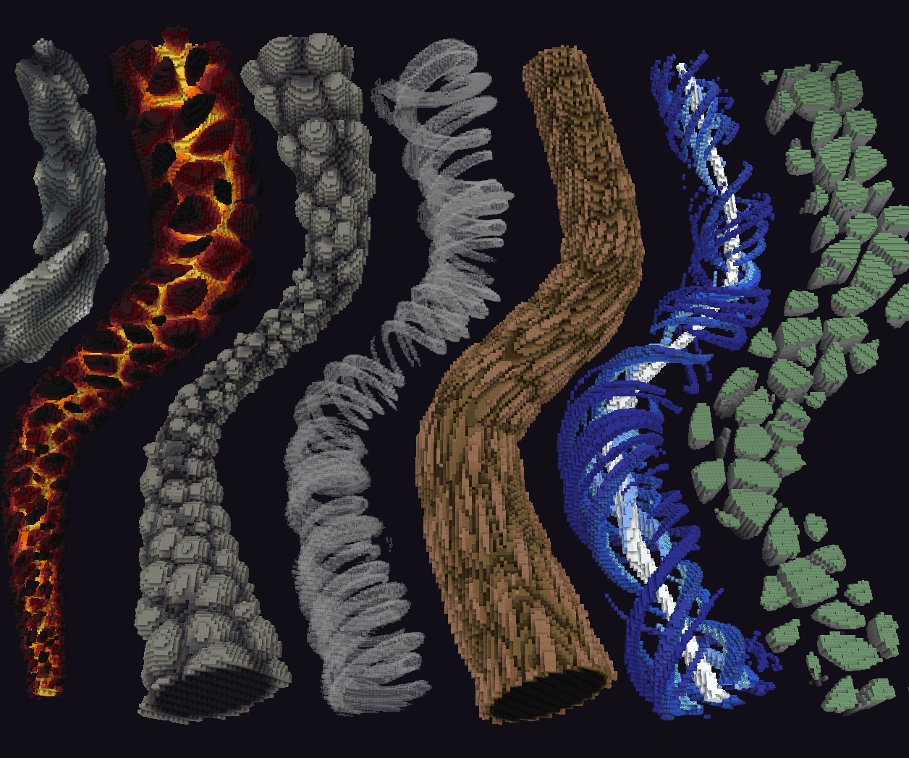
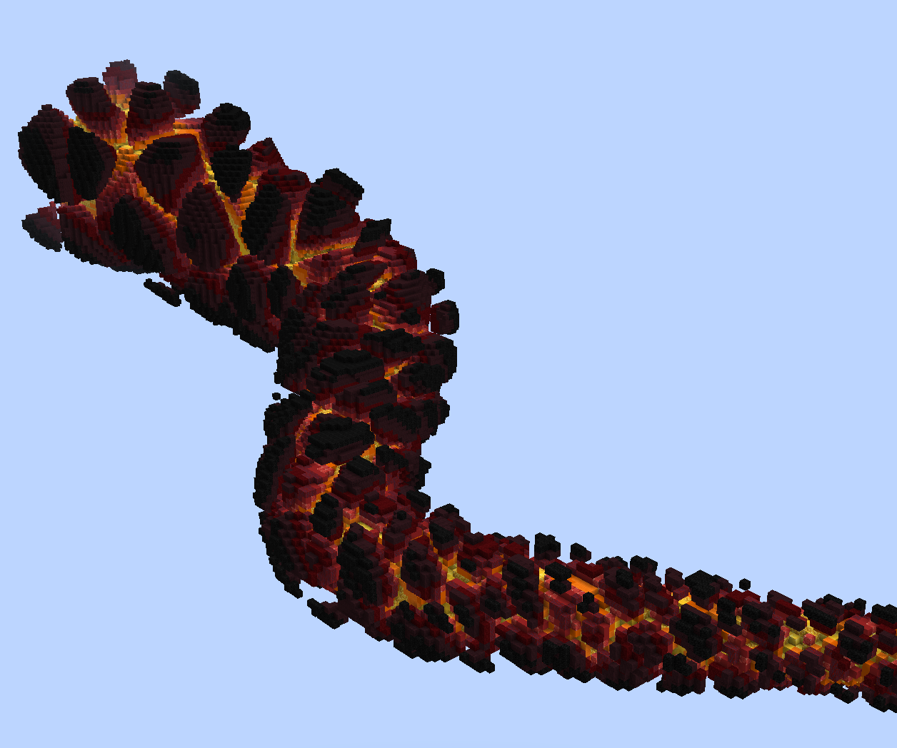
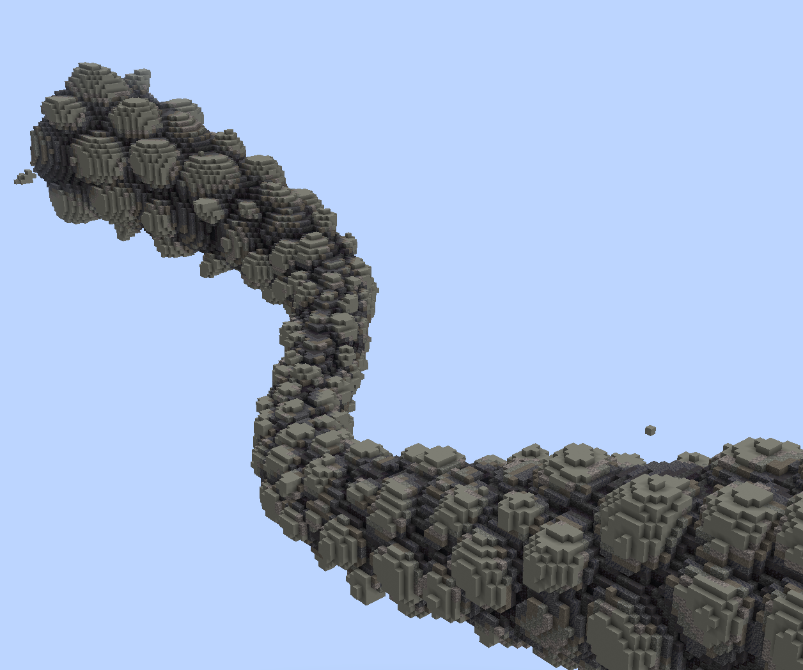
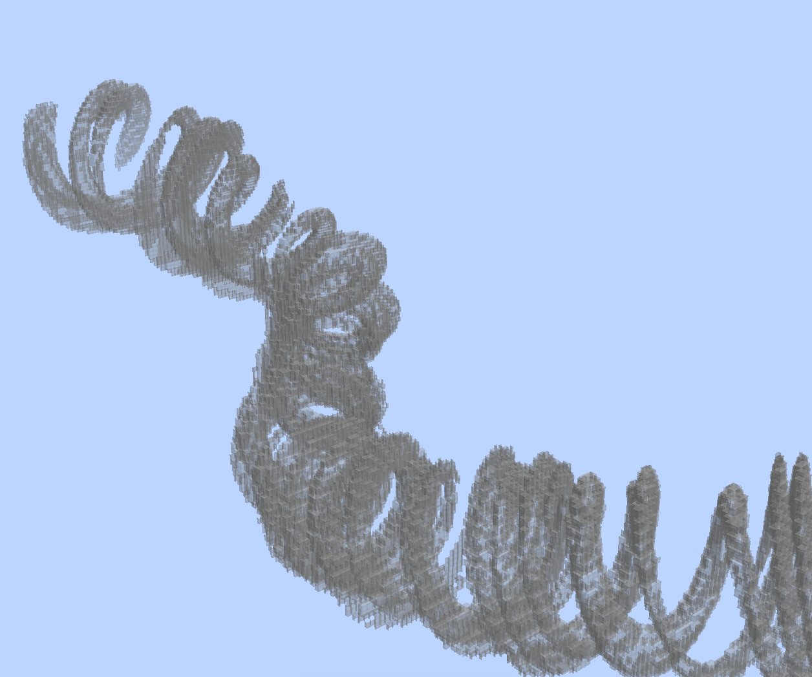
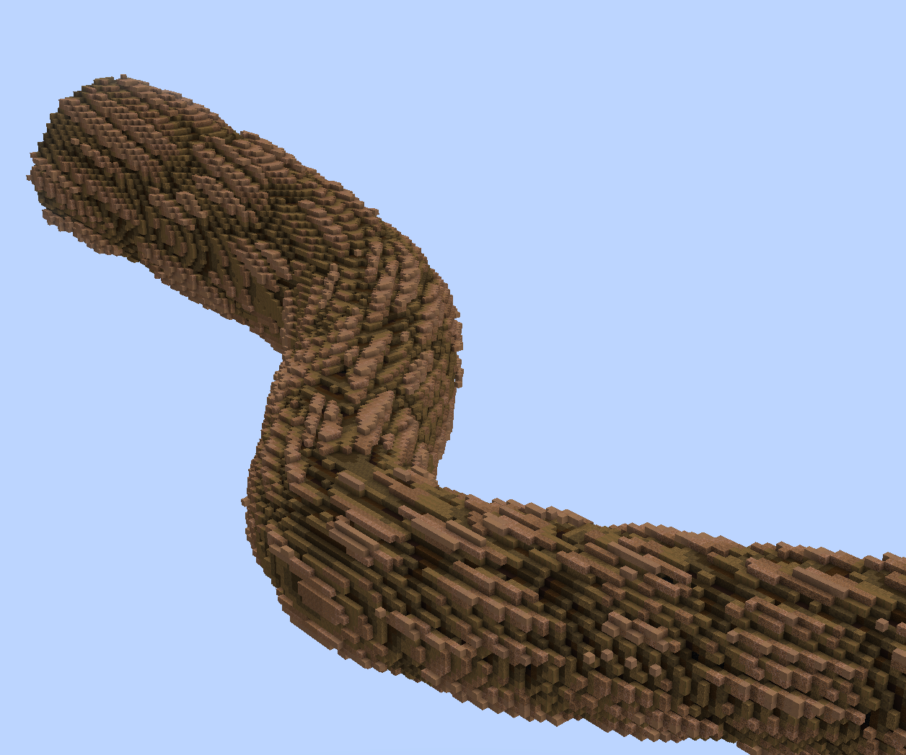
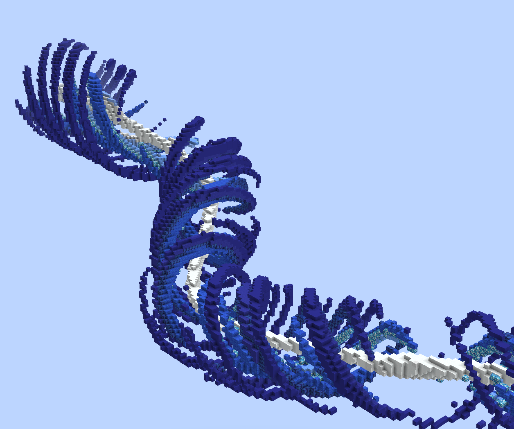
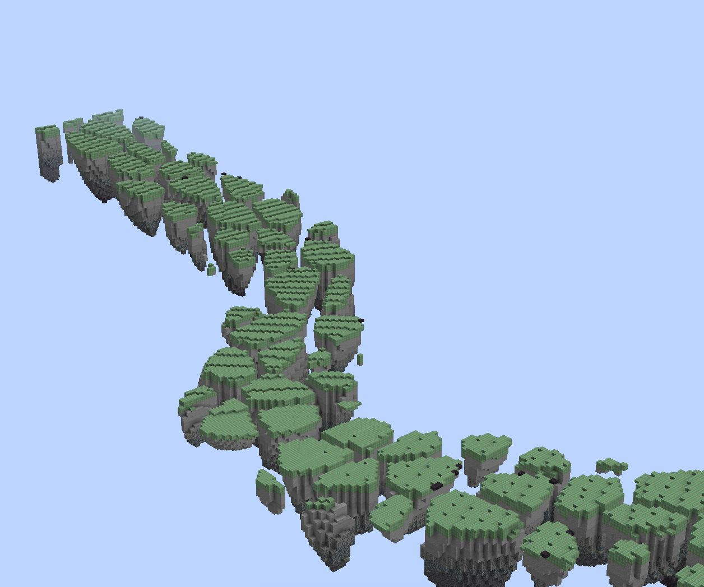
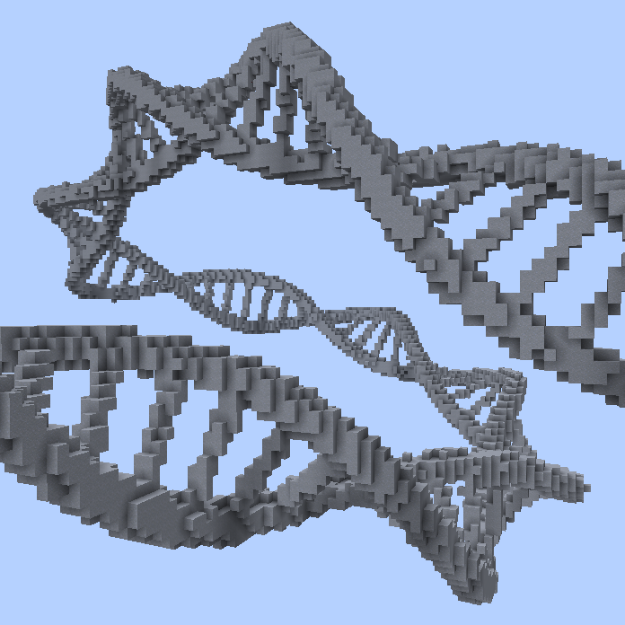
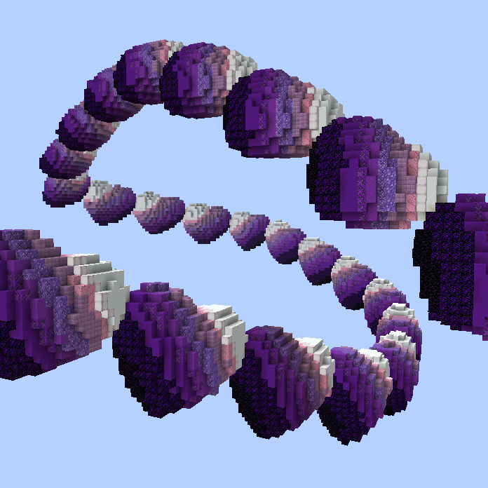

<!-- langmirror:chunk 0 -->
# 高级样条形状

以下 `//ezspline` 子命令包含三个功能强大但更为复杂的样条形状，具有几乎无限的自定义可能性。

***

#### 

### `//ezspline` <mark style="color:orange;">`noise`</mark> 

<mark style="color:blue;">噪声样条 (Noise Spline)</mark>

**`//ezsp noise`** <mark style="color:orange;">**`<palette>`**</mark> [**`<radii>`**](common-parameters.md#radii) <mark style="color:orange;">**`[noise]`**</mark> <mark style="color:orange;">**`[depth]`**</mark> [**`[-s <stretch>]`**](common-parameters.md#stretch-s-less-than-stretchfactor-greater-than) [**`[-t <angle>]`**](common-parameters.md#twist) [**`[-p <kbParameters>]`**](common-parameters.md#kb-parameters) [**`[-q <quality>]`**](common-parameters.md#quality) [**`[-n <normalMode>]`**](common-parameters.md#normal-mode) [**`[-h]`**](common-parameters.md#help-page)

沿着选定的位置生成基于噪声的样条。

* <mark style="color:orange;">**`<Palette>`**</mark>:
  * 指定构成样条的方块。
* <mark style="color:orange;">**`[noise]`**</mark> (默认: "Perlin(Freq:2,z:0.5)"):
  * 嵌入到样条路径中的噪声。
* <mark style="color:orange;">**`[depth]`**</mark> (默认: 0.7):
  * 噪声切入圆柱状样条的深度。深度趋近于 0 时，形状趋近于原始的圆柱状样条；0.5 表示噪声最深可达半径的一半；1.0 表示达到全半径，即触及中心。大于 1.0 的值会导致外观破碎。

<!-- langmirror:chunk 1 -->
* <mark style="color:orange;">**`[-i <expression>]`**</mark> (默认: "`r=sqrt(x*x+y*y);t=(r-1)/d+1;f=r>1?1:(4*r*(r-1))^2;g=f*t+(1-f)*n;p=max((r-1)/min(d,1)+1,.001);(g>t)*p`"):
  * 为大神准备的高级参数。如果上面的内容看起来很吓人，请忽略它。
  * 此表达式实现了在特定相对 `<depth>`（深度）下将噪声切入圆柱体的功能。[推导过程](https://www.desmos.com/calculator/qw8fro1npf)。如果你_**真的**_想尝试，可以在这里输入不同的表达式以获得不同的结果。不过如果你不需要自定义噪声，直接使用 `//ezspline expression` 即可。
  * 输入参数为 _`x,y,z,n,d`_，其中 _`x,y,z`_ 的赋值方式与 [//ezspline expression](advanced-spline-shapes.md#expression-spline) 相同，_`n`_ 是给定 `<noise>` 在坐标 _`x,y,z`_ 处的评估值，_`d`_ 是给定的 `<depth>` 参数。
  * 一个备选表达式可以是：
    * `r=sqrt(x*x+y*y);(r<1&&n>0.5)*max(n,0.01)`：如果你只想让噪声被限制在圆柱形状内。

_其余参数在_ [_通用参数_](common-parameters.md) _子页面中列出。_

示例：

`//ezspline noise ##Grayscale 10`

<mark style="color:blue;">演示</mark>

这只是我随手拼凑的一组简短的噪声命令，用来展示噪声样条线的功能。 \~eztaK

`//ezspline noise -##Magma 5,25 Ce(F:1.5,fO:1,cR:sub,M:OR,U:-.6) 0.6 -t 90`

<!-- langmirror:chunk 2 -->

`//ezspline noise ##GrayWarm(3:11),251:8*15 25,10,25 Ce(F:1.6,fO:1,cD:r,cR:r,M:OR,L:-1.1,U:-.2) 0.4`

`//ezspline noise -w Panes light_gray_stained_glass 20,15,25 Ce(f:1.4,z:.3,m:or,l:-1,u:-0.5) 3 -t 600 -i t=0.2;r=sqrt(x*x+y*y);m=1-abs(2*r-t-1)/abs(t-1);n<m&&r<1`

`//ezspline noise ##Brown 20,12 Ce(f:4,cr:sub,cj:.8,m:or,u:-.5,l:-1.3) 0.2 -s 6 -t 20`

`//ezspline noise -##GlowBlue(6:16) 20,12 Ce(f:2,cr:sub,m:or,u:-.55,l:-0.551,z:0.1) 0.9 -t 200`

`//ezspline noise -w Slabs ##GrayCold(4:11),waxed_weathered_cut_copper 20 Ce(f:1.5,cr:sub,m:or,u:-0.85,l:-.5,y:0.3) -n UPRIGHT -i (x*x+n+y*y<1&&y<0)*(y+0.97)`

***

#### 

### `//ezspline` <mark style="color:orange;">`expression`</mark> 

<mark style="color:blue;">表达式样条线</mark>

<!-- langmirror:chunk 3 -->
**`//ezsp expression`** <mark style="color:orange;">`<palette>`</mark> [**`<radii>`**](common-parameters.md#radii)[**`[-s <stretch>]`**](common-parameters.md#stretch-s-less-than-stretchfactor-greater-than) [**`[-t <angle>]`**](common-parameters.md#twist) [**`[-p <kbParameters>]`**](common-parameters.md#kb-parameters) [**`[-q <quality>]`**](common-parameters.md#quality) [**`[-n <normalMode>]`**](common-parameters.md#normal-mode) <mark style="color:orange;">**`[-z] [-o]`**</mark> [**`[-h]`**](common-parameters.md#help-page) <mark style="color:orange;">**`<expression...>`**</mark>

沿选定的点生成一个由给定 WorldEdit 表达式塑造形状的样条线。

<!-- langmirror:chunk 4 -->
* <mark style="color:orange;">**`<Palette>`**</mark>:
  * 指定方块调色盘。
* <mark style="color:orange;">**`[-z]`**</mark>:
  * 若不设置此标志，z 轴的定义域为 0 到“样条曲线长度除以半径”的值。你可以设置此标志来将沿样条路径运行的 z 轴归一化到 \[-1,1] 定义域。
* <mark style="color:orange;">**`[-o]`**</mark>:
  * 默认情况下，表达式输出将 >0..1 映射到调色盘。使用此标志可改为将输出映射为整数。
* <mark style="color:orange;">**`<expression...>`**</mark>:
  * [WorldEdit 表达式](https://worldedit.enginehub.org/en/latest/usage/other/expressions/)。输入变量为：
    * -1 ≤ _`x`_ ≤ 1
    * -1 ≤ _`y`_ ≤ 1
    * 0 ≤ _`z`_ ≤ L，其中 L 是样条长度除以其半径的结果。
    * 或者如果使用了 `-z` 标志，则为 -1 ≤ _`z`_ ≤ 1。
  * 输出要么是归一化的调色盘索引 (0,1]，或者如果使用了 -o 标志，则为 (0,P]，其中 P 是调色盘中的方块数量。请注意，<=0 意味着不放置任何方块。

_其余参数在_ [_通用参数_](common-parameters.md) _子页面中有详细说明。_

示例：

`//ezspline expression clay 10 -t 90 R=0.2;r=0.1;w=0.7;s=0.5;sqrt((abs(x)-w)^2+y^2)<R||sqrt(((z+1)%s-r)^2+y^2)<r&&abs(x)<w`

表达式作者：[imhols](https://twitter.com/imhols1)

***

#### 

<!-- langmirror:chunk 5 -->
### `//ezspline` <mark style="color:orange;">`structure`</mark> 

<mark style="color:blue;">结构样条线 (Structure Spline)</mark>

**`//ezsp structure`** <mark style="color:orange;">**`<structure>`**</mark> [**`[radii]`**](common-parameters.md#radii)[**`[-s <stretch>]`**](common-parameters.md#stretch-s-less-than-stretchfactor-greater-than) [**`[-t <angle>]`**](common-parameters.md#twist) [**`[-p <kbParameters>]`**](common-parameters.md#kb-parameters) [**`[-q <quality>]`**](common-parameters.md#quality) [**`[-n <normalMode>]`**](common-parameters.md#normal-mode) <mark style="color:orange;">**`[-z]`**</mark> [**`[-h]`**](common-parameters.md#help-page)

沿着由所选凸面选区定义的路径嵌入结构。

* <mark style="color:orange;">**`<structure>`**</mark>:
  * 沿路径嵌入的形状/剪贴板/建筑文件。请参阅 [available-structures.md](../placement/available-structures.md "mention")。
* <mark style="color:orange;">**`[-z]`**</mark>:
  * 归一化 Z 轴，这将导致正好一个结构被拉伸贯穿整条路径的长度。

<!-- langmirror:chunk 6 -->
结构将沿路径方向以其 Z 轴方向放置。多个实例将根据其包围盒的大小一个接一个地重复放置，除非你使用 `-z` 参数，在这种情况下，结构的一个实例将被拉伸以覆盖路径的全长。

专门针对 `//ezsp structure`，如果省略了 [`[radii]`](common-parameters.md#radii) 参数，我们将自动计算半径，使结构以其原始/固有尺寸生成。

_其余参数在_ [_通用参数_](common-parameters.md) _子页面中有详细说明。_

**示例**：

`//ezsp structure TS(P:##GlowPurple,S:Heart,T:=(z+y)*.4+.5) 12`

***