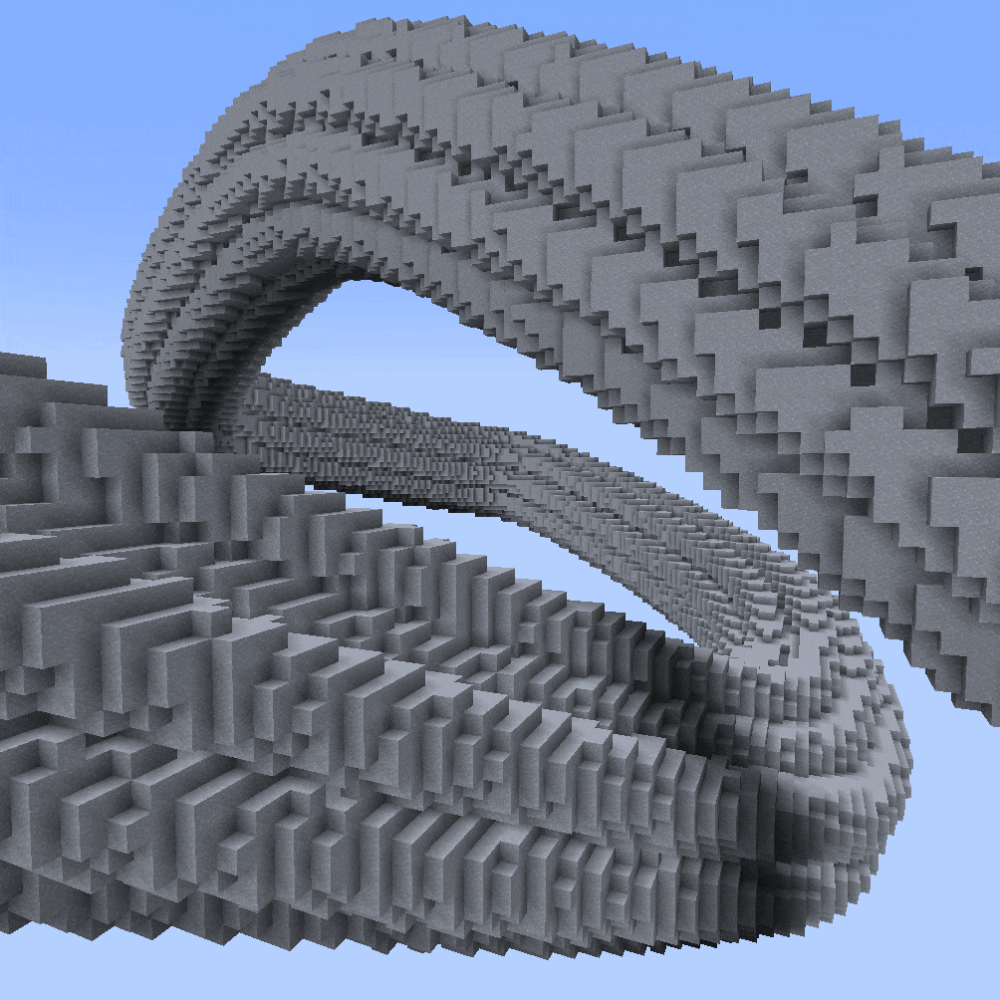
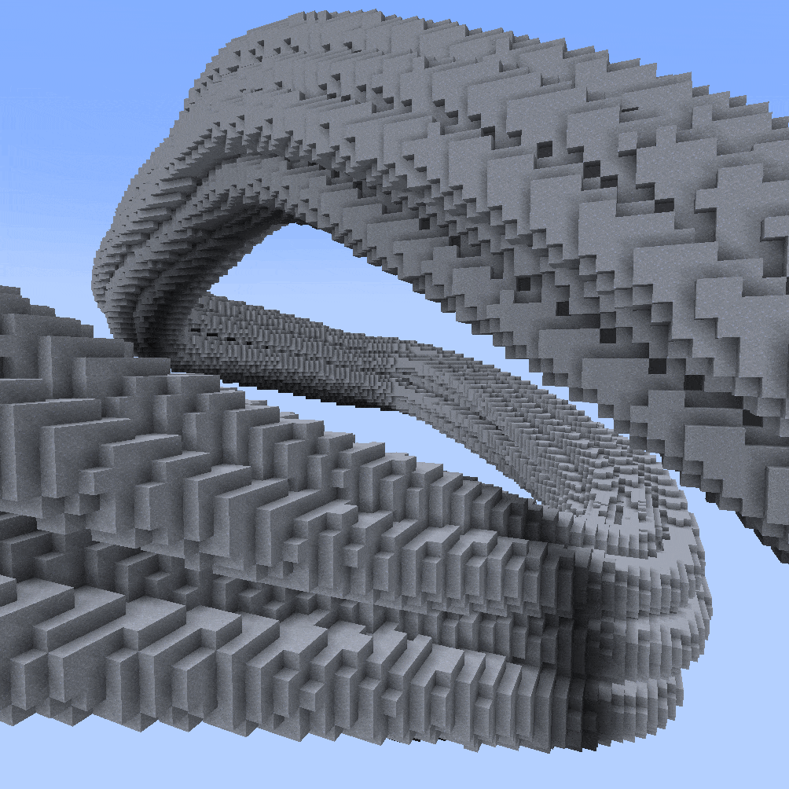
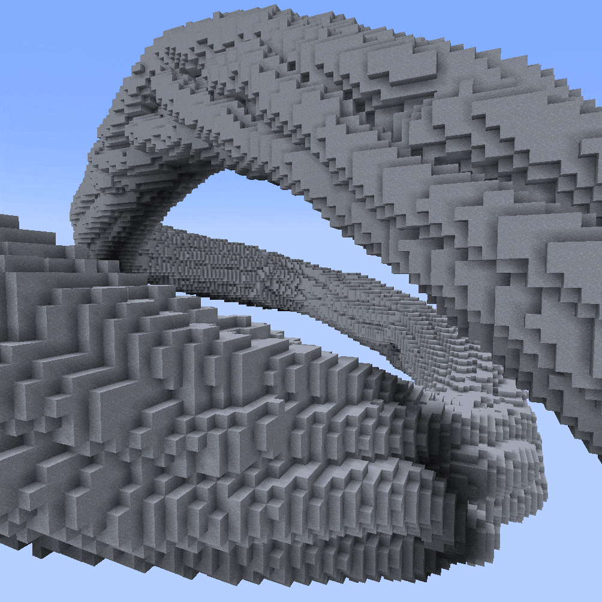
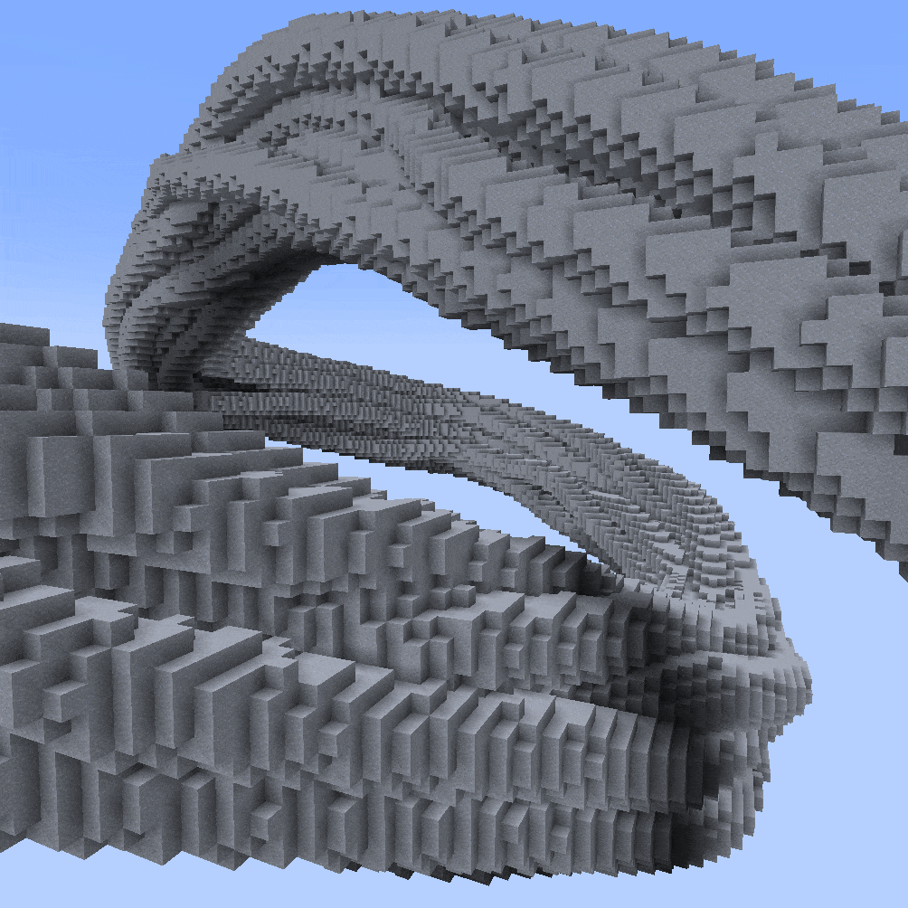

<!-- langmirror:chunk 0 -->
---
hidden: true
---

# 意大利面样条 (Spaghetti Spline)

***

#### 

### `//ezspline 3d `<mark style="color:orange;">`Sphaghetti (Sp)`</mark>

<mark style="color:blue;">意大利面样条</mark>

**`//ezsp Spaghetti([`**<mark style="color:orange;">**`Amount:<value>`**</mark>**`],[`**<mark style="color:orange;">**`Density:<value>`**</mark>**`],[`**<mark style="color:orange;">**`Frequency:<value>`**</mark>**`],[`**<mark style="color:orange;">**`Tangle:<value>`**</mark>**`],[`**<mark style="color:orange;">**`Width:<value>`**</mark>**`],[`**<mark style="color:orange;">**`Seed:<value>`**</mark>**`])`** [**`<pattern>`**](hopefully-invisible-spaghetti-spline.md#syntax) [**`<radii>`**](common-parameters.md#radii)[**`[-s <stretch>]`**](common-parameters.md#stretch-s-less-than-stretchfactor-greater-than) [**`[-t <angle>]`**](common-parameters.md#twist) [**`[-p <kbParameters>]`**](common-parameters.md#kb-parameters) [**`[-q <quality>]`**](common-parameters.md#quality) [**`[-n <normalMode>]`**](common-parameters.md#normal-mode) [**`[-h]`**](common-parameters.md#help-page)

实验性样条，可生成一组扭曲、缠绕且互不相交的子样条。

* **`[`**<mark style="color:orange;">**`Amount:<value>`**</mark>**`]`** (默认值: 12):
  * 缠绕线条的数量。
* **`[`**<mark style="color:orange;">**`Tangle:<value>`**</mark>**`]`** (默认值: 3.0):

<!-- langmirror:chunk 1 -->
* 决定线条相互交织和移动的程度。较低的值会产生完全笔直的线条。较高的值会导致更混乱的路径。
  * 
* **`[`**<mark style="color:orange;">**`Density:<value>`**</mark>**`]`** (默认值: 70%):
  * 通过指定横截面中填充材料与空气的比例，间接决定面条的宽度。100% 会使面条达到最大厚度，以便在给定的样条半径内尽可能容纳指定数量的面条。因此，较大的值不会留给线条太大的移动空间，从而导致路径出现异常。较小的值会在线条之间留下较大的空气间隙。
  * 示例：密度为 100% 时的样条横截面
  * 
  * 示例：密度为 50% 时的样条横截面（相同的线条数量）
  * 
  * 密度越小，单条线条的半径就越小。与 width 参数的区别：确定的半径用于碰撞检测。width 参数对线条之间的碰撞没有影响。
  * 
* **`[`**<mark style="color:orange;">**`Width:<value>`**</mark>**`]`** (默认值: 0.8):
  * 所有面条的相对宽度倍率，独立于线条碰撞检测。线条碰撞是以宽度 1.0 进行计算的。此参数定义了线条渲染/放置时的宽度。这意味着大于 1 的值会导致线条重叠、相互穿插；而小于 1 的值则确保所有线条之间都有空气间隙。
  * 
* **`[`**<mark style="color:orange;">**`Frequency:<value>`**</mark>**`]`** (默认值: 0.5):

  * 设置负责随机扰动的底层噪声频率值。较高的值会导致抖动。提示：如果样条的长度明显长于或短于其宽度，请尝试调高或调低频率。
* **`[`**<mark style="color:orange;">**`Seed:<value>`**</mark>**`]`** (默认值: -1 (随机)):
  * 设置负责随机扰动的底层噪声种子。

