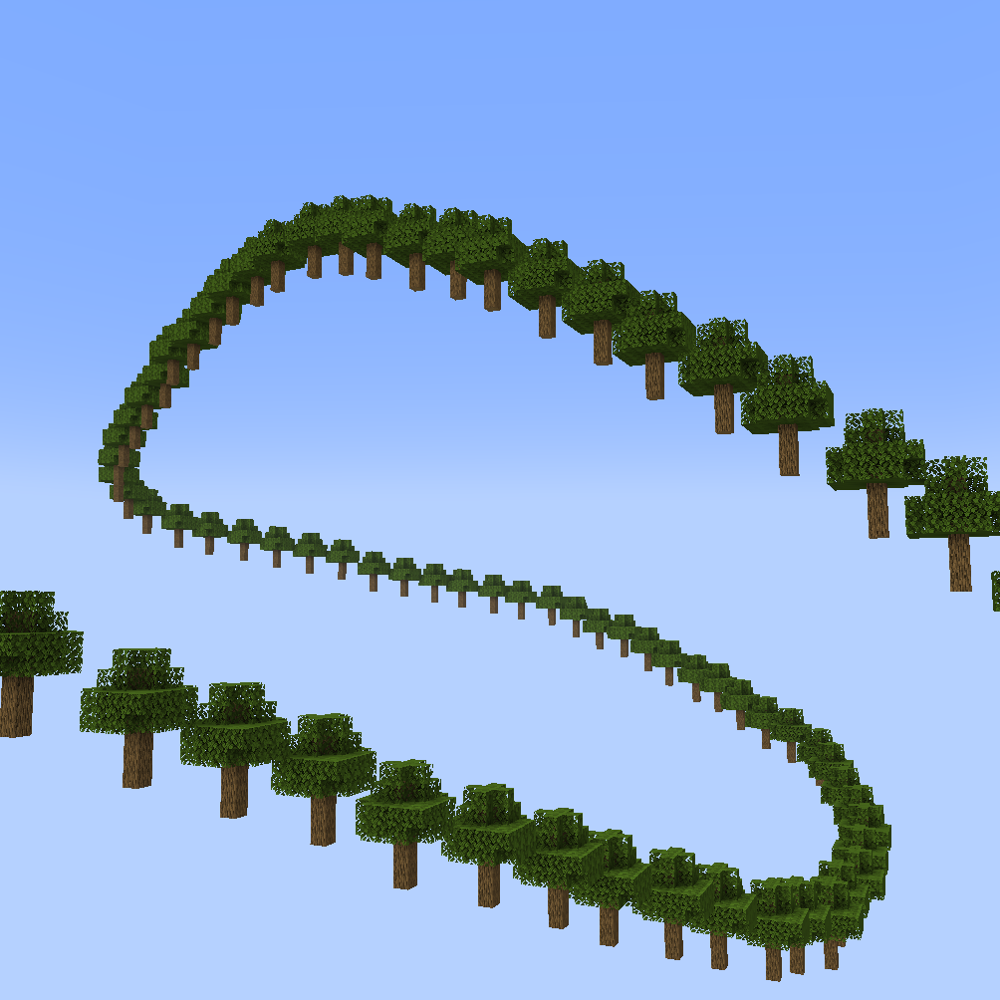
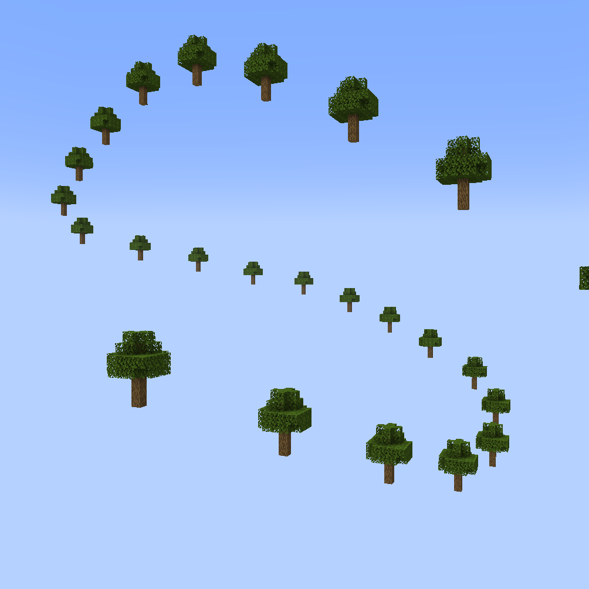
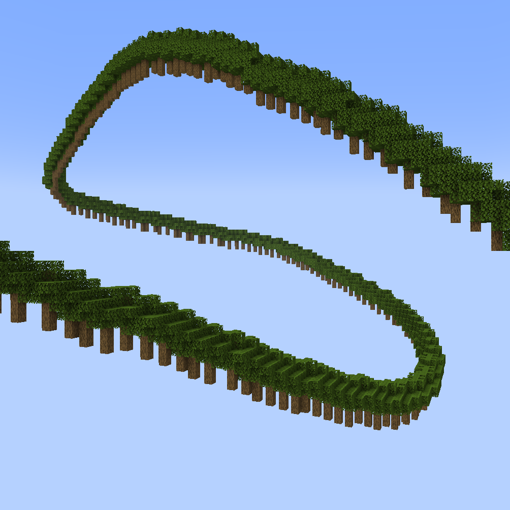
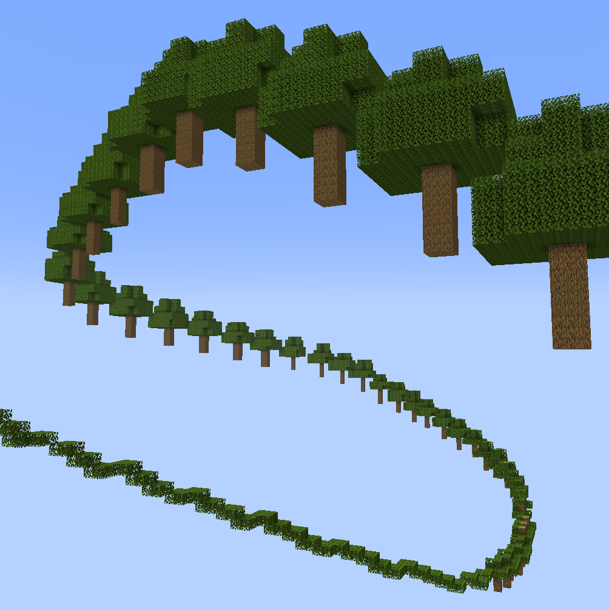
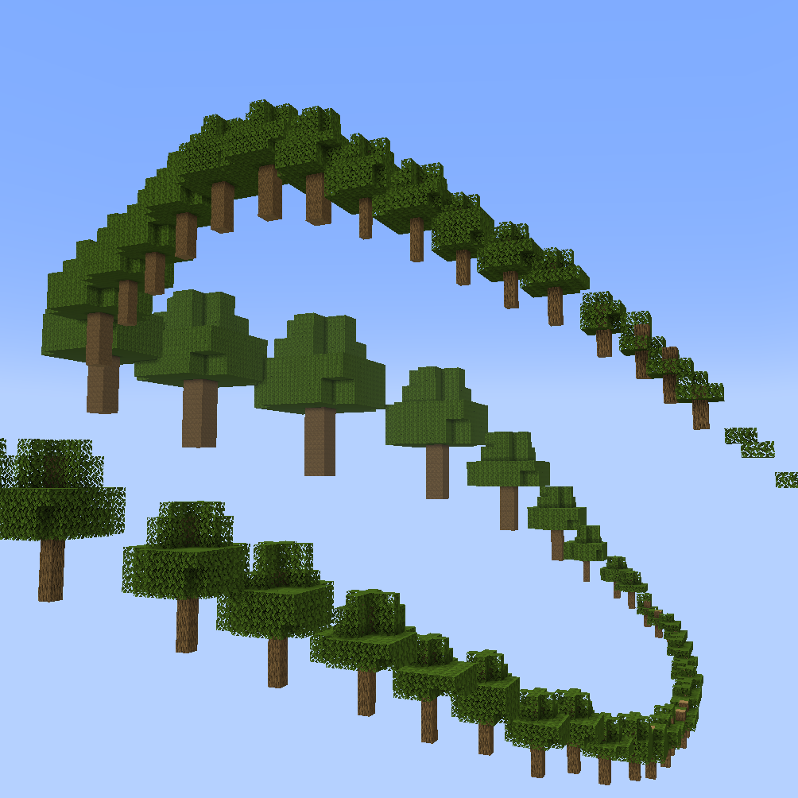
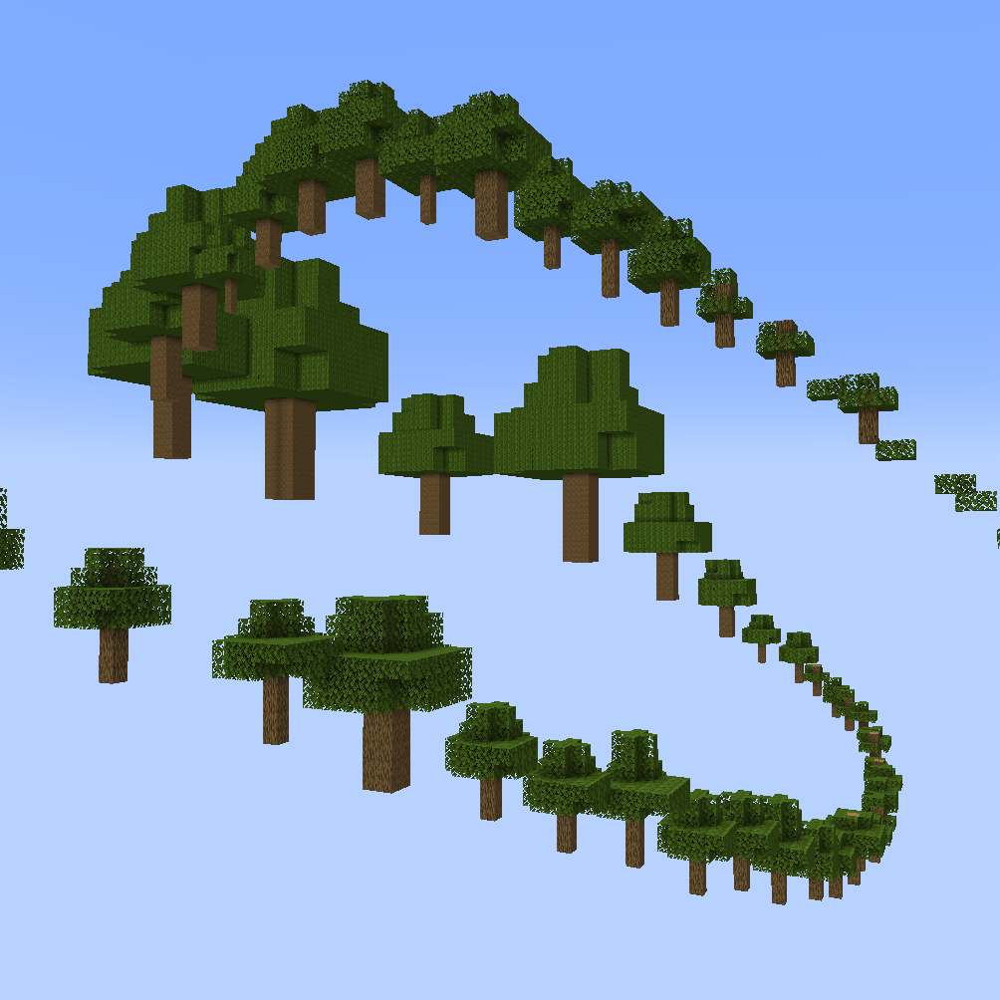
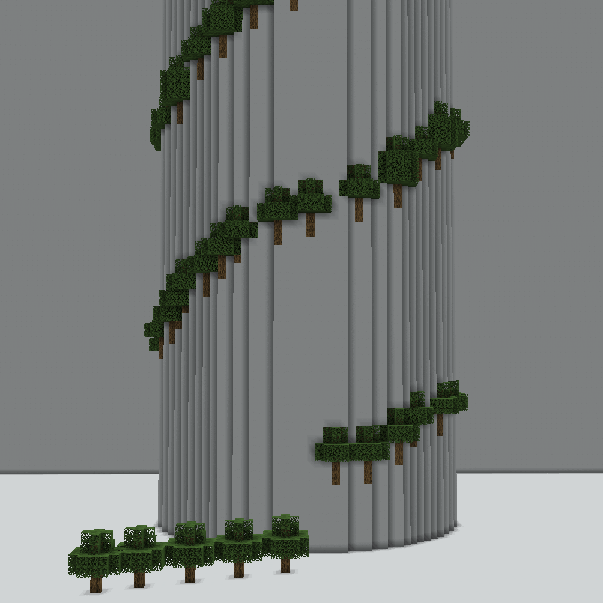

<!-- langmirror:chunk 0 -->
# 数组参数

`//ezarray` 和 `//ezbrush array` 沿着路径放置多个形状。以下参数适用于这些命令：

***

### 间距：<mark style="color:orange;">`-g <gap>`</mark>

通过定义每次放置之间的间隔距离来控制所有放置点的紧密程度。

默认为 `0`。这意味着，在直线上每次放置都会紧接着上一次，没有间隙。

正值将增加该距离并减少总放置结构的数量。

负值会导致放置重叠。

> **示例**
>
> 示例命令：`//ezarray Clipboard `**`-g <gap>`**（此处剪贴板中是一个默认的的原版橡树，仅作示例）
>
> `//ezar Cl `**`-g 0`**：（默认值，放置点彼此紧邻）
>
> 
>
> `//ezar Cl `**`-g 10`**：（放置点现在相隔更远）
>
> 
>
> `//ezar Cl `**`-g -3`**：（负值导致放置点重叠）
>
> 

***

### 渐变缩放：<mark style="color:orange;">`-q <radii>`</mark>

类似于随机缩放，此修饰符允许使用相对值对放置物进行缩放，例如：1 保持原比例，2 表示尺寸翻倍，0.5 表示尺寸减半。

缩放因子被定义为沿样条曲线的进度。这意味着你可以根据需要指定任意数量的逗号分隔缩放因子，样条路径将在所有条目之间进行平滑插值。

<!-- langmirror:chunk 1 -->
高级技巧：你可以在每个条目前加上 0 到 1 之间的位置数值，以指定在样条曲线的哪个部分达到特定的半径。`-q 0:1,0.8:3,1:1` 表示起始和结束时的半径为 1（`0:1` 和 `1:1`），但在样条路径 80% 处（`0.8:3`）“关键帧”半径为 3。（如果未指定位置，则会选择等距位置。）

> **示例**
>
> 示例命令：`//ezarray Clipboard `**`-q <radii>`**
>
> `//ezar Cl `**`-q 1`**
>
> （默认值，不进行缩放）
>
> 
>
> `//ezar Cl `**`-q 0.3,3`**
>
> （放置物在路径开始时被缩小到 0.3 倍，并随着样条路径向终点延伸逐渐变大，直到原始尺寸的三倍）
>
> 
>
> `//ezar Cl `**`-q 1.5,0.5,5.0,2.0,0.2`**
>
> （树在整个样条路径中按照给定的数值进行渐进式缩放）
>
> 
>
> `//ezar Cl `**`-q 1.5,0.5,5.0,2.0,0.2 -o 0.7,1.3`**
>
> （结合使用渐进式缩放 -q 与 [随机缩放](placement-parameters.md#random-scaling-o-less-than-sizemultiplierrange-greater-than) -o）
>
> 

***

### 路径参数：<mark style="color:orange;">`-p <kbParameters>`</mark>

<!-- langmirror:chunk 2 -->
修改从输入（凸选区）点创建路径的方式。参见 [#kochanek-bartel-parameters-p-less-than-kbparameters-greater-than](../spline/common-parameters.md#kochanek-bartel-parameters-p-less-than-kbparameters-greater-than "mention")

***

### 样条线朝向：<mark style="color:orange;">`-n <normalMode>`</mark>

修改 `<primary>` 和 `<secondary>` 参数中 ORTHOGONAL（正交）选项的行为方式。参见 [#spline-normal-mode-n-less-than-normalmode-greater-than](../spline/common-parameters.md#spline-normal-mode-n-less-than-normalmode-greater-than "mention")

> **示例**
>
> 示例命令：`//ezarray Clipboard Orthogonal Constant`**`-n <normalMode>`**
>
> `//ezar Cl O C `**`-n CONSISTENT`**
>
> （默认值）
>
> 
>
> `//ezar Cl O C `**`-n UPRIGHT`**
>
> （放置点不再那么倾斜）
>
> 

***

### 将放置点吸附至表面：<mark style="color:orange;">`-b`</mark>

默认情况下，结构是沿着由输入（凸选区）点引导的样条线路径放置的。此标志会将放置位置移动到最近的表面方块上，以防路径上的位置处于半空中或埋在方块内。

> **示例**
>
> GIF 对比
>
> `//ezarray Clipboard`（沿路径放置）
>
> `//ezarray Clipboard `**`-b`**（放置位置移至最近的表面方块）
>
> 


默认最大搜索范围为 96 个方块。最大搜索范围可以在配置文件中设置。如果在该范围内未找到表面方块，则将使用原始位置。


***