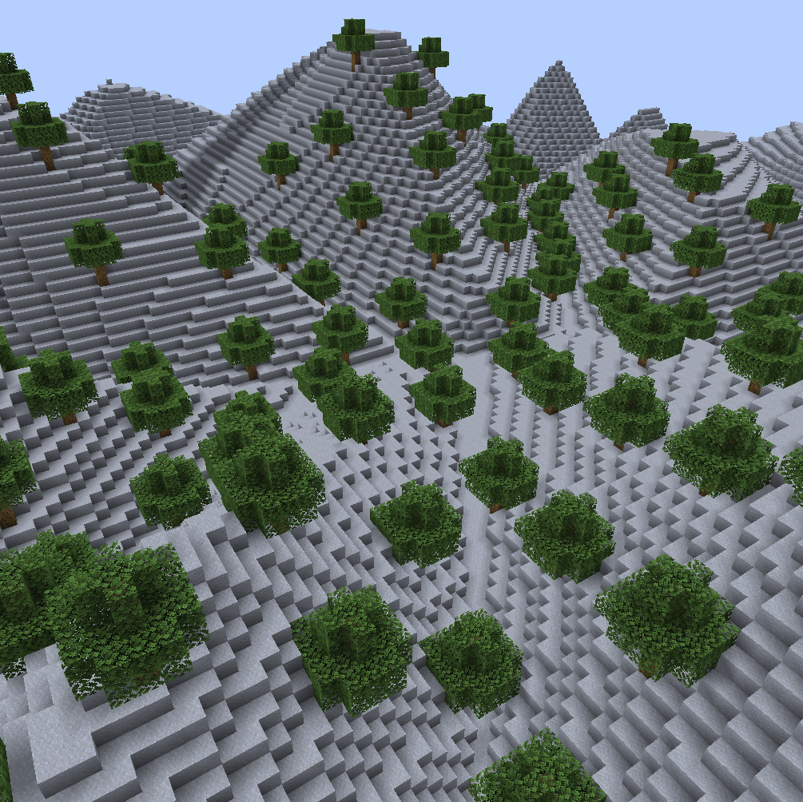
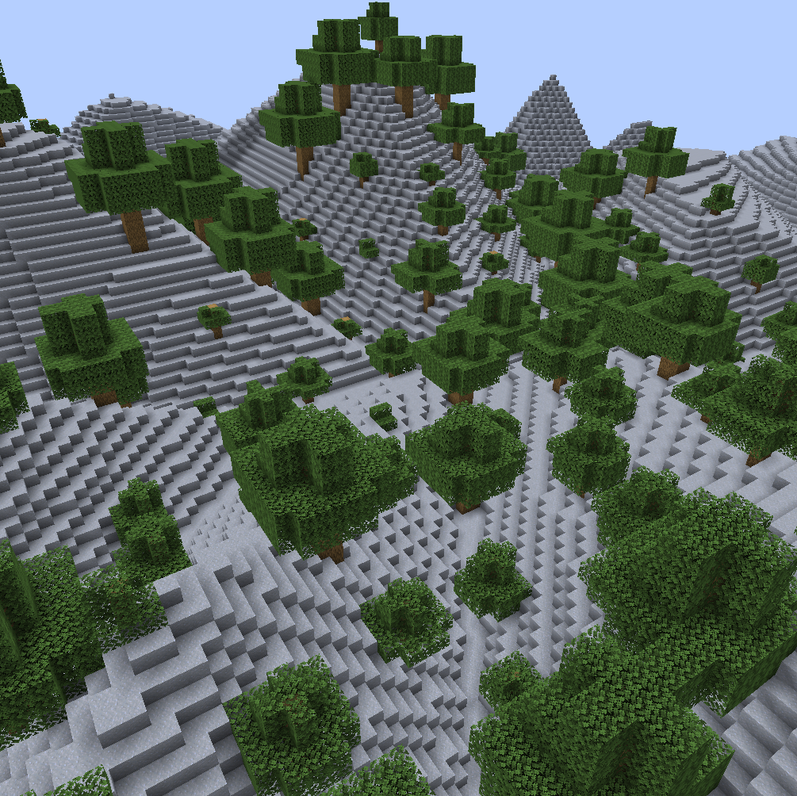
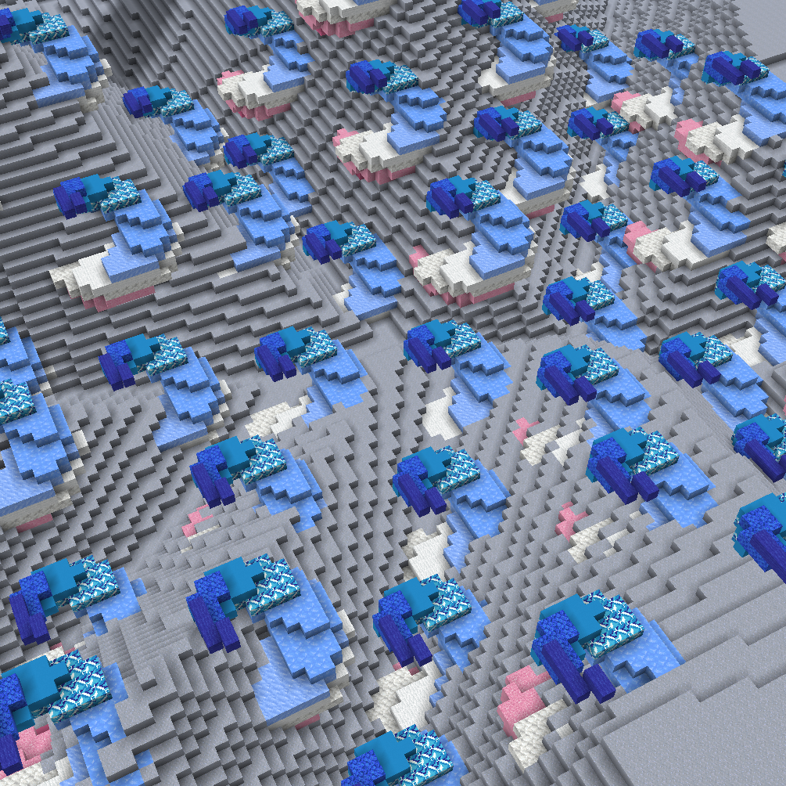
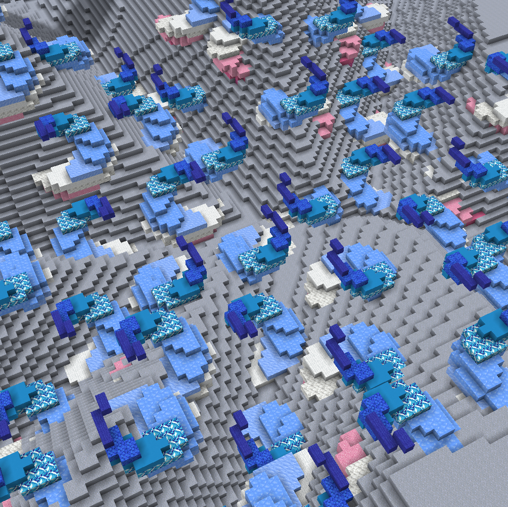
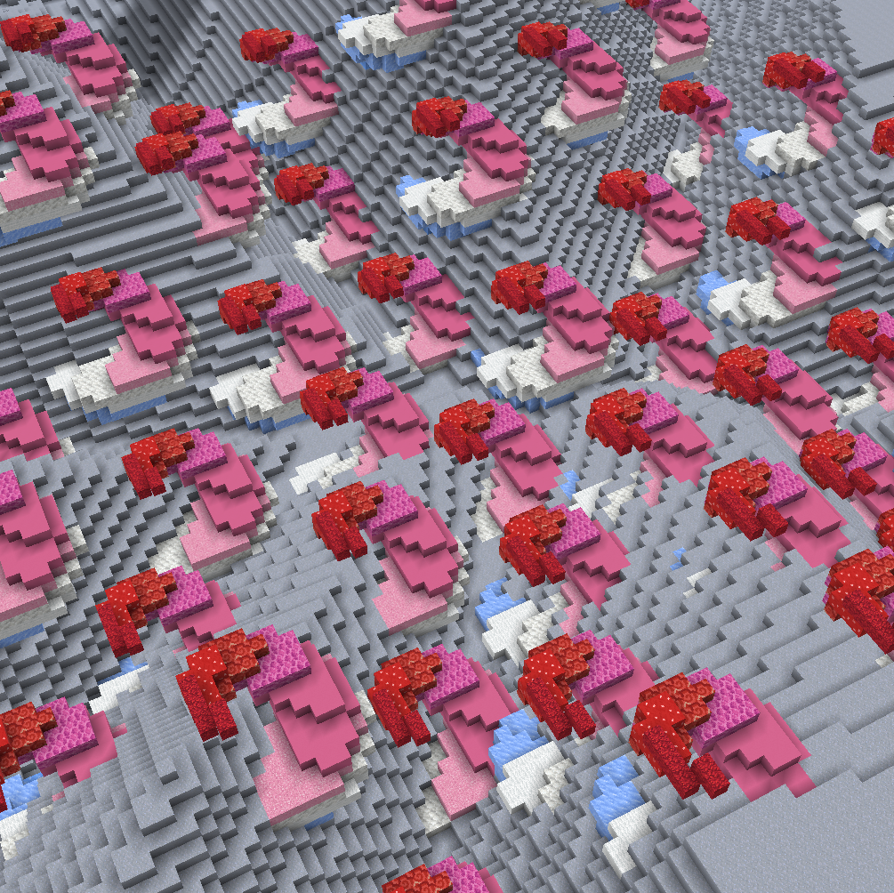
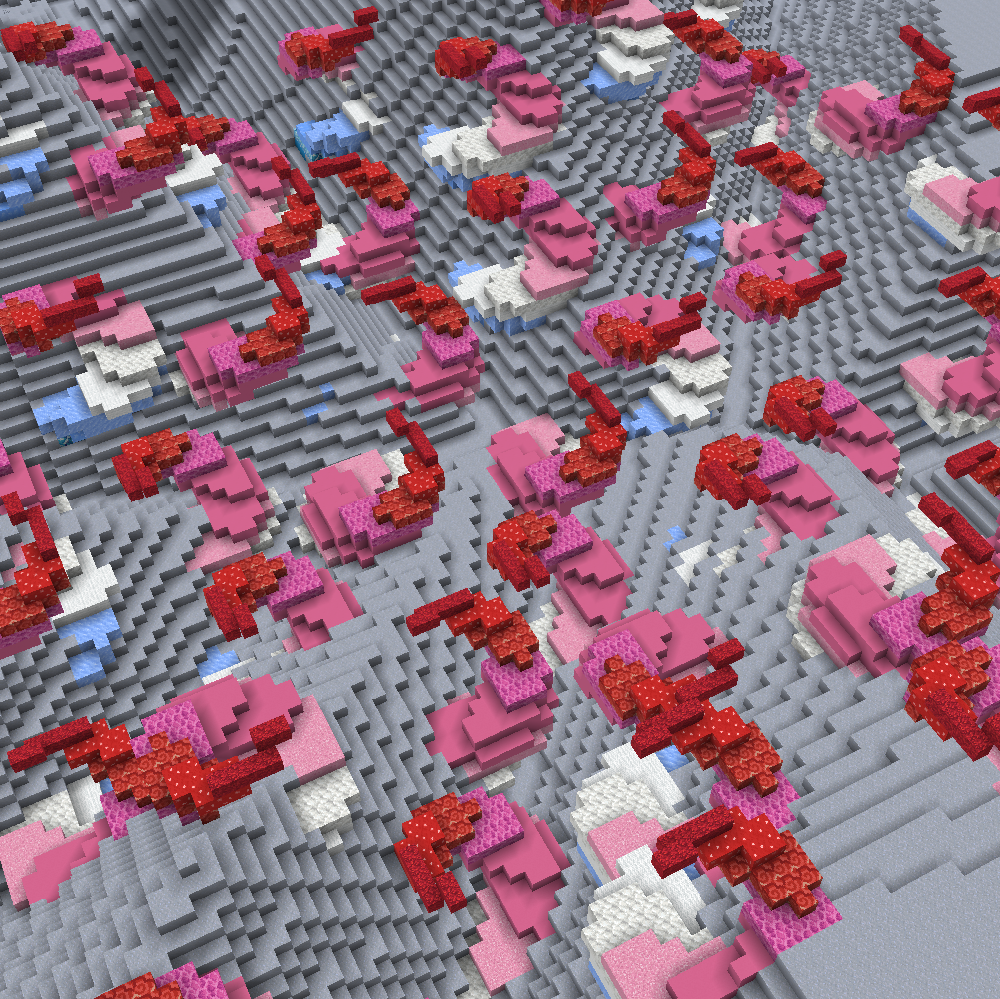

<!-- langmirror:chunk 0 -->
# 放置参数

每当放置一个结构时，它会经过以下管道（按该顺序）：

* [应用尺寸](placement-parameters.md#controlling-dimensions-s-less-than-dimensions-greater-than) (`-s`)
* [随机缩放](placement-parameters.md#random-scaling-o-less-than-sizemultiplierrange-greater-than) (`-t`)
* [方向](placement-parameters.md#orientation-advanced-k-less-than-orientationaxis-greater-than-and-c-less-than-orientationangle-great) (`-c` 和 `-k`)
* [随机翻转](placement-parameters.md#random-flips-f-less-than-randomflipsaxes-greater-than) (`-f`)
* [随机 90° 旋转](placement-parameters.md#random-90-rotations-r-less-than-randomrotationaxis-greater-than) (`-r`)
* [**对齐**](primary+secondary-alignment.md) (`<primary>` 和 `<secondary>`)

ezEdits 让你能够完全自定义此管道。括号中是适用于每个步骤的标志和参数。

***

### 控制尺寸：`-s <dimensions>`

尺寸通过设置其边界框大小来定义结构放置的大小。


标志 `-s <dimensions>` 设置放置的所需绝对基础尺寸（覆盖默认值）。


默认情况下，基于表达式的结构具有尺寸 `20,20,20`，而建筑文件/剪贴板结构则以其固有的原始尺寸放置。

注意：根据你选择的值，结构可能会显示为拉伸或压缩。

> 例如，如果你的剪贴板的固有大小为 5x7x5，那么将尺寸设置为 `-s 5,14,5` 将沿其 y 轴拉伸结构放置：
>
> 第一张图片：`//ezsc Clipboard -s 5,7,5`（原始剪贴板大小）
>
> 第二张图片：`//ezsc Clipboard -s 5,14,5`
>
> 
>
> 

***

### 随机缩放：`-o <sizeMultiplierRange>`

<!-- langmirror:chunk 1 -->
大多数结构命令一次放置多个结构。为了增加一些多样性，你可以为每个放置应用一些随机缩放。


`-o <sizeMultiplierRange>` 为每个放置应用随机缩放。你指定一个值的范围。从这个范围中选择一个随机数作为每个放置的缩放因子。


默认情况下，范围是 `1,1`，意味着缩放因子始终为 1，因此不会产生任何效果。

> **示例**
>
> 通过将范围设置为 `-o 0.5,2.0`，我们可以获得例如剪贴板的放置，其大小在所需大小的一半到两倍之间随机变化，
>
> `//ezsc Clipboard -o 0.5,2.0`
>
> 
>
> （同一棵树的剪贴板以各种不同的大小显示）

***

### 随机翻转：`-f <randomFlipsAxes>`


`-f <randomFlipsAxes>` 标志为每个放置启用结构在任何轴上的随机翻转。


可用的值为：

* None（默认）
* X
* Y
* Z
* XY
* XZ
* YZ
* XYZ

翻转在方向调整之后但在对齐之前应用。

> **示例**
>
> 第一张图：`//ezsc Clipboard`（无随机翻转）
>
> 第二张图：`//ezsc Clipboard -f XZ`（沿 x 轴和 z 轴随机镜像，但不包括 y 轴）
>
> 
>
> 

***

### 随机 90° 旋转：`-r <randomRotationAxis>`


`-r <randomRotationAxis>` 标志为每个放置启用结构在任一轴上的随机 90° 旋转。


可用的值为：

* X
* Y
* Z

默认情况下，此参数未设置任何值，即随机旋转被禁用。

90° 旋转在方向调整之后但在对齐之前应用。

<!-- langmirror:chunk 2 -->
> **示例**
>
> 第一张图片：`//ezsc Clipboard`（无随机旋转）
>
> 第二张图片：`//ezsc Clipboard -r Y`（绕Y轴随机旋转90°）
>
> 
>
> 

***

### 方向（高级）：`-k <orientationAxis>` 和 `-c <orientationAngle>`

设置方向意味着定义结构具有的内部坐标系。该坐标系随后用于随机翻转/旋转和对齐。_定义方向就是"定义哪一侧是上方，哪一侧是前方"_

方向由旋转轴（`-k <direction>`）和旋转角度（`-c <angle>`）设置。_旋转的工作方式与 `//ezd rotate` 相同_

默认情况下，旋转轴 `-k` 为 `y` 或 `up`，旋转角度 `-c` 为 `0`，表示不旋转。

例如，如果将旋转轴设置为 `-k x`，旋转角度设置为 `-c 90`，则结构会向一侧旋转。其东侧现在将成为其顶侧，依此类推。

***

### 放置空气：`-a`

默认情况下，如果_未_设置此标志，放置结构时会跳过空气方块。设置此标志时，结构内的空气方块能够覆盖现有方块。

（注意：此行为与 `//paste` 的 `-a` 标志相反。这可能会令人困惑，但我们认为这对我们的命令更方便。）