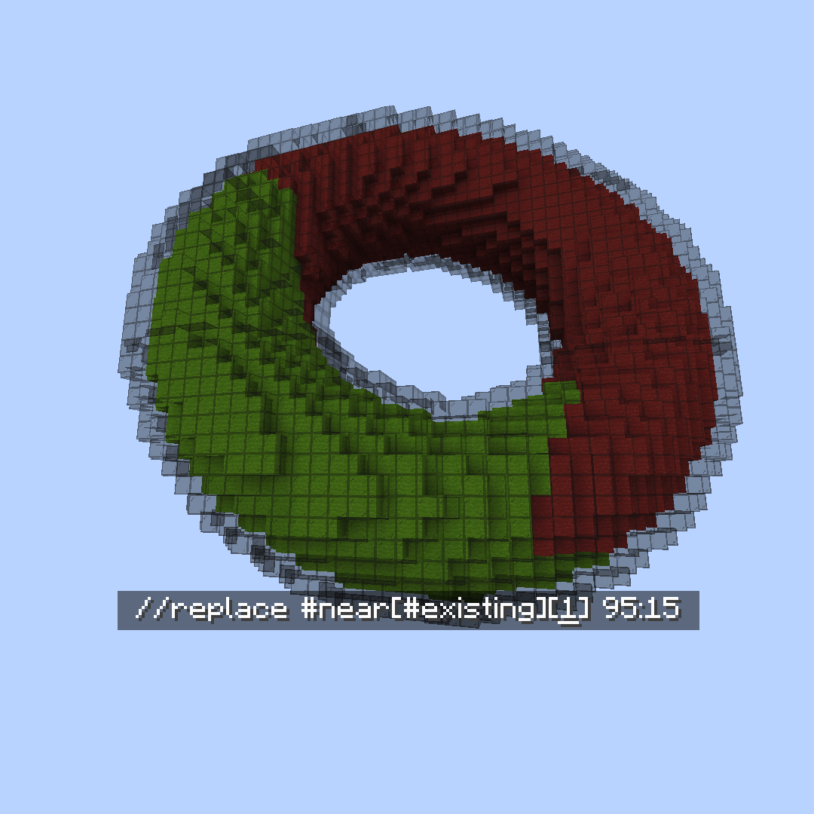
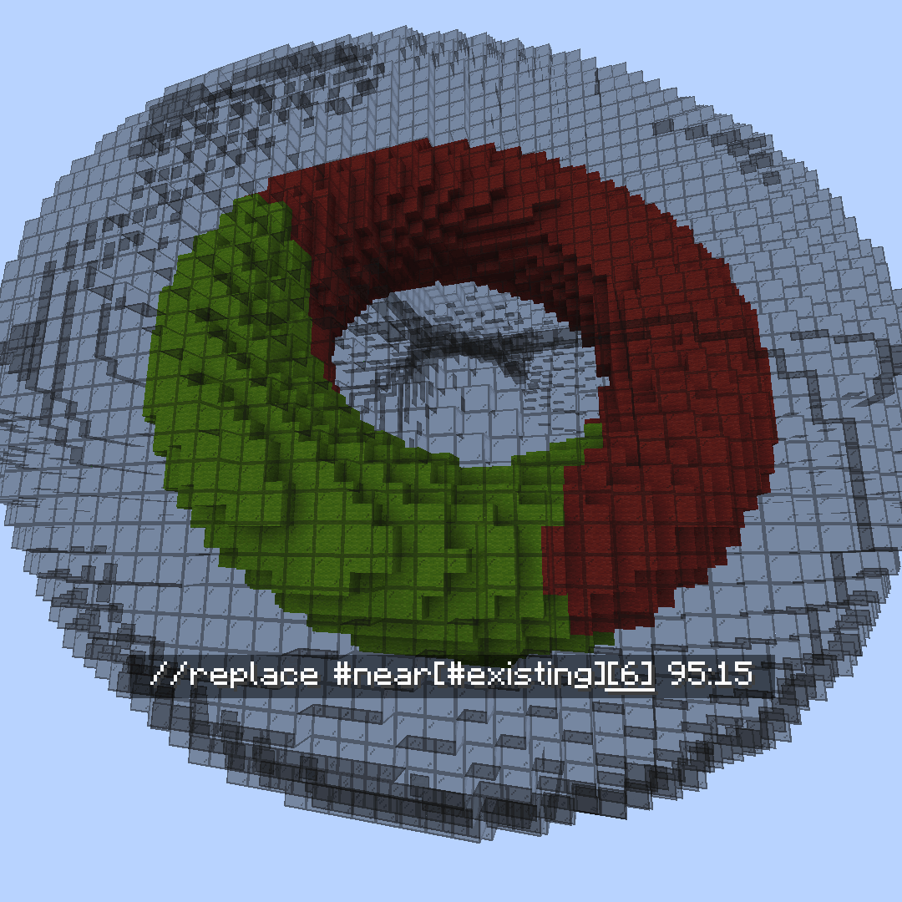
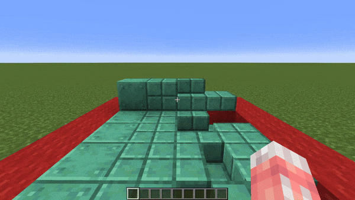

# 蒙板 Masks

### `#near`

#near 临近蒙板

**`#near[蒙板][距离]`**\
**`#near[蒙板][最小距离][最大距离]`**

在给定的球形（欧几里得）距离内匹配所有方块。\
不修改与内层`mask`匹配的方块。\
也可以设置为排除比最小距离更近的方块。

 **`[mask]`**

 **`[distance]`**

 **`[minDistance][maxDistance]`**

### `#aim`

#aim 目标蒙板

将玩家瞄准的方块作为蒙板。

### `#blocklight`

#blocklight 方块光照蒙板

**`#blocklight[光照级别]` or `#blocklight[最小级别][最大级别]`**

按给定的方块光照（由除天空光照外的光源提供的照明）匹配方块。
可以选择设置最小和最大光照级别，匹配该范围内的任何级别。

### `#truelight`

#truelight 全光照蒙板

**`#truelight[光照级别]` or `#truelight[最小级别][最大级别]`**

按给定的总光照级别（包括天空光照在内的任何光源提供的照明）匹配方块。
可以选择设置最小和最大光照级别，匹配该范围内的任何级别。

### `#eznoise`

#eznoise 噪声蒙板

**`#eznoisemask[噪声预设][<范围>][<threshold>][<种子>]`**\
**别名: `#eznm`**

使用噪声预设值`0.0-1.0`来匹配超过给定噪声阈值的方块。

### `#vectorgradient`

#vectorgradient 矢量渐变蒙板

**`#vectorgradientmask[矢量][距离][<噪声预设>][<噪声范围>][噪声种子]`**

简写: `#vgradientm`

沿向量匹配给定距离长度的方块。距离越近的方块通过蒙板检查的可能性越大。\
兼容噪声预设。

### `#attached`

#attached 附属蒙板

**`#attached[<向量,向量,向量 ...>]`**

匹配至少连接一个相邻非空气方块的方块。

可选择设置方向向量列表进行检查，而不是检查每个面。\
例如 `#attached[up,down,left,north]`

在任一种情况下，连接意味着方块“接触”相邻方块。因此，下部台阶不会通过`#attached[up]`，而状态为`[hanging=true]`的灯笼会通过。

### `#fullblock`

#fullblock 完整方块蒙板

匹配填满整个立方空间的方块。

例如，1-7层的雪不会通过，但8层的雪、像石头一样的方块或像玻璃一样的透明方块会通过蒙板检查。

### `#palette`

#palette 调色板蒙板

**`#palette[调色板][<strict>]`**

匹配与调色板中的任何方块相符的方块。

可选的`<strict>`值为True或False，以确定方块数据是否也必须匹配。\
例如 `oak_stairs[facing=east]` 只有在`strict`设置为**False**时才会与`oak_stairs[facing=west]`匹配。

### `#fuzzypalette`

#fuzzypalette 模糊调色板蒙板

**`#fuzzypalette[调色板]`**

简写: **`#fpalette`**

匹配与调色板中的任何方块相符的方块，不考虑方块数据。\
等效于 **`#palette[palette][False]`**

### `#current`

当前蒙板

简写: **`#c`**

这是一个表示当前全局蒙板（gmask）的蒙板。

例如，运行 `//gmask !#current` 将反转你当前的全局蒙板。

