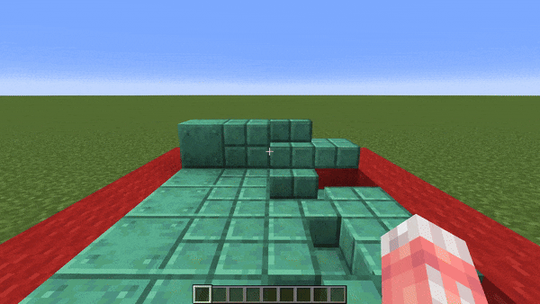
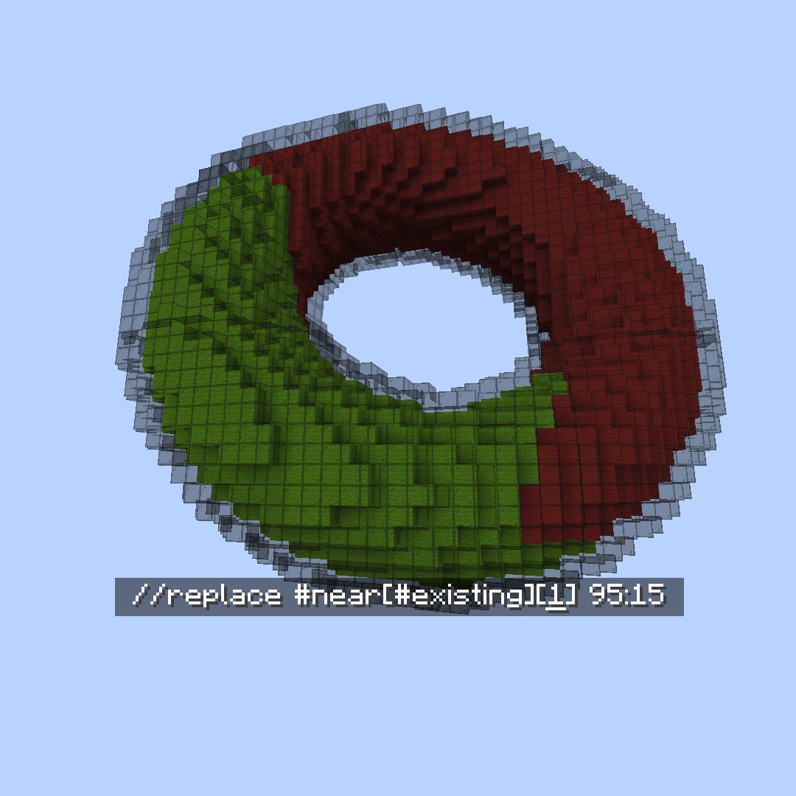
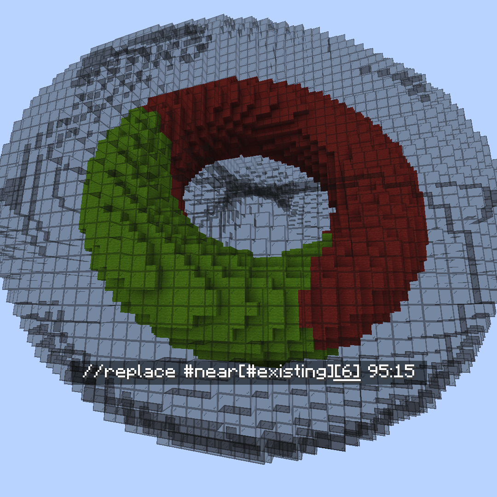

# 蒙版

### `#aim`

#aim 蒙版

**`#aim` 或 `#aim[True|False]`**

将玩家瞄准的方块作为蒙版。

可选择设置 True/False 来使瞄准对碰撞箱敏感。

* False 会将所有方块视为完整方块。例如，你无法 `#aim` 瞄准按钮后面的方块。
* True 会尊重你所看方块的碰撞箱。例如，你可以 `#aim` 瞄准台阶后面的方块。

### `#attached`

#attached 蒙版

**`#attached[<vector,vector,vector ...>]`**

匹配至少与 1 个相邻非空气方块连接的方块。

可选择提供一个方向向量列表来检查，而不是检查每一侧。\
例如 `#attached[up,down,left,north]`

\
无论哪种情况，attached 意味着该方块"接触"相邻方块。因此，底部台阶不会通过 `#attached[up]`，而状态为 `[hanging=true]` 的灯笼会通过。

### `#blocklight`

#blocklight 蒙版

**`#blocklight[lightLevel]` 或 `#blocklight[minLevel][maxLevel]`**

匹配给定方块光照等级的方块（由天空光以外的光源提供的照明）。可选择提供最小和最大光照等级，匹配该范围内的任何等级。

### `#current`

#current 蒙版

简写：**`#c`**

代表你当前全局蒙版（gmask）的蒙版。

例如运行 `//gmask !#current` 将反转你当前的 gmask

### `#eznoise`

#eznoise 蒙版

**`#eznoisemask[noisePreset][<scale>][<threshold>][<seed>]`**\
**别名：`#eznm`**

使用噪声预设值 `0.0-1.0` 来匹配高于给定噪声阈值的方块。

### `#fullblock`

#fullblock 蒙版

匹配填满整个立方体空间的方块。

例如 1-7 层雪不会通过，但 8 层雪、石头这样的方块或玻璃这样的透明方块会通过。

### `#fuzzypalette`

#fuzzypalette 蒙版

**`#fuzzypalette[palette]`**

简写：**`#fpalette`**

匹配调色板中任何方块的方块，无论方块数据如何。\
等同于 **`#palette[palette][False]`**

### `#infested`

#infested 蒙版

匹配被蠹虫感染的方块。

### `#lightsource`

#lightsource 蒙版

**`#lightsource` 或 `#lightsource[lightLevel]` 或 `#lightsource[minLevel][maxLevel]`**

蒙版到发光的方块。可选择性地接受特定的光照等级进行匹配，或最小和最大光照等级，匹配该范围内的任何等级。

### `#near`

#near 蒙版

**`#near[mask][distance]`**\
&#xNAN;**`#near[mask][minDistance][maxDistance]`**\
\
蒙版到给定球形（欧几里得）距离内蒙版的所有方块。\
不会修改匹配内部 `mask` 的方块。\
也可以设置为排除距离小于最小距离的方块。\\

 **`[mask]`**

 **`[distance]`**

 **`[minDistance][maxDistance]`**

### `#palette`

#palette 蒙版

**`#palette[palette][<strict>]`**

蒙版到与调色板中任何方块匹配的方块。

可选的 `<strict>` 值为 True 或 False，用于确定方块数据是否也必须匹配。\
例如，如果 strict 设置为 **False**，`oak_stairs[facing=east]` 将只与 `oak_stairs[facing=west]` 匹配。

### `#truelight`

#truelight 蒙版

**`#truelight[lightLevel]` 或 `#truelight[minLevel][maxLevel]`**

蒙版到给定总光照等级的方块（包括天空光在内的任何光源提供的照明）。可选择性地接受最小和最大光照等级，匹配该范围内的任何等级。

### `#vectorgradient`

#vectorgradient 蒙版

**`#vectorgradientmask[vector][distance][<noisePreset>][<noiseScale>][noiseSeed]`**

简写：`#vgradientm`

沿着给定距离长度的向量蒙版方块。距离较近的方块更有可能通过蒙版检查。\
兼容噪声预设。

