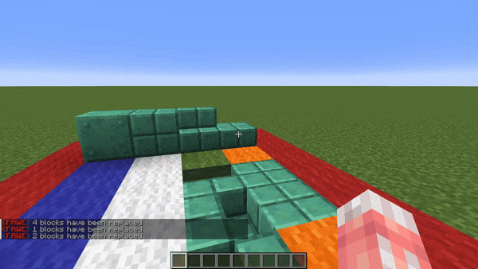

# Patterns

### `#aim`

#aim Pattern

Takes the block the player is aiming at as the pattern.

### `#eznoise`

#eznoise Pattern

**`#eznoise[palette][noisePreset][<scale>][<seed>]`**

Uses a noise preset values to return palette blocks.\
**Which also has the following in-built presets:**

* **`#ridged[palette][<scale>][<seed>]`**
* **`#smoothcells[palette][<scale>][<seed>]`**&#x20;
* **`#voronoiedge[palette][<scale>][<seed>]`**

### `#vectorgradient`

#vectorgradient Pattern

**`#vectorgradient[palette][vector][distance][<noisePreset>][<noiseScale>][<noiseSeed>]`**

Sets palette blocks along a vector with a given distance length with the block chosen based on distance plus a blending factor. Can also use noise presets.

### `#selection`

#selection Pattern

**`#selection[selection][<offset>]`**

Shorthand: **`#sel[selection][<offset>]`**

Sets blocks using  the blocks currently in world at the location of the saved selection.\
Acts as if the selection were tiled/stacked.

Optional `<offset>` variable to offset the pattern by a given vector.

