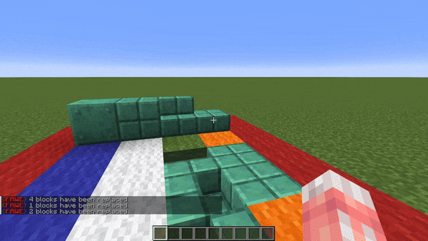

<!-- langmirror:chunk 0 -->
# 图案

### `#aim`

#aim 图案

**`#aim` 或 `#aim[True|False]`**

将玩家正在瞄准的方块作为图案。

可选择设置 True/False 来使你的瞄准对碰撞箱敏感。

* False 会将所有方块视为完整方块。例如，你无法 `#aim` 瞄准按钮后面的方块。
* True 会尊重你正在看的方块的碰撞箱。例如，你可以 `#aim` 瞄准台阶后面的方块。

### `#eznoise`

#eznoise 图案

**`#eznoisepattern[palette][noisePreset][<scale>][<seed>]`**\
**别名：`#eznp`**

使用噪声预设值来返回调色板方块。\
**同时具有以下内置预设：**

* **`#ridged[palette][<scale>][<seed>]`**
* **`#smoothcells[palette][<scale>][<seed>]`**
* **`#voronoiedge[palette][<scale>][<seed>]`**

### `#palette`

#palette 图案

**`#palette[palette]`**

获取给定的调色板并返回调色板方块列表。可用作随机方块图案。

例如 `//set #palette[##ice]` 等同于 `//set [blue_ice,packed_ice,ice]`

### `#selection`

#selection 图案

**`#selection[selection][<offset>]`**

简写：**`#sel[selection][<offset>]`**

使用保存的选区位置处世界中当前的方块来设置方块。\
表现得就像选区被平铺/堆叠一样。

可选的 `<offset>` 变量用于按给定向量偏移图案。

### `#vectorgradient`

#vectorgradient 图案

**`#vectorgradientpattern[palette][vector][distance][<noisePreset>][<noiseScale>][<noiseSeed>]`**\
**别名：`#vgradientp`**

沿着给定距离长度的向量设置调色板方块，方块的选择基于距离加上混合因子。也可以使用噪声预设。

