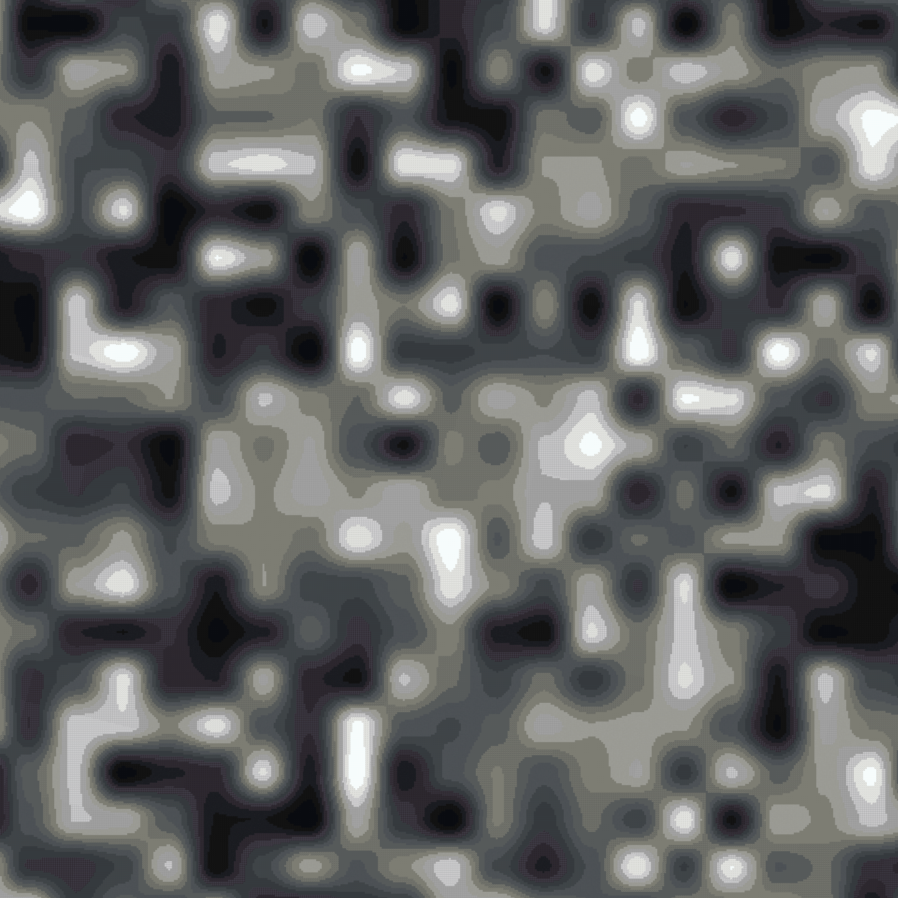
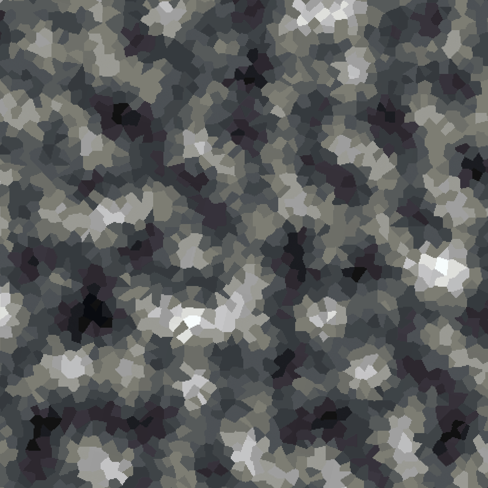

# 噪声说明

噪声对于从未接触过的人来说可能是一个复杂的话题，但最简单的理解是，噪声是一种通过某些输入（通常是X,Y,Z坐标）获取值的方法。

你最熟悉噪声的地方可能是Minecraft的地形生成。在世界的每个点上，多个噪声函数会结合在一起决定是否放置一个方块，如果放置的话，决定放置哪个方块。

这几乎就是我们在ezEdits中所做的事情，使用噪声来生成形状、地形和纹理。

在插件中，你会发现几种噪声类型，每种都有不同的特性，特别是Cellular噪声，它带有许多你可以自定义的额外参数。

一些使用噪声的众多功能包括：

* `//eznoisegen ...` - *噪声指令*
* `#eznoisemask` - *蒙版*
* `//ezbrush gradient ...` - *笔刷*

_ezEdits中的噪声基于修改版的 FastNoiseLite，因此我们强烈推荐这个网站来试验噪声参数：_ [_http://auburn.github.io/FastNoiseLite/_ ](http://auburn.github.io/FastNoiseLite/)

## 噪声参数

每个参数和许多值都有一个简写，比如“Fractal”代替“FractalType”或“Simplex”代替“OpenSimplex2”。在可能的情况下，简写将显示在括号中。\
<mark style="color:red;">`红色 = 参数`</mark>    <mark style="color:purple;">`紫色 = 值`</mark>

&#x20;

### 噪声类型

设置噪声类型 <mark style="color:red;">

设置要使用的噪声类型。这是任何噪声的起点，格式为 `Noise()`，例如 `Perlin()`，所有其他参数将放在括号中。

* <mark style="color:purple;">`Perlin (per)`</mark>
* <mark style="color:purple;">`OpenSimplex2 (simplex)`</mark>
* <mark style="color:purple;">`OpenSimplex2S (smooth)`</mark>
* <mark style="color:purple;">`Value (val)`</mark>
* <mark style="color:purple;">`ValueCubic (cubic)`</mark>
* <mark style="color:purple;">`White`</mark>
* <mark style="color:purple;">`Cellular (vor)`</mark>
* <mark style="color:purple;">`Shard`</mark>

### 基本噪声参数

基本噪声参数

* <mark style="color:red;">`Seed`</mark>\
  设置噪声的种子值。-1或不设置将导致随机噪声种子。
* <mark style="color:red;">`Frequency (Freq)`</mark>\
  设置噪声的频率。较高的频率会产生陡峭的噪声，较低的值会产生平滑的噪声。
* <mark style="color:red;">`Inverted (Invert)`</mark>\
  是否反转噪声值。默认为false。
  * <mark style="color:purple;">`True`</mark>
  * <mark style="color:purple;">`False`</mark>
* <mark style="color:red;">`ValueMapping (Map)`</mark>\
  是否忽略或覆盖值映射。默认情况下，噪声被采样以在0到1之间映射。
  * <mark style="color:purple;">`Default (Def)`</mark>
  * <mark style="color:purple;">`None (No)`</mark>
  * <mark style="color:purple;">`Override (OR)`</mark>\
    **如果覆盖:**
    * <mark style="color:red;">`LowerBound (Min)`</mark>
    * <mark style="color:red;">`UpperBound (Max)`</mark>
* <mark style="color:red;">`YScaling (Y)`</mark>\
  在使用3D噪声时，可用于拉伸或压缩Y轴。

### Cellular噪声参数

<strong>额外的 Cellular 噪声参数</strong>

* <mark style="color:red;">`CellularJitterModifier (Jitter)`</mark>\
  通常为 `0..1.0`\
  控制随机抖动或分布的细胞噪声节点，0表示完全网格化，1表示最大程度的“随机”，不重叠。超过1的值会开始与其邻居重叠。
* <mark style="color:red;">`CellularDistanceFunction (Distance)`</mark>\
  控制用于确定每个点到其节点的距离值的数学方法。
  * <mark style="color:purple;">`Euclidean`</mark>
  * <mark style="color:purple;">`EuclideanSq (sq)`</mark>
  * <mark style="color:purple;">`Manhattan (man)`</mark>
  * <mark style="color:purple;">`Hybrid`</mark>
  * <mark style="color:purple;">`Minkovski1 (m1)`</mark>
  * <mark style="color:purple;">`Minkowvki4 (m4)`</mark>
  * <mark style="color:purple;">`Minkowski99 (m99)`</mark>
  * <mark style="color:purple;">`Rounded (round)`</mark>
* <mark style="color:red;">`CellularReturnType (DistReturn)`</mark>\
  控制返回距离值之前如何修改。\
  所有 Distance2\* 值指的是第二近的节点而不是最近的节点。
  * <mark style="color:purple;">`CellValue (cell)`</mark>
  * <mark style="color:purple;">`Distance (1)`</mark>
  * <mark style="color:purple;">`DistanceSquared (sq)`</mark>
  * <mark style="color:purple;">`DistanceInverse (inv)`</mark>
  * <mark style="color:purple;">`DistanceLog (log)`</mark>
  * <mark style="color:purple;">`DistanceExp (exp)`</mark>
  * <mark style="color:purple;">`Distance2 (2)`</mark>
  * <mark style="color:purple;">`Distance2Add (2add)`</mark>
  * <mark style="color:purple;">`Distance2Add (2sub)`</mark>
  * <mark style="color:purple;">`Distance2Add (2mul)`</mark>
  * <mark style="color:purple;">`Distance2Add (2div)`</mark>
  * <mark style="color:purple;">`Distance2Sq (2sq)`</mark>
  * <mark style="color:purple;">`Distance2Inv (2inv)`</mark>
  * <mark style="color:purple;">`Distance2Log (2log)`</mark>
  * <mark style="color:purple;">`Distance2Exp (2exp)`</mark>
  * <mark style="color:purple;">`Edge`</mark>
  * <mark style="color:purple;">`Rounded (round)`</mark>
  * <mark style="color:purple;">`NoiseLookup (noise)`</mark>\
    **额外的噪声查找参数:**
    * <mark style="color:red;">`CellularNoiseLookup (Lookup)`</mark>\
      当使用NoiseLookup返回类型时，控制覆盖细胞噪声的基础噪声。
      * <mark style="color:purple;">`Perlin (per)`</mark>
      * <mark style="color:purple;">`OpenSimplex2 (simplex)`</mark>
      * <mark style="color:purple;">`OpenSimplex2S (smooth)`</mark>
      * <mark style="color:purple;">`Value (val)`</mark>
      * <mark style="color:purple;">`ValueCubic (cubic)`</mark>
      * <mark style="color:purple;">`White`</mark>
      * <mark style="color:purple;">`Cellular (vor)`</mark>
    * <mark style="color:red;">`CellularNoiseLookupFrequency (DistReturn)`</mark>\
      控制基础噪声的频率。

### Shard噪声参数

额外的 Shard 噪声参数

* <mark style="color:red;">`Sharpness (Sharp)`</mark>\
  通常为 `0..1.0`\
  控制Shard噪声的图案锐度。较高的值在图案内部有更明确的边缘，而较低的值会显得更模糊。

### 分形噪声参数

分形噪声参数

* <mark style="color:red;">`FractalType (Fractal)`</mark>\
  设置要使用的分形噪声类型。
  * <mark style="color:purple;">`None (No)`</mark>
  * <mark style="color:purple;">`FBm`</mark>
  * <mark style="color:purple;">`Ridged`</mark>
  * <mark style="color:purple;">`PingPong (PP)`</mark>\
    **额外的PingPong分形参数:**
    * <mark style="color:red;">`PingPongStrength (PPStr)`</mark>

**如果选择了除 `None` 以外的分形类型:**

* <mark style="color:red;">`Octaves (Oct)`</mark>\
  设置要使用的分形噪声层数。
* <mark style="color:red;">`Lacunarity (Lac)`</mark>\
  设置每个分形层的比例尺度。大于1的值将有效增加每层的频率，小于1的值将有效降低每层的频率。
* <mark style="color:red;">`Gain`</mark>\
  设置每个分形层的相对强度。小于1的值将逐层减弱，大于1的值将逐层增强。
* <mark style="color:red;">`WeightedStrength (Weighted)`</mark>\
  设置每层强度对噪声值的响应性。

### 域扭曲参数

域扭曲参数

* <mark style="color:red;">`DomainWarpType (Warp)`</mark>\
  设置要使用的域扭曲类型。
  * <mark style="color:purple;">`None (No)`</mark>
  * <mark style="color:purple;">`BasicGrid (Grid)`</mark>
  * <mark style="color:purple;">`OpenSimplex2 (Simplex)`</mark>
  * <mark style="color:purple;">`OpenSimplex2Reduced (Reduced)`</mark>
  * <mark style="color:purple;">`Flow`</mark>
  * <mark style="color:purple;">`Turbulence (Turb)`</mark>

**如果选择了除 `None` 以外的域扭曲类型:**

* <mark style="color:red;">`DomainWarpFreq (WarpFreq)`</mark>\
  设置域扭曲的频率。
* <mark style="color:red;">`DomainWarpOct (WarpOct)`</mark>\
  设置域扭曲的层数。
* <mark style="color:red;">`DomainWarpGain (WarpGain)`</mark>\
  设置每个域扭曲层的相对强度。
* <mark style="color:red;">`DomainWarpAmp (WarpAmp)`</mark>\
  设置域扭曲的总振幅（强度）。
* <mark style="color:red;">`DomainWarpFrac (WarpFrac)`</mark>\
  设置要使用的域扭曲特定分形类型。
  * <mark style="color:purple;">`None (No)`</mark>
  * <mark style="color:purple;">`DomainWarpIndependent (ind)`</mark>
  * <mark style="color:purple;">`DomainWarpProgressive (prog)`</mark>
* <mark style="color:red;">`DomainWarpLacunarity (WarpLac)`</mark>\
  设置每个域扭曲层的比例尺度。

## 示例

**`Value(Seed:123,Freq:0.04)`**

<figure><figcaption></figcaption></figure>

**`Cellular(Distance:Euclidean,DistReturn:NoiseLookup,Lookup:Perlin,LookupFreq:0.2,Freq:0.1)`**

<figure><figcaption></figcaption></figure>
