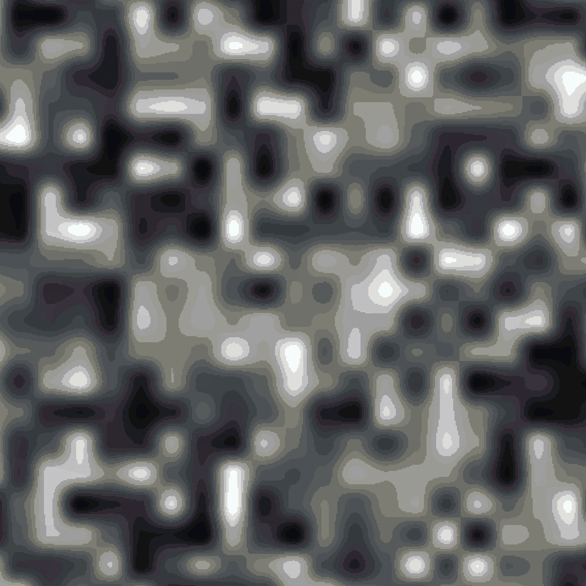
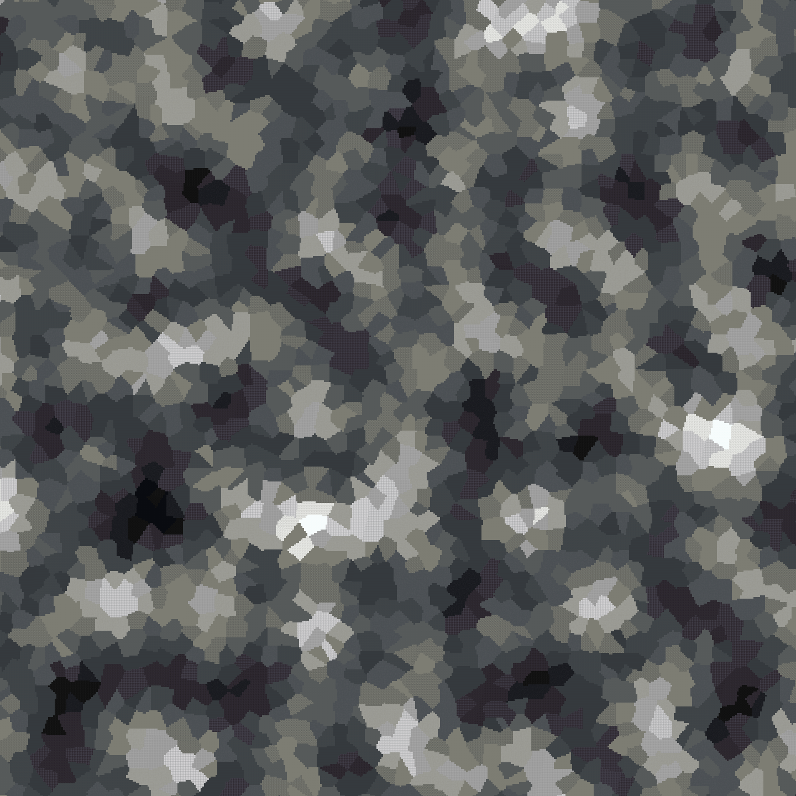

<!-- langmirror:chunk 0 -->
# Noise 噪声详解

对于从未了解过它的人来说，噪声（Noise）可能是一个复杂的话题，但简单来说，噪声是一种通过某些输入（通常是 X,Y,Z 坐标）获取数值的方法。

你最熟悉噪声的地方可能是在 Minecraft 的地形生成中。在世界中的每一个点，多个噪声函数被组合在一起，用以确定是否应当放置方块，以及如果放置的话，应该放置哪种方块。

这基本上也是我们在 ezEdits 中所做的，利用噪声来生成形状、地形和纹理。

在插件中，你会发现几种噪声类型，每种类型都有不同的特性，特别是 Cellular（细胞噪声）还带有许多你可以自定义的额外参数。

使用噪声的众多功能包括：

* `//eznoisegen ...` - _Noisegen（噪声生成）命令_
* `#eznoisemask` - _Masks（蒙版）_
* `//ezbrush gradient ...` - _Brushes（笔刷）_

_ezEdits 中的噪声基于 FastNoiseLite 的修改版本，因此我们强烈推荐使用此网站来实验噪声参数：_[http://auburn.github.io/FastNoiseLite/](http://auburn.github.io/FastNoiseLite/)

## Noise Parameters 噪声参数

每个参数和许多数值都有简写，例如用 "ft" 代替 "FractalType"，或用 "Si" 代替 "OpenSimplex2"。在可行的地方，简写会显示在括号中。\
<mark style="color:red;">`红色 = 参数`</mark> <mark style="color:purple;">`紫色 = 数值`</mark>

### Noise Type 噪声类型

设置噪声类型 

设置要使用的噪声类型。这是任何噪声的开始，格式为 `Noise()`，例如 `Perlin()`，所有其他参数都将放在括号之间。

<!-- langmirror:chunk 1 -->
* <mark style="color:purple;">`Perlin (Pe)`</mark>
* <mark style="color:purple;">`OpenSimplex2 (Si)`</mark>
* <mark style="color:purple;">`OpenSimplex2S (Sm)`</mark>
* <mark style="color:purple;">`Value (Va)`</mark>
* <mark style="color:purple;">`ValueCubic (VC)`</mark>
* <mark style="color:purple;">`White (Wh)`</mark>
* <mark style="color:purple;">`Cellular (Ce)`</mark>
* <mark style="color:purple;">`Shard (Sh)`</mark>

### 基础噪声参数

基础噪声参数

<!-- langmirror:chunk 2 -->
* <mark style="color:red;">`Seed (s)`</mark>\
  设置噪声的种子值。-1 或不填将导致生成随机噪声种子。
* <mark style="color:red;">`Frequency (f)`</mark>\
  设置噪声的频率。较高的频率会导致更陡峭的噪声，较低的值会导致更平滑的噪声。
* <mark style="color:red;">`Inverted (i)`</mark>\
  是否反转噪声值。默认为 false。
  * <mark style="color:purple;">`True`</mark>
  * <mark style="color:purple;">`False`</mark>
* <mark style="color:red;">`ValueMapping (m)`</mark>\
  是否忽略或覆盖值映射。默认情况下，噪声采样映射在 0 到 1 之间。
  * <mark style="color:purple;">`Default (Def)`</mark>
  * <mark style="color:purple;">`None (No)`</mark>
  * <mark style="color:purple;">`Override (OR)`</mark>\
    **如果覆盖：**
    * <mark style="color:red;">`LowerBound (l)`</mark>
    * <mark style="color:red;">`UpperBound (u)`</mark>
* <mark style="color:red;">`XScaling (x)`</mark>\
  可用于拉伸或挤压 X 轴。
* <mark style="color:red;">`YScaling (y)`</mark>\
  使用 3D 噪声时，可用于拉伸或挤压 Y 轴。
* <mark style="color:red;">`ZScaling (z)`</mark>\
  可用于拉伸或挤压 Z 轴。

### Cellular Noise Parameters（细胞噪声参数）

<strong>Additional Cellular Noise Parameters（额外细胞噪声参数）</strong>

* <mark style="color:red;">`CellularJitterModifier (cJ)`</mark>\
  通常为 `0..1.0`\
  控制细胞噪声节点的随机抖动或分布，0 为完美的网格，1 为最大程度的“随机”且无重叠。超过 1 的值将开始与其相邻节点重叠。
* <mark style="color:red;">`CellularDistanceFunction (cD)`</mark>\

<!-- langmirror:chunk 3 -->
控制用于确定每个点到其节点之间距离值的数学方法。
  * <mark style="color:purple;">`Euclidean (e)`</mark>（欧几里得距离）
  * <mark style="color:purple;">`EuclideanSq (sq)`</mark>（欧几里得距离平方）
  * <mark style="color:purple;">`Manhattan (man)`</mark>（曼哈顿距离）
  * <mark style="color:purple;">`Hybrid (h)`</mark>（混合距离）
  * <mark style="color:purple;">`Minkovski1 (m1)`</mark>（闵可夫斯基距离1）
  * <mark style="color:purple;">`Minkowvki4 (m4)`</mark>（闵可夫斯基距离4）
  * <mark style="color:purple;">`Minkowski99 (m99)`</mark>（闵可夫斯基距离99）
  * <mark style="color:purple;">`Rounded (r)`</mark>（圆整距离）
* <mark style="color:red;">`CellularReturnType (cR)`</mark>\
  控制距离值在返回前如何进行修改。\
  所有 Distance2* 值均指代第 2 近的节点，而非最近的节点。
  * <mark style="color:purple;">`CellValue (cell)`</mark>（单元格值）
  * <mark style="color:purple;">`Distance (1)`</mark>（距离）
  * <mark style="color:purple;">`DistanceSquared (sq)`</mark>（距离平方）
  * <mark style="color:purple;">`DistanceInverse (inv)`</mark>（距离反比）
  * <mark style="color:purple;">`DistanceLog (log)`</mark>（距离对数）
  * <mark style="color:purple;">`DistanceExp (exp)`</mark>（距离指数）
  * <mark style="color:purple;">`Distance2 (2)`</mark>（距离2）
  * <mark style="color:purple;">`Distance2Add (2add)`</mark>（距离2加）
  * <mark style="color:purple;">`Distance2Add (2sub)`</mark>（距离2减）
  * <mark style="color:purple;">`Distance2Add (2mul)`</mark>（距离2乘）
  * <mark style="color:purple;">`Distance2Add (2div)`</mark>（距离2除）
  * <mark style="color:purple;">`Distance2Sq (2sq)`</mark>（距离2平方）
  * <mark style="color:purple;">`Distance2Inv (2inv)`</mark>（距离2反比）

<!-- langmirror:chunk 4 -->
* <mark style="color:purple;">`Distance2Log (2log)`</mark>
  * <mark style="color:purple;">`Distance2Exp (2exp)`</mark>
  * <mark style="color:purple;">`Edge (e)`</mark>
  * <mark style="color:purple;">`Rounded (r)`</mark>
  * <mark style="color:purple;">`NoiseLookup (n)`</mark>\
    **额外噪声查找参数：**
    * <mark style="color:red;">`CellularNoiseLookup (cN)`</mark>\
      当使用 NoiseLookup 返回类型时，此参数控制叠加在细胞噪声之下的基础噪声。
      * <mark style="color:purple;">`Perlin (Pe)`</mark>
      * <mark style="color:purple;">`OpenSimplex2 (Si)`</mark>
      * <mark style="color:purple;">`OpenSimplex2S (Sm)`</mark>
      * <mark style="color:purple;">`Value (Va)`</mark>
      * <mark style="color:purple;">`ValueCubic (VC)`</mark>
      * <mark style="color:purple;">`White (Wh)`</mark>
      * <mark style="color:purple;">`Cellular (Ce)`</mark>
    * <mark style="color:red;">`CellularNoiseLookupFrequency (cF)`</mark>\
      控制基础噪声的频率。

### Shard（碎片）噪声参数

额外 Shard 噪声参数

* <mark style="color:red;">`Sharpness (h)`</mark>\
  通常为 `0..1.0`\
  控制 Shard 噪声的图案锐度。较高的值会使图案内部的边缘更清晰，而较低的值则显得更模糊。

### Fractal（分形）噪声参数

分形噪声参数

<!-- langmirror:chunk 5 -->
* <mark style="color:red;">`FractalType (fT)`</mark>\
  设置要使用的分形噪声类型。
  * <mark style="color:purple;">`None (N)`</mark>
  * <mark style="color:purple;">`FBm (F)`</mark>
  * <mark style="color:purple;">`Ridged (R)`</mark>
  * <mark style="color:purple;">`PingPong (P)`</mark>\
    **额外的 PingPong 分形参数：**
    * <mark style="color:red;">`PingPongStrength (fP)`</mark>

**如果选择了除 `None` 以外的分形类型：**

* <mark style="color:red;">`Octaves (fO)`</mark>\
  设置要使用的分形噪声层数。
* <mark style="color:red;">`Lacunarity (fL)`</mark>\
  设置每个分形层的缩放比例。值 >1 会有效增加每层的频率，值 <1 会有效降低每层的频率。
* <mark style="color:red;">`Gain (fG)`</mark>\
  设置每个分形层的相对强度。值 <1 会降低每层的强度，值 >1 会增加强度。
* <mark style="color:red;">`WeightedStrength (fW)`</mark>\
  设置每层强度对噪声值的响应程度。

### Domain Warp Parameters（定义域扭曲参数）

Domain Warp Parameters（定义域扭曲参数）

* <mark style="color:red;">`DomainWarpType (wT)`</mark>\
  设置要使用的定义域扭曲类型。
  * <mark style="color:purple;">`None (N)`</mark>
  * <mark style="color:purple;">`BasicGrid (G)`</mark>
  * <mark style="color:purple;">`OpenSimplex2 (S)`</mark>
  * <mark style="color:purple;">`OpenSimplex2Reduced (R)`</mark>
  * <mark style="color:purple;">`Flow (F)`</mark>
  * <mark style="color:purple;">`Turbulence (T)`</mark>

<!-- langmirror:chunk 6 -->
**如果选择了 `None`（无）以外的域扭曲（Domain Warp）类型：**

* <mark style="color:red;">`DomainWarpFreq (wF)`</mark>\
  设置域扭曲的频率。
* <mark style="color:red;">`DomainWarpOct (wO)`</mark>\
  设置域扭曲的层数（倍频）。
* <mark style="color:red;">`DomainWarpGain (wG)`</mark>\
  设置每个域扭曲层的相对强度（增益）。
* <mark style="color:red;">`DomainWarpAmp (wA)`</mark>\
  设置域扭曲的总振幅（强度）。
* <mark style="color:red;">`DomainWarpFrac (wC)`</mark>\
  设置要使用的域扭曲特定分形类型。
  * <mark style="color:purple;">`None (N)`</mark>（无）
  * <mark style="color:purple;">`DomainWarpIndependent (I)`</mark>（独立域扭曲）
  * <mark style="color:purple;">`DomainWarpProgressive (P)`</mark>（渐进域扭曲）
* <mark style="color:red;">`DomainWarpLacunarity (wl)`</mark>\
  设置每个域扭曲层的间隙度（缩放）。

## 示例

**`Value(Seed:123,Frequency:0.04)`**

<figure><figcaption></figcaption></figure>

**`Cellular(cellularDistanceFunction:Euclidean,cellularReturnType:NoiseLookup,cellularNoiseLookup:Perlin,cellularNoiseLookupFrequency:0.2,Frequency:0.1)`**

_同样的噪声，但使用所有缩写：_ **`Ce(cD:e,cR:n,cN:Pe,cF:.2,F:.1)`**

<figure><figcaption></figcaption></figure>