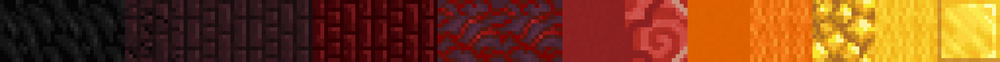
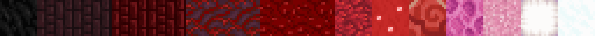
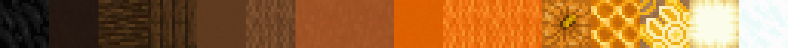
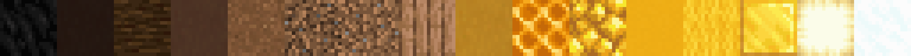
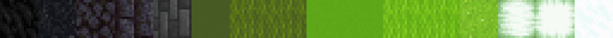
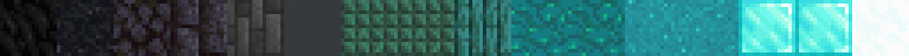
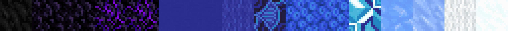
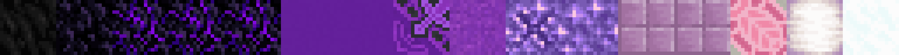
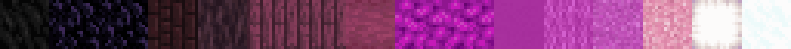
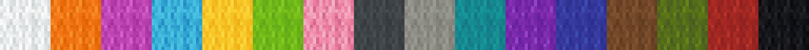

<!-- langmirror:chunk 0 -->
# 默认调色板

默认情况下，调色板是按玩家个人保存的。然而，服务器管理员可以在以下路径中定义一组供所有玩家访问的默认调色板：

```
plugins/ezEdits/resources/DefaultPalettes.json
```

我们也预置了一系列默认调色板：

***

<figure><figcaption><p>##Grayscale（灰度）</p></figcaption></figure>

<figure><figcaption><p>##GrayRough（粗糙灰）</p></figcaption></figure>

<figure><figcaption><p>##GrayWarm（暖灰）</p></figcaption></figure>

<figure><figcaption><p>##GrayCold（冷灰）</p></figcaption></figure>

***

<figure><figcaption><p>##BlueWhiteRed（蓝白红）</p></figcaption></figure>

<figure><figcaption><p>##Infrared（红外线）</p></figcaption></figure>

<figure><figcaption><p>##Magma（岩浆）</p></figcaption></figure>

<figure><figcaption><p>##Beige（米色）</p></figcaption></figure>

***

<figure><figcaption><p>##GlowRed（荧光红）</p></figcaption></figure>

<figure><figcaption><p>##GlowOrange（荧光橙）</p></figcaption></figure>

<figure><figcaption><p>##GlowYellow（荧光黄）</p></figcaption></figure>

<figure><figcaption><p>##GlowLime（荧光青柠）</p></figcaption></figure>

<!-- langmirror:chunk 1 -->
<figure><figcaption><p>##GlowCyan（发光青）</p></figcaption></figure>

<figure><figcaption><p>##GlowBlue（发光蓝）</p></figcaption></figure>

<figure><figcaption><p>##GlowPurple（发光紫）</p></figcaption></figure>

<figure><figcaption><p>##GlowMagenta（发光品红）</p></figcaption></figure>

***

<figure><figcaption><p>##FadeRed（渐变红）</p></figcaption></figure>

<figure><figcaption><p>##FadeOrange（渐变橙）</p></figcaption></figure>

<figure><figcaption><p>##FadeGold（渐变金）</p></figcaption></figure>

<figure><figcaption><p>##FadeLime（渐变黄绿）</p></figcaption></figure>

<figure><figcaption><p>##FadeCyan（渐变青）</p></figcaption></figure>

<figure><figcaption><p>##FadeBlue（渐变蓝）</p></figcaption></figure>

<figure><figcaption><p>##FadePurple（渐变紫）</p></figcaption></figure>

<figure><figcaption><p>##FadeMagenta（渐变品红）</p></figcaption></figure>

***

<figure><figcaption><p>##Brown（棕色）</p></figcaption></figure>

<figure><figcaption><p>##DustyBrown（土棕）</p></figcaption></figure>

***

<!-- langmirror:chunk 2 -->
<figure><figcaption><p>##EnchantedDark（附魔深色）</p></figcaption></figure>

<figure><figcaption><p>##EnchantedWarm（附魔暖色）</p></figcaption></figure>

<figure><figcaption><p>##EnchantedBright（附魔亮色）</p></figcaption></figure>

***

<figure><figcaption><p>##LegacyWool（经典羊毛）</p></figcaption></figure>

<figure><figcaption><p>##Light（浅色）</p></figcaption></figure>

***

<figure><figcaption><p>##Moss（苔藓）</p></figcaption></figure>

<figure><figcaption><p>##Ice（冰）</p></figcaption></figure>

<figure><figcaption><p>##Rocks（岩石）</p></figcaption></figure>

<figure><figcaption><p>##Leaf（树叶）</p></figcaption></figure>

<figure><figcaption><p>##LeavesAll（全树叶）</p></figcaption></figure>

<figure><figcaption><p>##Sand（沙子）</p></figcaption></figure>

<figure><figcaption><p>##ShiningGold（闪耀金）</p></figcaption></figure>

***