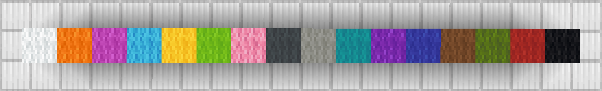

# 调色板说明

ezEdits中的调色板表示可以在多个命令中使用的方块列表，其中方块的顺序将被保持。

调色板可以使用以下前缀进行保存和访问：
* `#` 保存用户调色板。
* `##` 内置预设的调色板。\

例如 `##LegacyWool` 表示内置的羊毛调色板，从白色羊毛、橙色羊毛一直到红色羊毛，最后是黑色羊毛。

一些使用调色板的功能包括：

* `//eztexture ...` - *材质指令*
* `#palette` - *蒙版*
* `//ezbrush gradient ...` - *笔刷*

调色板可以通过几种修饰符构建：

* &#x20;**`,`** - 连接：将一个方块或调色板添加到前面一个方块或调色板的末尾。 例如，
   `stone,dirt` 是由石头和泥土组成的两个方块的调色板。 `stone,##LegacyWool` 是由石头和 ##LegacyWool 预设调色板中的方块组成的调色板。
* &#x20;**`-`** - 反转：颠倒调色板的顺序。 例如， `-##LegacyWool` 是 ##LegacyWool 预设调色板的反向顺序（从黑色开始而不是白色）。
* &#x20;**`(start:end)`** - 子调色板：返回调色板的一部分。 例如， `##LegacyWool(1:8)` 将返回 ##LegacyWool 预设调色板的前8个方块。
* &#x20;**`*`** - 重复器：重复前一个段一定次数。 例如， `gold_block*10,diamond_block` 将返回一个调色板，其中有10个金块，然后是一个钻石块。
* &#x20;**`[]`** - 分组：将调色板组合在一起，使修饰符可以将它们视为单个调色板。 例如， `-##LegacyWool,gold_block` 将返回反向的 ##LegacyWool 预设调色板，最后是一个金块。而 `-[##LegacyWool,gold_block]` 将在开始处返回一个金块。
* &#x20;**`=`** - 结果：如果需要，允许调色板被 tab 键自动完成为其方块列表。

**##LegacyWool 调色板预设:**

<figure><figcaption></figcaption></figure>
