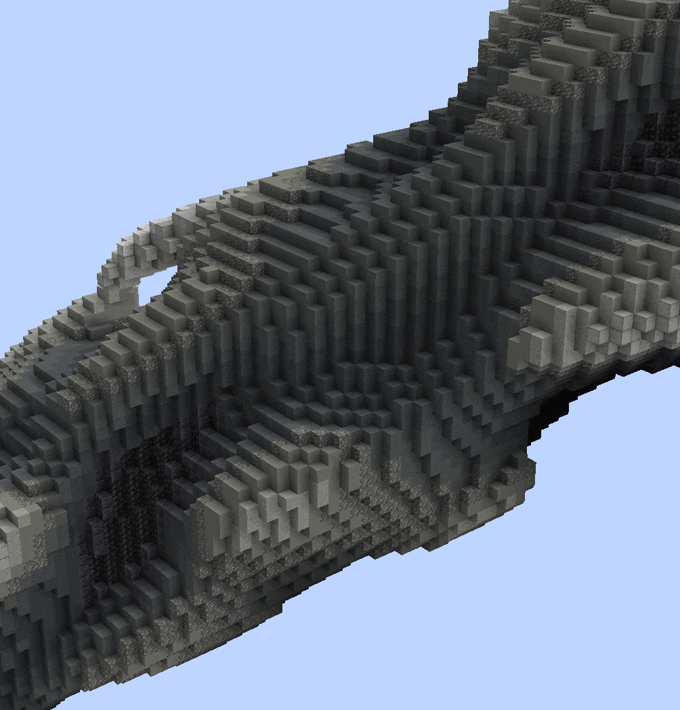
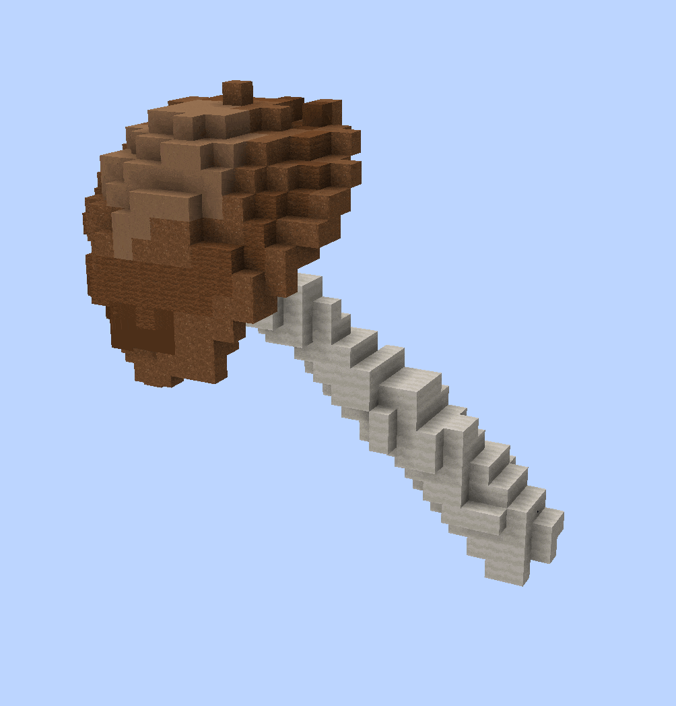
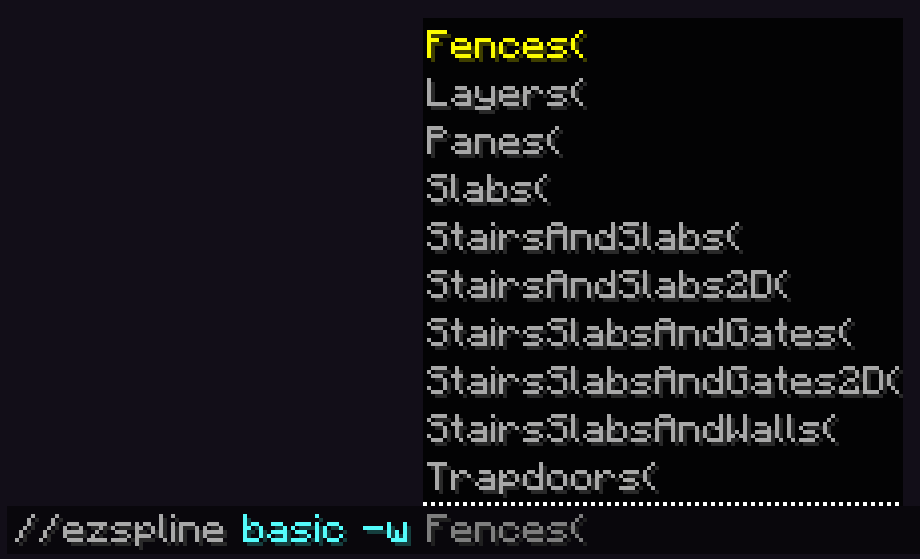
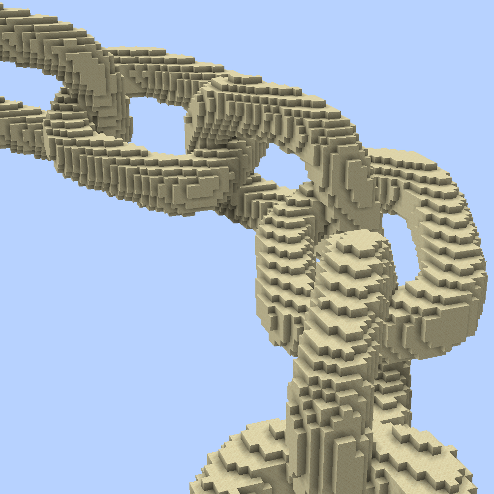
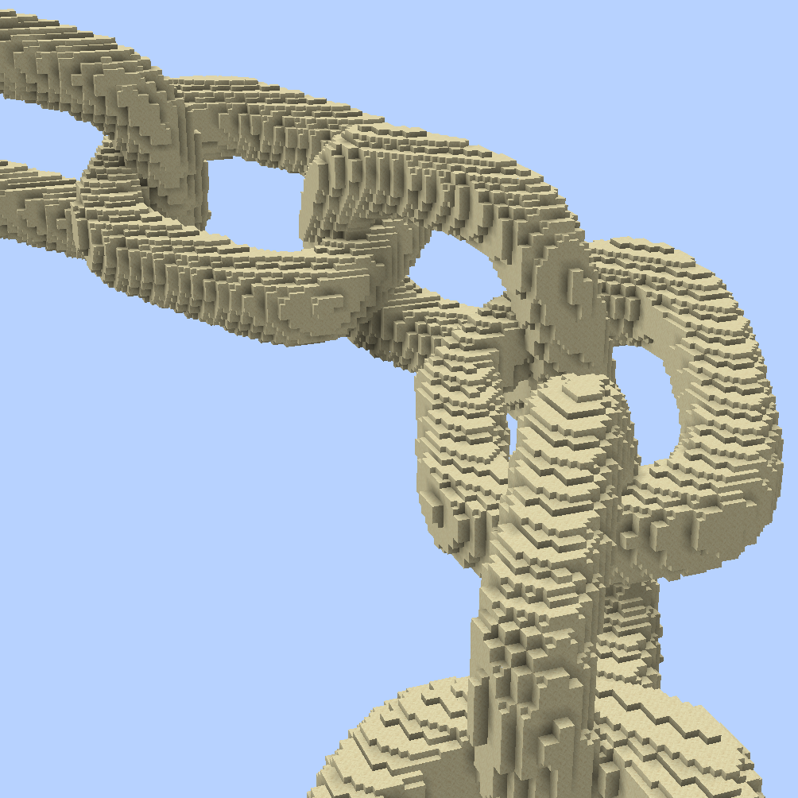
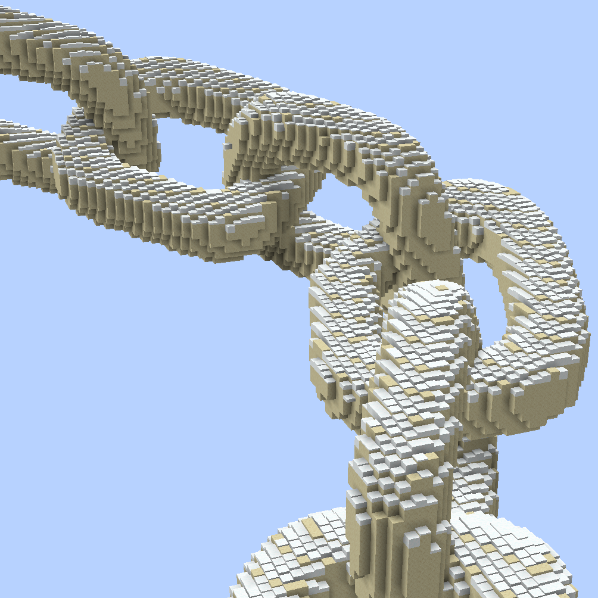
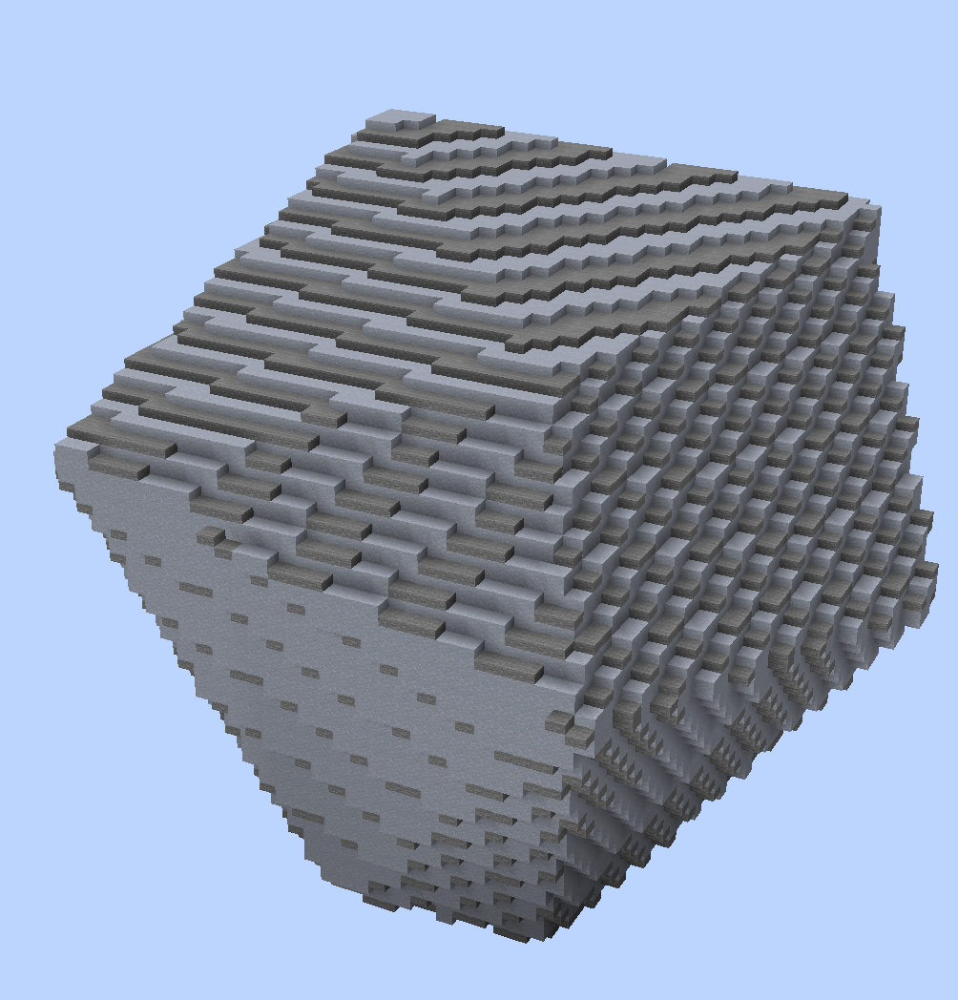
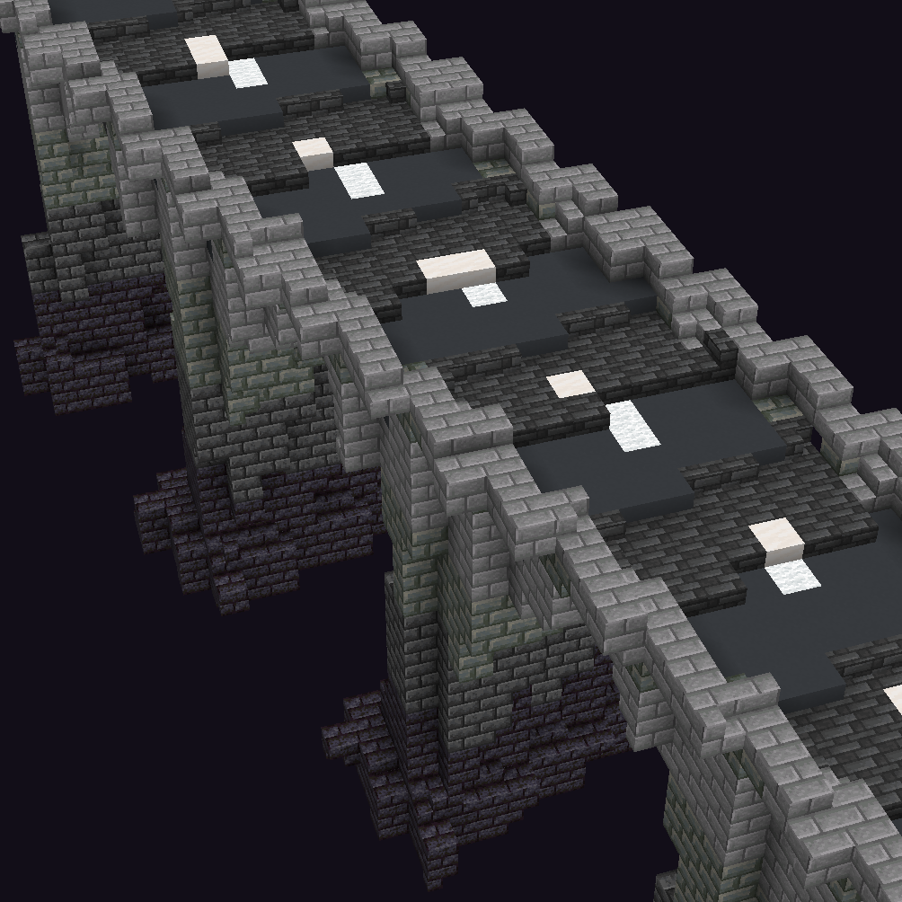
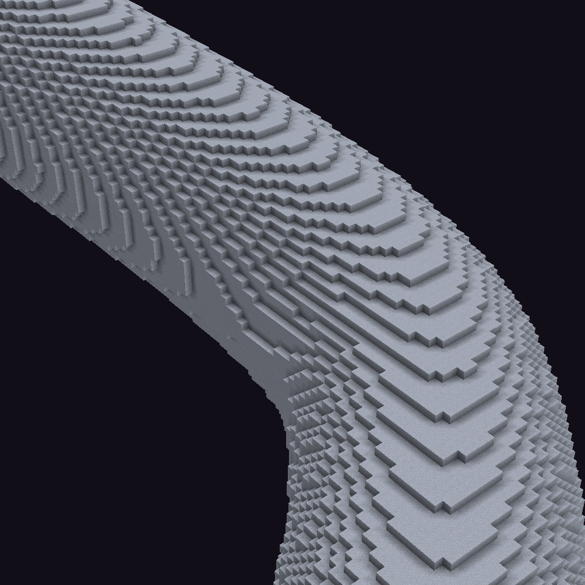
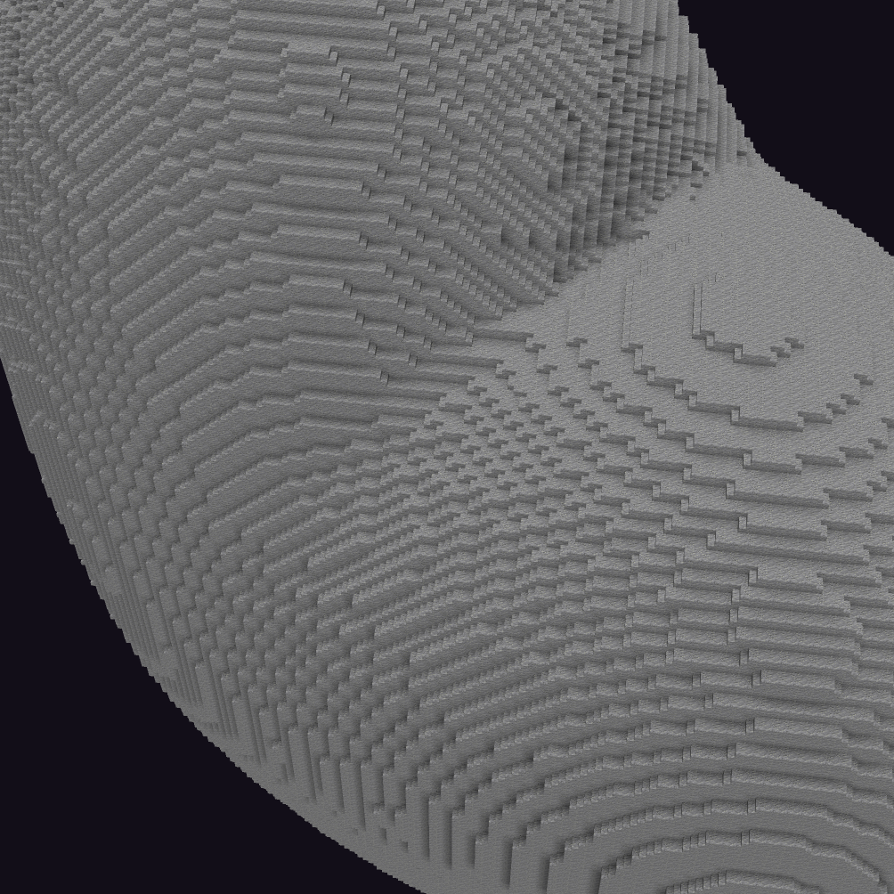

# 平滑方块

使用平滑方块（如台阶、楼梯、雪层、水位等）生成、放置形状并执行编辑。

### 当前支持的命令有：

[变形命令 (//ezdeform)](../commands/deformation/)

[放置命令 (//ezplace, //ezarray, //ezscatter)](../commands/placement/)

[样条命令 (//ezspline)](../commands/spline/)

[平滑命令 (//ezsmooth, //ezinflate, //ezdeflate, //ezsmoothblocks)](../commands/smoothing.md)

[表面命令 (//ezsurface)](../commands/surface.md)

### 如何使用

在使用上述支持的命令时，添加 <mark style="color:orange;">**`-w <profile>`**</mark> 标志。

<mark style="color:blue;">示例</mark>

比较使用和不使用 SlabsOnly 配置文件生成噪声样条的效果。

* `//ezspline noise ##grayscale 20`

- `//ezspline noise ##grayscale 20`` `<mark style="color:orange;">**`-w Slabs`**</mark>

比较使用和不使用 SlabsOnly 配置文件粘贴旋转蘑菇建筑文件的效果。

* `//ezplace Clipboard Aim`
* `//ezplace Clipboard Aim`` `<mark style="color:orange;">**`-w Slabs`**</mark>

### 配置文件

有不同的平滑方块配置文件。例如，一个可能只使用台阶，另一个可能使用楼梯和台阶，还有一个可能也使用楼梯和台阶但方向不同。我们对每个预设进行了硬编码以实现特定效果。每个预设使用特定的平滑方块子集。我们根据每个预设使用的平滑方块来命名。根据复杂程度，某些预设可能比其他预设运行时间更长。

<figure><figcaption></figcaption></figure>

<mark style="color:blue;">示例</mark>

比较 <mark style="color:blue;">**`//ezspline 3d ch smooth_sandstone -w <profile>`**</mark>

无平滑方块\
\

-w Slabs\
\

-w SlabsAndStairs\
\

-w SlabsAndStairs2D\
\

-w Layers\

### 材质

默认情况下，我们使用与指定的[图案](https://worldedit.enginehub.org/en/latest/usage/general/patterns/)、[调色板](../palettes/palettes-explained.md)或建筑文件中相应方块<mark style="color:orange;">**最接近颜色**</mark>的平滑方块。

<mark style="color:blue;">示例</mark>

如果你使用图案 <mark style="color:blue;">**`clay`**</mark> 并使用 <mark style="color:blue;">**`Slabs`**</mark> 平滑方块配置文件生成一个[结构](../commands/placement/available-structures.md)（例如[二十面体](../commands/placement/available-structures.md#icosphere-ic)）。那么，由于不存在粘土台阶，它将使用**颜色最接近**的台阶变体（使用默认 Minecraft 材质确定），对于粘土来说，这将是石台阶。

\

另一个例子：ezEdits 确定\
\- `deepslate_tile_slab` 是最接近 `gray_concrete` 的台阶\
\- `smooth_quartz_slab` 是最接近 `white_wool` 的台阶\
（原始建筑文件不包含 `deepslate_tile` 或 `smooth_quartz`）

你也可以通过自己设置材料来<mark style="color:orange;">**覆盖**</mark>每个塑形方块变体的材料，例如：<mark style="color:orange;">**`-w Slabs(Slab:acacia)`**</mark>。在使用接受调色板的命令时，你甚至可以为每个方块变体定义完整的自定义调色板或材料。

* （注意：目前，在粘贴建筑文件、剪贴板或使用平滑方块编辑现有区域时，你无法覆盖材料。）
* （特殊情况：要覆盖本身需要图案或调色板字段的结构的塑形方块材料，你需要使用内部的"Smoothblocks"参数，而不是 -w 标志。）

### Coverage（覆盖率）

覆盖率参数是一个非常特殊的参数，它（不是直接但实际上）让你可以控制应该使用多少塑形方块（以百分比表示）。0 表示只放置完整方块，1 表示每个表面方块都将是某种塑形方块。

默认值（也是数学上最准确的值）是 `0.5`。

示例

从 `Coverage:0.0` 到 `Coverage:1.0` 的动图。\

示例命令：`//ezspline basic clay 15 -w SSW(C:0.5)`

`C:0.5` 和 `C:1.0` 之间的另一个比较：

<figure><figcaption>
Coverage:0.5
</figcaption></figure> <figure><figcaption>
Coverage:1.0
</figcaption></figure>

注意 0.5 如何创建更平滑、更忠实的轮廓，而 1.0 在每个可能的角落方块放置楼梯，牺牲了准确性，但在 Minecraft 的默认阴影下看起来很好。

